# PROYECTO: PLANES DE PAGO

## Contexto del proyecto

Esta empresa de telefonía ofrece a sus clientes dos tarifas de prepago, Surf y Ultimate. El departamento comercial quiere saber cuál de las tarifas genera más ingresos para poder ajustar el presupuesto de publicidad.

Realizar un análisis preliminar de las tarifas basado en una selección de clientes. Analizar el comportamiento de los clientes y determinar qué tarifa de prepago genera más ingresos.


```python
from google.colab import drive
drive.mount('/content/drive')
```

    Drive already mounted at /content/drive; to attempt to forcibly remount, call drive.mount("/content/drive", force_remount=True).
    

## 1. Cargar librerías


```python
# Cargar todas las librerías
import pandas as pd
import numpy as np
import seaborn as sns
from scipy import stats as st
from math import factorial
import math as mt
from matplotlib import pyplot as plt


```

## 2. Cargar datos


```python
# Carga los archivos de datos en diferentes DataFrames
calls = pd.read_csv('/content/megaline_calls.csv')
internet = pd.read_csv('/content/megaline_internet.csv')
messages = pd.read_csv('/content/megaline_messages.csv')
plans = pd.read_csv('/content/megaline_plans.csv')
users = pd.read_csv('/content/megaline_users.csv')


```

## 3. Preparar los datos

Los datos para este proyecto se dividen en varias tablas. Exploraremos cada una para tener una comprensión inicial. Si es necesario, realizaremos las correcciones pertinentes.

1. La tabla users - catálogo de clientes y plan contratado
2. La tabla calls - consumo de llamadas por cada cliente
3. La tabla messages - consumo de mensajes SMS por cada cliente
4. La tabla internet - consumo de datos por cada cliente
5. La tabla plans - catálogo de tarifas

## 3.1. Tabla Plans (tarifas)


```python
# Imprimir la información general/resumida sobre el DataFrame de las tarifas
plans.info()

```

    <class 'pandas.core.frame.DataFrame'>
    RangeIndex: 2 entries, 0 to 1
    Data columns (total 8 columns):
     #   Column                 Non-Null Count  Dtype  
    ---  ------                 --------------  -----  
     0   messages_included      2 non-null      int64  
     1   mb_per_month_included  2 non-null      int64  
     2   minutes_included       2 non-null      int64  
     3   usd_monthly_pay        2 non-null      int64  
     4   usd_per_gb             2 non-null      int64  
     5   usd_per_message        2 non-null      float64
     6   usd_per_minute         2 non-null      float64
     7   plan_name              2 non-null      object 
    dtypes: float64(2), int64(5), object(1)
    memory usage: 260.0+ bytes
    


```python
# Imprimir una muestra de los datos para las tarifas
plans.sample(2)


```


  <div id="df-04f32072-59d0-4fb3-bd05-02e8f45af525" class="colab-df-container">
    <div>
<style scoped>
    .dataframe tbody tr th:only-of-type {
        vertical-align: middle;
    }

    .dataframe tbody tr th {
        vertical-align: top;
    }

    .dataframe thead th {
        text-align: right;
    }
</style>
<table border="1" class="dataframe">
  <thead>
    <tr style="text-align: right;">
      <th></th>
      <th>messages_included</th>
      <th>mb_per_month_included</th>
      <th>minutes_included</th>
      <th>usd_monthly_pay</th>
      <th>usd_per_gb</th>
      <th>usd_per_message</th>
      <th>usd_per_minute</th>
      <th>plan_name</th>
    </tr>
  </thead>
  <tbody>
    <tr>
      <th>0</th>
      <td>50</td>
      <td>15360</td>
      <td>500</td>
      <td>20</td>
      <td>10</td>
      <td>0.03</td>
      <td>0.03</td>
      <td>surf</td>
    </tr>
    <tr>
      <th>1</th>
      <td>1000</td>
      <td>30720</td>
      <td>3000</td>
      <td>70</td>
      <td>7</td>
      <td>0.01</td>
      <td>0.01</td>
      <td>ultimate</td>
    </tr>
  </tbody>
</table>
</div>
    <div class="colab-df-buttons">

  <div class="colab-df-container">
    <button class="colab-df-convert" onclick="convertToInteractive('df-04f32072-59d0-4fb3-bd05-02e8f45af525')"
            title="Convert this dataframe to an interactive table."
            style="display:none;">

  <svg xmlns="http://www.w3.org/2000/svg" height="24px" viewBox="0 -960 960 960">
    <path d="M120-120v-720h720v720H120Zm60-500h600v-160H180v160Zm220 220h160v-160H400v160Zm0 220h160v-160H400v160ZM180-400h160v-160H180v160Zm440 0h160v-160H620v160ZM180-180h160v-160H180v160Zm440 0h160v-160H620v160Z"/>
  </svg>
    </button>

  <style>
    .colab-df-container {
      display:flex;
      gap: 12px;
    }

    .colab-df-convert {
      background-color: #E8F0FE;
      border: none;
      border-radius: 50%;
      cursor: pointer;
      display: none;
      fill: #1967D2;
      height: 32px;
      padding: 0 0 0 0;
      width: 32px;
    }

    .colab-df-convert:hover {
      background-color: #E2EBFA;
      box-shadow: 0px 1px 2px rgba(60, 64, 67, 0.3), 0px 1px 3px 1px rgba(60, 64, 67, 0.15);
      fill: #174EA6;
    }

    .colab-df-buttons div {
      margin-bottom: 4px;
    }

    [theme=dark] .colab-df-convert {
      background-color: #3B4455;
      fill: #D2E3FC;
    }

    [theme=dark] .colab-df-convert:hover {
      background-color: #434B5C;
      box-shadow: 0px 1px 3px 1px rgba(0, 0, 0, 0.15);
      filter: drop-shadow(0px 1px 2px rgba(0, 0, 0, 0.3));
      fill: #FFFFFF;
    }
  </style>

    <script>
      const buttonEl =
        document.querySelector('#df-04f32072-59d0-4fb3-bd05-02e8f45af525 button.colab-df-convert');
      buttonEl.style.display =
        google.colab.kernel.accessAllowed ? 'block' : 'none';

      async function convertToInteractive(key) {
        const element = document.querySelector('#df-04f32072-59d0-4fb3-bd05-02e8f45af525');
        const dataTable =
          await google.colab.kernel.invokeFunction('convertToInteractive',
                                                    [key], {});
        if (!dataTable) return;

        const docLinkHtml = 'Like what you see? Visit the ' +
          '<a target="_blank" href=https://colab.research.google.com/notebooks/data_table.ipynb>data table notebook</a>'
          + ' to learn more about interactive tables.';
        element.innerHTML = '';
        dataTable['output_type'] = 'display_data';
        await google.colab.output.renderOutput(dataTable, element);
        const docLink = document.createElement('div');
        docLink.innerHTML = docLinkHtml;
        element.appendChild(docLink);
      }
    </script>
  </div>


    <div id="df-31c75428-d9da-4ac1-8e90-e69359a1f5da">
      <button class="colab-df-quickchart" onclick="quickchart('df-31c75428-d9da-4ac1-8e90-e69359a1f5da')"
                title="Suggest charts"
                style="display:none;">

<svg xmlns="http://www.w3.org/2000/svg" height="24px"viewBox="0 0 24 24"
     width="24px">
    <g>
        <path d="M19 3H5c-1.1 0-2 .9-2 2v14c0 1.1.9 2 2 2h14c1.1 0 2-.9 2-2V5c0-1.1-.9-2-2-2zM9 17H7v-7h2v7zm4 0h-2V7h2v10zm4 0h-2v-4h2v4z"/>
    </g>
</svg>
      </button>

<style>
  .colab-df-quickchart {
      --bg-color: #E8F0FE;
      --fill-color: #1967D2;
      --hover-bg-color: #E2EBFA;
      --hover-fill-color: #174EA6;
      --disabled-fill-color: #AAA;
      --disabled-bg-color: #DDD;
  }

  [theme=dark] .colab-df-quickchart {
      --bg-color: #3B4455;
      --fill-color: #D2E3FC;
      --hover-bg-color: #434B5C;
      --hover-fill-color: #FFFFFF;
      --disabled-bg-color: #3B4455;
      --disabled-fill-color: #666;
  }

  .colab-df-quickchart {
    background-color: var(--bg-color);
    border: none;
    border-radius: 50%;
    cursor: pointer;
    display: none;
    fill: var(--fill-color);
    height: 32px;
    padding: 0;
    width: 32px;
  }

  .colab-df-quickchart:hover {
    background-color: var(--hover-bg-color);
    box-shadow: 0 1px 2px rgba(60, 64, 67, 0.3), 0 1px 3px 1px rgba(60, 64, 67, 0.15);
    fill: var(--button-hover-fill-color);
  }

  .colab-df-quickchart-complete:disabled,
  .colab-df-quickchart-complete:disabled:hover {
    background-color: var(--disabled-bg-color);
    fill: var(--disabled-fill-color);
    box-shadow: none;
  }

  .colab-df-spinner {
    border: 2px solid var(--fill-color);
    border-color: transparent;
    border-bottom-color: var(--fill-color);
    animation:
      spin 1s steps(1) infinite;
  }

  @keyframes spin {
    0% {
      border-color: transparent;
      border-bottom-color: var(--fill-color);
      border-left-color: var(--fill-color);
    }
    20% {
      border-color: transparent;
      border-left-color: var(--fill-color);
      border-top-color: var(--fill-color);
    }
    30% {
      border-color: transparent;
      border-left-color: var(--fill-color);
      border-top-color: var(--fill-color);
      border-right-color: var(--fill-color);
    }
    40% {
      border-color: transparent;
      border-right-color: var(--fill-color);
      border-top-color: var(--fill-color);
    }
    60% {
      border-color: transparent;
      border-right-color: var(--fill-color);
    }
    80% {
      border-color: transparent;
      border-right-color: var(--fill-color);
      border-bottom-color: var(--fill-color);
    }
    90% {
      border-color: transparent;
      border-bottom-color: var(--fill-color);
    }
  }
</style>

      <script>
        async function quickchart(key) {
          const quickchartButtonEl =
            document.querySelector('#' + key + ' button');
          quickchartButtonEl.disabled = true;  // To prevent multiple clicks.
          quickchartButtonEl.classList.add('colab-df-spinner');
          try {
            const charts = await google.colab.kernel.invokeFunction(
                'suggestCharts', [key], {});
          } catch (error) {
            console.error('Error during call to suggestCharts:', error);
          }
          quickchartButtonEl.classList.remove('colab-df-spinner');
          quickchartButtonEl.classList.add('colab-df-quickchart-complete');
        }
        (() => {
          let quickchartButtonEl =
            document.querySelector('#df-31c75428-d9da-4ac1-8e90-e69359a1f5da button');
          quickchartButtonEl.style.display =
            google.colab.kernel.accessAllowed ? 'block' : 'none';
        })();
      </script>
    </div>

    </div>
  </div>


OBSERVACIONES:

- Nombres de columnas: los títulos de columna son claros y tienen el estándar correcto. Sin embargo no tienen un orden muy lógico. Hay que darle un mejor orden.
- Registros: tienen 2 registros correspondientes a 2 planes de pago, conforme a lo que se podría haber esperado.
- Tipo de datos: Sería mas correcto que los campos de $ fueran todos del tipo float64.
- Valores: los valores de la columna mb_per_month_included parecen ser incorrectos. En las instrucciones se menciona que son 15 GB y 30 GB respectivamente. Sin embargo el dato que se presenta es 15,720 y 15,360. Vamos a tener que corregir esta información.


## Corregir datos


```python
# cambiar a float64 el tipo de datos de las columnas usd_monthly_pay, usd_per_monthly_pay	y usd_per_gb
plans['usd_monthly_pay'] = plans['usd_monthly_pay'].astype('float')
plans['usd_per_monthly_pay'] = plans['usd_monthly_pay'].astype('float')
plans['usd_per_gb'] = plans['usd_per_gb'].astype('float')
plans.info()
# ajustar los valores de la columna mb_per_month_included a la cantidad correcta. En las instrucciones se menciona 15k gb y 30k gb.
plans['mb_per_month_included'] = [15000, 30000]
plans.head(2)
```

    <class 'pandas.core.frame.DataFrame'>
    RangeIndex: 2 entries, 0 to 1
    Data columns (total 9 columns):
     #   Column                 Non-Null Count  Dtype  
    ---  ------                 --------------  -----  
     0   messages_included      2 non-null      int64  
     1   mb_per_month_included  2 non-null      int64  
     2   minutes_included       2 non-null      int64  
     3   usd_monthly_pay        2 non-null      float64
     4   usd_per_gb             2 non-null      float64
     5   usd_per_message        2 non-null      float64
     6   usd_per_minute         2 non-null      float64
     7   plan_name              2 non-null      object 
     8   usd_per_monthly_pay    2 non-null      float64
    dtypes: float64(5), int64(3), object(1)
    memory usage: 276.0+ bytes
    


  <div id="df-2e3d6d8b-f67a-4c84-b084-122a147f9349" class="colab-df-container">
    <div>
<style scoped>
    .dataframe tbody tr th:only-of-type {
        vertical-align: middle;
    }

    .dataframe tbody tr th {
        vertical-align: top;
    }

    .dataframe thead th {
        text-align: right;
    }
</style>
<table border="1" class="dataframe">
  <thead>
    <tr style="text-align: right;">
      <th></th>
      <th>messages_included</th>
      <th>mb_per_month_included</th>
      <th>minutes_included</th>
      <th>usd_monthly_pay</th>
      <th>usd_per_gb</th>
      <th>usd_per_message</th>
      <th>usd_per_minute</th>
      <th>plan_name</th>
      <th>usd_per_monthly_pay</th>
    </tr>
  </thead>
  <tbody>
    <tr>
      <th>0</th>
      <td>50</td>
      <td>15000</td>
      <td>500</td>
      <td>20.0</td>
      <td>10.0</td>
      <td>0.03</td>
      <td>0.03</td>
      <td>surf</td>
      <td>20.0</td>
    </tr>
    <tr>
      <th>1</th>
      <td>1000</td>
      <td>30000</td>
      <td>3000</td>
      <td>70.0</td>
      <td>7.0</td>
      <td>0.01</td>
      <td>0.01</td>
      <td>ultimate</td>
      <td>70.0</td>
    </tr>
  </tbody>
</table>
</div>
    <div class="colab-df-buttons">

  <div class="colab-df-container">
    <button class="colab-df-convert" onclick="convertToInteractive('df-2e3d6d8b-f67a-4c84-b084-122a147f9349')"
            title="Convert this dataframe to an interactive table."
            style="display:none;">

  <svg xmlns="http://www.w3.org/2000/svg" height="24px" viewBox="0 -960 960 960">
    <path d="M120-120v-720h720v720H120Zm60-500h600v-160H180v160Zm220 220h160v-160H400v160Zm0 220h160v-160H400v160ZM180-400h160v-160H180v160Zm440 0h160v-160H620v160ZM180-180h160v-160H180v160Zm440 0h160v-160H620v160Z"/>
  </svg>
    </button>

  <style>
    .colab-df-container {
      display:flex;
      gap: 12px;
    }

    .colab-df-convert {
      background-color: #E8F0FE;
      border: none;
      border-radius: 50%;
      cursor: pointer;
      display: none;
      fill: #1967D2;
      height: 32px;
      padding: 0 0 0 0;
      width: 32px;
    }

    .colab-df-convert:hover {
      background-color: #E2EBFA;
      box-shadow: 0px 1px 2px rgba(60, 64, 67, 0.3), 0px 1px 3px 1px rgba(60, 64, 67, 0.15);
      fill: #174EA6;
    }

    .colab-df-buttons div {
      margin-bottom: 4px;
    }

    [theme=dark] .colab-df-convert {
      background-color: #3B4455;
      fill: #D2E3FC;
    }

    [theme=dark] .colab-df-convert:hover {
      background-color: #434B5C;
      box-shadow: 0px 1px 3px 1px rgba(0, 0, 0, 0.15);
      filter: drop-shadow(0px 1px 2px rgba(0, 0, 0, 0.3));
      fill: #FFFFFF;
    }
  </style>

    <script>
      const buttonEl =
        document.querySelector('#df-2e3d6d8b-f67a-4c84-b084-122a147f9349 button.colab-df-convert');
      buttonEl.style.display =
        google.colab.kernel.accessAllowed ? 'block' : 'none';

      async function convertToInteractive(key) {
        const element = document.querySelector('#df-2e3d6d8b-f67a-4c84-b084-122a147f9349');
        const dataTable =
          await google.colab.kernel.invokeFunction('convertToInteractive',
                                                    [key], {});
        if (!dataTable) return;

        const docLinkHtml = 'Like what you see? Visit the ' +
          '<a target="_blank" href=https://colab.research.google.com/notebooks/data_table.ipynb>data table notebook</a>'
          + ' to learn more about interactive tables.';
        element.innerHTML = '';
        dataTable['output_type'] = 'display_data';
        await google.colab.output.renderOutput(dataTable, element);
        const docLink = document.createElement('div');
        docLink.innerHTML = docLinkHtml;
        element.appendChild(docLink);
      }
    </script>
  </div>


    <div id="df-0d58277b-0e4f-404c-a9bb-65a710a67c00">
      <button class="colab-df-quickchart" onclick="quickchart('df-0d58277b-0e4f-404c-a9bb-65a710a67c00')"
                title="Suggest charts"
                style="display:none;">

<svg xmlns="http://www.w3.org/2000/svg" height="24px"viewBox="0 0 24 24"
     width="24px">
    <g>
        <path d="M19 3H5c-1.1 0-2 .9-2 2v14c0 1.1.9 2 2 2h14c1.1 0 2-.9 2-2V5c0-1.1-.9-2-2-2zM9 17H7v-7h2v7zm4 0h-2V7h2v10zm4 0h-2v-4h2v4z"/>
    </g>
</svg>
      </button>

<style>
  .colab-df-quickchart {
      --bg-color: #E8F0FE;
      --fill-color: #1967D2;
      --hover-bg-color: #E2EBFA;
      --hover-fill-color: #174EA6;
      --disabled-fill-color: #AAA;
      --disabled-bg-color: #DDD;
  }

  [theme=dark] .colab-df-quickchart {
      --bg-color: #3B4455;
      --fill-color: #D2E3FC;
      --hover-bg-color: #434B5C;
      --hover-fill-color: #FFFFFF;
      --disabled-bg-color: #3B4455;
      --disabled-fill-color: #666;
  }

  .colab-df-quickchart {
    background-color: var(--bg-color);
    border: none;
    border-radius: 50%;
    cursor: pointer;
    display: none;
    fill: var(--fill-color);
    height: 32px;
    padding: 0;
    width: 32px;
  }

  .colab-df-quickchart:hover {
    background-color: var(--hover-bg-color);
    box-shadow: 0 1px 2px rgba(60, 64, 67, 0.3), 0 1px 3px 1px rgba(60, 64, 67, 0.15);
    fill: var(--button-hover-fill-color);
  }

  .colab-df-quickchart-complete:disabled,
  .colab-df-quickchart-complete:disabled:hover {
    background-color: var(--disabled-bg-color);
    fill: var(--disabled-fill-color);
    box-shadow: none;
  }

  .colab-df-spinner {
    border: 2px solid var(--fill-color);
    border-color: transparent;
    border-bottom-color: var(--fill-color);
    animation:
      spin 1s steps(1) infinite;
  }

  @keyframes spin {
    0% {
      border-color: transparent;
      border-bottom-color: var(--fill-color);
      border-left-color: var(--fill-color);
    }
    20% {
      border-color: transparent;
      border-left-color: var(--fill-color);
      border-top-color: var(--fill-color);
    }
    30% {
      border-color: transparent;
      border-left-color: var(--fill-color);
      border-top-color: var(--fill-color);
      border-right-color: var(--fill-color);
    }
    40% {
      border-color: transparent;
      border-right-color: var(--fill-color);
      border-top-color: var(--fill-color);
    }
    60% {
      border-color: transparent;
      border-right-color: var(--fill-color);
    }
    80% {
      border-color: transparent;
      border-right-color: var(--fill-color);
      border-bottom-color: var(--fill-color);
    }
    90% {
      border-color: transparent;
      border-bottom-color: var(--fill-color);
    }
  }
</style>

      <script>
        async function quickchart(key) {
          const quickchartButtonEl =
            document.querySelector('#' + key + ' button');
          quickchartButtonEl.disabled = true;  // To prevent multiple clicks.
          quickchartButtonEl.classList.add('colab-df-spinner');
          try {
            const charts = await google.colab.kernel.invokeFunction(
                'suggestCharts', [key], {});
          } catch (error) {
            console.error('Error during call to suggestCharts:', error);
          }
          quickchartButtonEl.classList.remove('colab-df-spinner');
          quickchartButtonEl.classList.add('colab-df-quickchart-complete');
        }
        (() => {
          let quickchartButtonEl =
            document.querySelector('#df-0d58277b-0e4f-404c-a9bb-65a710a67c00 button');
          quickchartButtonEl.style.display =
            google.colab.kernel.accessAllowed ? 'block' : 'none';
        })();
      </script>
    </div>

    </div>
  </div>


## Enriquecer los datos


```python
# El cobro se hace por GB. Agregaremos la columna gb_per_month_included, para tener las unidades que necesitaremos
plans['gb_per_month_included'] = plans['mb_per_month_included'] / 1000
# Ajustamos el orden de las columnas para que tenga mejor sentido, descartando la columna 'mb_per_month_included'
# y en su lugar dejamos 'gb_per_month_included'
plans = plans[['plan_name', 'usd_monthly_pay', 'minutes_included', 'usd_per_minute', 'messages_included', 'usd_per_message', 'gb_per_month_included', 'usd_per_gb']]

plans.info()
print()
plans.head(2)


```

    <class 'pandas.core.frame.DataFrame'>
    RangeIndex: 2 entries, 0 to 1
    Data columns (total 8 columns):
     #   Column                 Non-Null Count  Dtype  
    ---  ------                 --------------  -----  
     0   plan_name              2 non-null      object 
     1   usd_monthly_pay        2 non-null      float64
     2   minutes_included       2 non-null      int64  
     3   usd_per_minute         2 non-null      float64
     4   messages_included      2 non-null      int64  
     5   usd_per_message        2 non-null      float64
     6   gb_per_month_included  2 non-null      float64
     7   usd_per_gb             2 non-null      float64
    dtypes: float64(5), int64(2), object(1)
    memory usage: 260.0+ bytes
    
    


  <div id="df-1c12b886-7f1c-4ba2-b3bb-3b9c1727a0ad" class="colab-df-container">
    <div>
<style scoped>
    .dataframe tbody tr th:only-of-type {
        vertical-align: middle;
    }

    .dataframe tbody tr th {
        vertical-align: top;
    }

    .dataframe thead th {
        text-align: right;
    }
</style>
<table border="1" class="dataframe">
  <thead>
    <tr style="text-align: right;">
      <th></th>
      <th>plan_name</th>
      <th>usd_monthly_pay</th>
      <th>minutes_included</th>
      <th>usd_per_minute</th>
      <th>messages_included</th>
      <th>usd_per_message</th>
      <th>gb_per_month_included</th>
      <th>usd_per_gb</th>
    </tr>
  </thead>
  <tbody>
    <tr>
      <th>0</th>
      <td>surf</td>
      <td>20.0</td>
      <td>500</td>
      <td>0.03</td>
      <td>50</td>
      <td>0.03</td>
      <td>15.0</td>
      <td>10.0</td>
    </tr>
    <tr>
      <th>1</th>
      <td>ultimate</td>
      <td>70.0</td>
      <td>3000</td>
      <td>0.01</td>
      <td>1000</td>
      <td>0.01</td>
      <td>30.0</td>
      <td>7.0</td>
    </tr>
  </tbody>
</table>
</div>
    <div class="colab-df-buttons">

  <div class="colab-df-container">
    <button class="colab-df-convert" onclick="convertToInteractive('df-1c12b886-7f1c-4ba2-b3bb-3b9c1727a0ad')"
            title="Convert this dataframe to an interactive table."
            style="display:none;">

  <svg xmlns="http://www.w3.org/2000/svg" height="24px" viewBox="0 -960 960 960">
    <path d="M120-120v-720h720v720H120Zm60-500h600v-160H180v160Zm220 220h160v-160H400v160Zm0 220h160v-160H400v160ZM180-400h160v-160H180v160Zm440 0h160v-160H620v160ZM180-180h160v-160H180v160Zm440 0h160v-160H620v160Z"/>
  </svg>
    </button>

  <style>
    .colab-df-container {
      display:flex;
      gap: 12px;
    }

    .colab-df-convert {
      background-color: #E8F0FE;
      border: none;
      border-radius: 50%;
      cursor: pointer;
      display: none;
      fill: #1967D2;
      height: 32px;
      padding: 0 0 0 0;
      width: 32px;
    }

    .colab-df-convert:hover {
      background-color: #E2EBFA;
      box-shadow: 0px 1px 2px rgba(60, 64, 67, 0.3), 0px 1px 3px 1px rgba(60, 64, 67, 0.15);
      fill: #174EA6;
    }

    .colab-df-buttons div {
      margin-bottom: 4px;
    }

    [theme=dark] .colab-df-convert {
      background-color: #3B4455;
      fill: #D2E3FC;
    }

    [theme=dark] .colab-df-convert:hover {
      background-color: #434B5C;
      box-shadow: 0px 1px 3px 1px rgba(0, 0, 0, 0.15);
      filter: drop-shadow(0px 1px 2px rgba(0, 0, 0, 0.3));
      fill: #FFFFFF;
    }
  </style>

    <script>
      const buttonEl =
        document.querySelector('#df-1c12b886-7f1c-4ba2-b3bb-3b9c1727a0ad button.colab-df-convert');
      buttonEl.style.display =
        google.colab.kernel.accessAllowed ? 'block' : 'none';

      async function convertToInteractive(key) {
        const element = document.querySelector('#df-1c12b886-7f1c-4ba2-b3bb-3b9c1727a0ad');
        const dataTable =
          await google.colab.kernel.invokeFunction('convertToInteractive',
                                                    [key], {});
        if (!dataTable) return;

        const docLinkHtml = 'Like what you see? Visit the ' +
          '<a target="_blank" href=https://colab.research.google.com/notebooks/data_table.ipynb>data table notebook</a>'
          + ' to learn more about interactive tables.';
        element.innerHTML = '';
        dataTable['output_type'] = 'display_data';
        await google.colab.output.renderOutput(dataTable, element);
        const docLink = document.createElement('div');
        docLink.innerHTML = docLinkHtml;
        element.appendChild(docLink);
      }
    </script>
  </div>


    <div id="df-792df764-567d-4f26-b64d-c605c69890f4">
      <button class="colab-df-quickchart" onclick="quickchart('df-792df764-567d-4f26-b64d-c605c69890f4')"
                title="Suggest charts"
                style="display:none;">

<svg xmlns="http://www.w3.org/2000/svg" height="24px"viewBox="0 0 24 24"
     width="24px">
    <g>
        <path d="M19 3H5c-1.1 0-2 .9-2 2v14c0 1.1.9 2 2 2h14c1.1 0 2-.9 2-2V5c0-1.1-.9-2-2-2zM9 17H7v-7h2v7zm4 0h-2V7h2v10zm4 0h-2v-4h2v4z"/>
    </g>
</svg>
      </button>

<style>
  .colab-df-quickchart {
      --bg-color: #E8F0FE;
      --fill-color: #1967D2;
      --hover-bg-color: #E2EBFA;
      --hover-fill-color: #174EA6;
      --disabled-fill-color: #AAA;
      --disabled-bg-color: #DDD;
  }

  [theme=dark] .colab-df-quickchart {
      --bg-color: #3B4455;
      --fill-color: #D2E3FC;
      --hover-bg-color: #434B5C;
      --hover-fill-color: #FFFFFF;
      --disabled-bg-color: #3B4455;
      --disabled-fill-color: #666;
  }

  .colab-df-quickchart {
    background-color: var(--bg-color);
    border: none;
    border-radius: 50%;
    cursor: pointer;
    display: none;
    fill: var(--fill-color);
    height: 32px;
    padding: 0;
    width: 32px;
  }

  .colab-df-quickchart:hover {
    background-color: var(--hover-bg-color);
    box-shadow: 0 1px 2px rgba(60, 64, 67, 0.3), 0 1px 3px 1px rgba(60, 64, 67, 0.15);
    fill: var(--button-hover-fill-color);
  }

  .colab-df-quickchart-complete:disabled,
  .colab-df-quickchart-complete:disabled:hover {
    background-color: var(--disabled-bg-color);
    fill: var(--disabled-fill-color);
    box-shadow: none;
  }

  .colab-df-spinner {
    border: 2px solid var(--fill-color);
    border-color: transparent;
    border-bottom-color: var(--fill-color);
    animation:
      spin 1s steps(1) infinite;
  }

  @keyframes spin {
    0% {
      border-color: transparent;
      border-bottom-color: var(--fill-color);
      border-left-color: var(--fill-color);
    }
    20% {
      border-color: transparent;
      border-left-color: var(--fill-color);
      border-top-color: var(--fill-color);
    }
    30% {
      border-color: transparent;
      border-left-color: var(--fill-color);
      border-top-color: var(--fill-color);
      border-right-color: var(--fill-color);
    }
    40% {
      border-color: transparent;
      border-right-color: var(--fill-color);
      border-top-color: var(--fill-color);
    }
    60% {
      border-color: transparent;
      border-right-color: var(--fill-color);
    }
    80% {
      border-color: transparent;
      border-right-color: var(--fill-color);
      border-bottom-color: var(--fill-color);
    }
    90% {
      border-color: transparent;
      border-bottom-color: var(--fill-color);
    }
  }
</style>

      <script>
        async function quickchart(key) {
          const quickchartButtonEl =
            document.querySelector('#' + key + ' button');
          quickchartButtonEl.disabled = true;  // To prevent multiple clicks.
          quickchartButtonEl.classList.add('colab-df-spinner');
          try {
            const charts = await google.colab.kernel.invokeFunction(
                'suggestCharts', [key], {});
          } catch (error) {
            console.error('Error during call to suggestCharts:', error);
          }
          quickchartButtonEl.classList.remove('colab-df-spinner');
          quickchartButtonEl.classList.add('colab-df-quickchart-complete');
        }
        (() => {
          let quickchartButtonEl =
            document.querySelector('#df-792df764-567d-4f26-b64d-c605c69890f4 button');
          quickchartButtonEl.style.display =
            google.colab.kernel.accessAllowed ? 'block' : 'none';
        })();
      </script>
    </div>

    </div>
  </div>


## 3.2. Tabla Users


```python
# Imprimir la información general/resumida sobre el DataFrame de usuarios
users.info()


```

    <class 'pandas.core.frame.DataFrame'>
    RangeIndex: 500 entries, 0 to 499
    Data columns (total 8 columns):
     #   Column      Non-Null Count  Dtype 
    ---  ------      --------------  ----- 
     0   user_id     500 non-null    int64 
     1   first_name  500 non-null    object
     2   last_name   500 non-null    object
     3   age         500 non-null    int64 
     4   city        500 non-null    object
     5   reg_date    500 non-null    object
     6   plan        500 non-null    object
     7   churn_date  34 non-null     object
    dtypes: int64(2), object(6)
    memory usage: 31.4+ KB
    


```python
# Imprimir una muestra de datos para usuarios
users.sample(10)


```


  <div id="df-dcd14d41-7676-4d38-9d2d-69eb304df935" class="colab-df-container">
    <div>
<style scoped>
    .dataframe tbody tr th:only-of-type {
        vertical-align: middle;
    }

    .dataframe tbody tr th {
        vertical-align: top;
    }

    .dataframe thead th {
        text-align: right;
    }
</style>
<table border="1" class="dataframe">
  <thead>
    <tr style="text-align: right;">
      <th></th>
      <th>user_id</th>
      <th>first_name</th>
      <th>last_name</th>
      <th>age</th>
      <th>city</th>
      <th>reg_date</th>
      <th>plan</th>
      <th>churn_date</th>
    </tr>
  </thead>
  <tbody>
    <tr>
      <th>95</th>
      <td>1095</td>
      <td>Lilliam</td>
      <td>Alvarado</td>
      <td>55</td>
      <td>Louisville/Jefferson County, KY-IN MSA</td>
      <td>2018-04-21</td>
      <td>surf</td>
      <td>NaN</td>
    </tr>
    <tr>
      <th>248</th>
      <td>1248</td>
      <td>Leigha</td>
      <td>Dawson</td>
      <td>35</td>
      <td>Nashville-Davidson–Murfreesboro–Franklin, TN MSA</td>
      <td>2018-11-01</td>
      <td>surf</td>
      <td>NaN</td>
    </tr>
    <tr>
      <th>418</th>
      <td>1418</td>
      <td>Hal</td>
      <td>Barnes</td>
      <td>40</td>
      <td>New York-Newark-Jersey City, NY-NJ-PA MSA</td>
      <td>2018-01-19</td>
      <td>surf</td>
      <td>NaN</td>
    </tr>
    <tr>
      <th>451</th>
      <td>1451</td>
      <td>Lenard</td>
      <td>Harding</td>
      <td>53</td>
      <td>Charlotte-Concord-Gastonia, NC-SC MSA</td>
      <td>2018-02-15</td>
      <td>ultimate</td>
      <td>2018-12-10</td>
    </tr>
    <tr>
      <th>410</th>
      <td>1410</td>
      <td>Wendell</td>
      <td>Lloyd</td>
      <td>46</td>
      <td>Los Angeles-Long Beach-Anaheim, CA MSA</td>
      <td>2018-10-06</td>
      <td>surf</td>
      <td>NaN</td>
    </tr>
    <tr>
      <th>327</th>
      <td>1327</td>
      <td>Natosha</td>
      <td>Peck</td>
      <td>20</td>
      <td>New York-Newark-Jersey City, NY-NJ-PA MSA</td>
      <td>2018-02-17</td>
      <td>surf</td>
      <td>NaN</td>
    </tr>
    <tr>
      <th>458</th>
      <td>1458</td>
      <td>Joella</td>
      <td>Munoz</td>
      <td>32</td>
      <td>Detroit-Warren-Dearborn, MI MSA</td>
      <td>2018-07-24</td>
      <td>ultimate</td>
      <td>NaN</td>
    </tr>
    <tr>
      <th>163</th>
      <td>1163</td>
      <td>Lanie</td>
      <td>Washington</td>
      <td>27</td>
      <td>Los Angeles-Long Beach-Anaheim, CA MSA</td>
      <td>2018-01-12</td>
      <td>ultimate</td>
      <td>NaN</td>
    </tr>
    <tr>
      <th>201</th>
      <td>1201</td>
      <td>Jeanelle</td>
      <td>Estrada</td>
      <td>61</td>
      <td>Bridgeport-Stamford-Norwalk, CT MSA</td>
      <td>2018-06-04</td>
      <td>surf</td>
      <td>NaN</td>
    </tr>
    <tr>
      <th>475</th>
      <td>1475</td>
      <td>Arlen</td>
      <td>Sutton</td>
      <td>66</td>
      <td>Dallas-Fort Worth-Arlington, TX MSA</td>
      <td>2018-05-28</td>
      <td>ultimate</td>
      <td>NaN</td>
    </tr>
  </tbody>
</table>
</div>
    <div class="colab-df-buttons">

  <div class="colab-df-container">
    <button class="colab-df-convert" onclick="convertToInteractive('df-dcd14d41-7676-4d38-9d2d-69eb304df935')"
            title="Convert this dataframe to an interactive table."
            style="display:none;">

  <svg xmlns="http://www.w3.org/2000/svg" height="24px" viewBox="0 -960 960 960">
    <path d="M120-120v-720h720v720H120Zm60-500h600v-160H180v160Zm220 220h160v-160H400v160Zm0 220h160v-160H400v160ZM180-400h160v-160H180v160Zm440 0h160v-160H620v160ZM180-180h160v-160H180v160Zm440 0h160v-160H620v160Z"/>
  </svg>
    </button>

  <style>
    .colab-df-container {
      display:flex;
      gap: 12px;
    }

    .colab-df-convert {
      background-color: #E8F0FE;
      border: none;
      border-radius: 50%;
      cursor: pointer;
      display: none;
      fill: #1967D2;
      height: 32px;
      padding: 0 0 0 0;
      width: 32px;
    }

    .colab-df-convert:hover {
      background-color: #E2EBFA;
      box-shadow: 0px 1px 2px rgba(60, 64, 67, 0.3), 0px 1px 3px 1px rgba(60, 64, 67, 0.15);
      fill: #174EA6;
    }

    .colab-df-buttons div {
      margin-bottom: 4px;
    }

    [theme=dark] .colab-df-convert {
      background-color: #3B4455;
      fill: #D2E3FC;
    }

    [theme=dark] .colab-df-convert:hover {
      background-color: #434B5C;
      box-shadow: 0px 1px 3px 1px rgba(0, 0, 0, 0.15);
      filter: drop-shadow(0px 1px 2px rgba(0, 0, 0, 0.3));
      fill: #FFFFFF;
    }
  </style>

    <script>
      const buttonEl =
        document.querySelector('#df-dcd14d41-7676-4d38-9d2d-69eb304df935 button.colab-df-convert');
      buttonEl.style.display =
        google.colab.kernel.accessAllowed ? 'block' : 'none';

      async function convertToInteractive(key) {
        const element = document.querySelector('#df-dcd14d41-7676-4d38-9d2d-69eb304df935');
        const dataTable =
          await google.colab.kernel.invokeFunction('convertToInteractive',
                                                    [key], {});
        if (!dataTable) return;

        const docLinkHtml = 'Like what you see? Visit the ' +
          '<a target="_blank" href=https://colab.research.google.com/notebooks/data_table.ipynb>data table notebook</a>'
          + ' to learn more about interactive tables.';
        element.innerHTML = '';
        dataTable['output_type'] = 'display_data';
        await google.colab.output.renderOutput(dataTable, element);
        const docLink = document.createElement('div');
        docLink.innerHTML = docLinkHtml;
        element.appendChild(docLink);
      }
    </script>
  </div>


    <div id="df-67ccd26f-f586-4d1e-bd69-e964787255e3">
      <button class="colab-df-quickchart" onclick="quickchart('df-67ccd26f-f586-4d1e-bd69-e964787255e3')"
                title="Suggest charts"
                style="display:none;">

<svg xmlns="http://www.w3.org/2000/svg" height="24px"viewBox="0 0 24 24"
     width="24px">
    <g>
        <path d="M19 3H5c-1.1 0-2 .9-2 2v14c0 1.1.9 2 2 2h14c1.1 0 2-.9 2-2V5c0-1.1-.9-2-2-2zM9 17H7v-7h2v7zm4 0h-2V7h2v10zm4 0h-2v-4h2v4z"/>
    </g>
</svg>
      </button>

<style>
  .colab-df-quickchart {
      --bg-color: #E8F0FE;
      --fill-color: #1967D2;
      --hover-bg-color: #E2EBFA;
      --hover-fill-color: #174EA6;
      --disabled-fill-color: #AAA;
      --disabled-bg-color: #DDD;
  }

  [theme=dark] .colab-df-quickchart {
      --bg-color: #3B4455;
      --fill-color: #D2E3FC;
      --hover-bg-color: #434B5C;
      --hover-fill-color: #FFFFFF;
      --disabled-bg-color: #3B4455;
      --disabled-fill-color: #666;
  }

  .colab-df-quickchart {
    background-color: var(--bg-color);
    border: none;
    border-radius: 50%;
    cursor: pointer;
    display: none;
    fill: var(--fill-color);
    height: 32px;
    padding: 0;
    width: 32px;
  }

  .colab-df-quickchart:hover {
    background-color: var(--hover-bg-color);
    box-shadow: 0 1px 2px rgba(60, 64, 67, 0.3), 0 1px 3px 1px rgba(60, 64, 67, 0.15);
    fill: var(--button-hover-fill-color);
  }

  .colab-df-quickchart-complete:disabled,
  .colab-df-quickchart-complete:disabled:hover {
    background-color: var(--disabled-bg-color);
    fill: var(--disabled-fill-color);
    box-shadow: none;
  }

  .colab-df-spinner {
    border: 2px solid var(--fill-color);
    border-color: transparent;
    border-bottom-color: var(--fill-color);
    animation:
      spin 1s steps(1) infinite;
  }

  @keyframes spin {
    0% {
      border-color: transparent;
      border-bottom-color: var(--fill-color);
      border-left-color: var(--fill-color);
    }
    20% {
      border-color: transparent;
      border-left-color: var(--fill-color);
      border-top-color: var(--fill-color);
    }
    30% {
      border-color: transparent;
      border-left-color: var(--fill-color);
      border-top-color: var(--fill-color);
      border-right-color: var(--fill-color);
    }
    40% {
      border-color: transparent;
      border-right-color: var(--fill-color);
      border-top-color: var(--fill-color);
    }
    60% {
      border-color: transparent;
      border-right-color: var(--fill-color);
    }
    80% {
      border-color: transparent;
      border-right-color: var(--fill-color);
      border-bottom-color: var(--fill-color);
    }
    90% {
      border-color: transparent;
      border-bottom-color: var(--fill-color);
    }
  }
</style>

      <script>
        async function quickchart(key) {
          const quickchartButtonEl =
            document.querySelector('#' + key + ' button');
          quickchartButtonEl.disabled = true;  // To prevent multiple clicks.
          quickchartButtonEl.classList.add('colab-df-spinner');
          try {
            const charts = await google.colab.kernel.invokeFunction(
                'suggestCharts', [key], {});
          } catch (error) {
            console.error('Error during call to suggestCharts:', error);
          }
          quickchartButtonEl.classList.remove('colab-df-spinner');
          quickchartButtonEl.classList.add('colab-df-quickchart-complete');
        }
        (() => {
          let quickchartButtonEl =
            document.querySelector('#df-67ccd26f-f586-4d1e-bd69-e964787255e3 button');
          quickchartButtonEl.style.display =
            google.colab.kernel.accessAllowed ? 'block' : 'none';
        })();
      </script>
    </div>

    </div>
  </div>


OBSERVACIONES:

- Columnas: Los títulos son claros y los nombres tienen estándar correcto.
- Formatos: Las columnas 'reg_date' y 'churn_date' deberían tener formato de fecha.
- Valores: La columna 'churn_date' tiene sólo 34 valores distintos a 'nulo'. Esto llama la atención pero es correcto debido a que el valor 'nulo' se relaciona a clientes que siguen activos y por ello no tienen una fecha de abandono.

### Corregir los datos


```python
# 'reg_date' y 'churn_date': Debería tener formato de fecha
users['reg_date'] = pd.to_datetime(users['reg_date'])
users['churn_date'] = pd.to_datetime(users['churn_date'])
users.info()
print()
users.sample(10)


```

    <class 'pandas.core.frame.DataFrame'>
    RangeIndex: 500 entries, 0 to 499
    Data columns (total 8 columns):
     #   Column      Non-Null Count  Dtype         
    ---  ------      --------------  -----         
     0   user_id     500 non-null    int64         
     1   first_name  500 non-null    object        
     2   last_name   500 non-null    object        
     3   age         500 non-null    int64         
     4   city        500 non-null    object        
     5   reg_date    500 non-null    datetime64[ns]
     6   plan        500 non-null    object        
     7   churn_date  34 non-null     datetime64[ns]
    dtypes: datetime64[ns](2), int64(2), object(4)
    memory usage: 31.4+ KB
    
    


  <div id="df-cf4d1ca7-83a0-44bd-b33a-602f8990db94" class="colab-df-container">
    <div>
<style scoped>
    .dataframe tbody tr th:only-of-type {
        vertical-align: middle;
    }

    .dataframe tbody tr th {
        vertical-align: top;
    }

    .dataframe thead th {
        text-align: right;
    }
</style>
<table border="1" class="dataframe">
  <thead>
    <tr style="text-align: right;">
      <th></th>
      <th>user_id</th>
      <th>first_name</th>
      <th>last_name</th>
      <th>age</th>
      <th>city</th>
      <th>reg_date</th>
      <th>plan</th>
      <th>churn_date</th>
    </tr>
  </thead>
  <tbody>
    <tr>
      <th>145</th>
      <td>1145</td>
      <td>Venice</td>
      <td>Brooks</td>
      <td>29</td>
      <td>San Jose-Sunnyvale-Santa Clara, CA MSA</td>
      <td>2018-04-12</td>
      <td>surf</td>
      <td>NaT</td>
    </tr>
    <tr>
      <th>470</th>
      <td>1470</td>
      <td>Gerald</td>
      <td>Reese</td>
      <td>45</td>
      <td>Washington-Arlington-Alexandria, DC-VA-MD-WV MSA</td>
      <td>2018-04-21</td>
      <td>surf</td>
      <td>NaT</td>
    </tr>
    <tr>
      <th>50</th>
      <td>1050</td>
      <td>Jone</td>
      <td>Owen</td>
      <td>23</td>
      <td>Miami-Fort Lauderdale-West Palm Beach, FL MSA</td>
      <td>2018-03-20</td>
      <td>ultimate</td>
      <td>2018-10-07</td>
    </tr>
    <tr>
      <th>6</th>
      <td>1006</td>
      <td>Jesusa</td>
      <td>Bradford</td>
      <td>73</td>
      <td>San Francisco-Oakland-Berkeley, CA MSA</td>
      <td>2018-11-27</td>
      <td>ultimate</td>
      <td>2018-12-18</td>
    </tr>
    <tr>
      <th>384</th>
      <td>1384</td>
      <td>Dominique</td>
      <td>Good</td>
      <td>36</td>
      <td>Philadelphia-Camden-Wilmington, PA-NJ-DE-MD MSA</td>
      <td>2018-06-09</td>
      <td>ultimate</td>
      <td>NaT</td>
    </tr>
    <tr>
      <th>405</th>
      <td>1405</td>
      <td>Shella</td>
      <td>Hunter</td>
      <td>34</td>
      <td>Indianapolis-Carmel-Anderson, IN MSA</td>
      <td>2018-06-22</td>
      <td>ultimate</td>
      <td>NaT</td>
    </tr>
    <tr>
      <th>462</th>
      <td>1462</td>
      <td>Lesley</td>
      <td>Workman</td>
      <td>20</td>
      <td>Las Vegas-Henderson-Paradise, NV MSA</td>
      <td>2018-09-05</td>
      <td>ultimate</td>
      <td>NaT</td>
    </tr>
    <tr>
      <th>465</th>
      <td>1465</td>
      <td>Arianna</td>
      <td>Morrison</td>
      <td>73</td>
      <td>Pittsburgh, PA MSA</td>
      <td>2018-06-22</td>
      <td>ultimate</td>
      <td>NaT</td>
    </tr>
    <tr>
      <th>168</th>
      <td>1168</td>
      <td>Shay</td>
      <td>Weaver</td>
      <td>58</td>
      <td>Milwaukee-Waukesha, WI MSA</td>
      <td>2018-12-13</td>
      <td>surf</td>
      <td>NaT</td>
    </tr>
    <tr>
      <th>328</th>
      <td>1328</td>
      <td>Tamesha</td>
      <td>Huber</td>
      <td>20</td>
      <td>Minneapolis-St. Paul-Bloomington, MN-WI MSA</td>
      <td>2018-02-10</td>
      <td>surf</td>
      <td>NaT</td>
    </tr>
  </tbody>
</table>
</div>
    <div class="colab-df-buttons">

  <div class="colab-df-container">
    <button class="colab-df-convert" onclick="convertToInteractive('df-cf4d1ca7-83a0-44bd-b33a-602f8990db94')"
            title="Convert this dataframe to an interactive table."
            style="display:none;">

  <svg xmlns="http://www.w3.org/2000/svg" height="24px" viewBox="0 -960 960 960">
    <path d="M120-120v-720h720v720H120Zm60-500h600v-160H180v160Zm220 220h160v-160H400v160Zm0 220h160v-160H400v160ZM180-400h160v-160H180v160Zm440 0h160v-160H620v160ZM180-180h160v-160H180v160Zm440 0h160v-160H620v160Z"/>
  </svg>
    </button>

  <style>
    .colab-df-container {
      display:flex;
      gap: 12px;
    }

    .colab-df-convert {
      background-color: #E8F0FE;
      border: none;
      border-radius: 50%;
      cursor: pointer;
      display: none;
      fill: #1967D2;
      height: 32px;
      padding: 0 0 0 0;
      width: 32px;
    }

    .colab-df-convert:hover {
      background-color: #E2EBFA;
      box-shadow: 0px 1px 2px rgba(60, 64, 67, 0.3), 0px 1px 3px 1px rgba(60, 64, 67, 0.15);
      fill: #174EA6;
    }

    .colab-df-buttons div {
      margin-bottom: 4px;
    }

    [theme=dark] .colab-df-convert {
      background-color: #3B4455;
      fill: #D2E3FC;
    }

    [theme=dark] .colab-df-convert:hover {
      background-color: #434B5C;
      box-shadow: 0px 1px 3px 1px rgba(0, 0, 0, 0.15);
      filter: drop-shadow(0px 1px 2px rgba(0, 0, 0, 0.3));
      fill: #FFFFFF;
    }
  </style>

    <script>
      const buttonEl =
        document.querySelector('#df-cf4d1ca7-83a0-44bd-b33a-602f8990db94 button.colab-df-convert');
      buttonEl.style.display =
        google.colab.kernel.accessAllowed ? 'block' : 'none';

      async function convertToInteractive(key) {
        const element = document.querySelector('#df-cf4d1ca7-83a0-44bd-b33a-602f8990db94');
        const dataTable =
          await google.colab.kernel.invokeFunction('convertToInteractive',
                                                    [key], {});
        if (!dataTable) return;

        const docLinkHtml = 'Like what you see? Visit the ' +
          '<a target="_blank" href=https://colab.research.google.com/notebooks/data_table.ipynb>data table notebook</a>'
          + ' to learn more about interactive tables.';
        element.innerHTML = '';
        dataTable['output_type'] = 'display_data';
        await google.colab.output.renderOutput(dataTable, element);
        const docLink = document.createElement('div');
        docLink.innerHTML = docLinkHtml;
        element.appendChild(docLink);
      }
    </script>
  </div>


    <div id="df-4b3d86b1-9b56-4969-8374-d1138b07fc03">
      <button class="colab-df-quickchart" onclick="quickchart('df-4b3d86b1-9b56-4969-8374-d1138b07fc03')"
                title="Suggest charts"
                style="display:none;">

<svg xmlns="http://www.w3.org/2000/svg" height="24px"viewBox="0 0 24 24"
     width="24px">
    <g>
        <path d="M19 3H5c-1.1 0-2 .9-2 2v14c0 1.1.9 2 2 2h14c1.1 0 2-.9 2-2V5c0-1.1-.9-2-2-2zM9 17H7v-7h2v7zm4 0h-2V7h2v10zm4 0h-2v-4h2v4z"/>
    </g>
</svg>
      </button>

<style>
  .colab-df-quickchart {
      --bg-color: #E8F0FE;
      --fill-color: #1967D2;
      --hover-bg-color: #E2EBFA;
      --hover-fill-color: #174EA6;
      --disabled-fill-color: #AAA;
      --disabled-bg-color: #DDD;
  }

  [theme=dark] .colab-df-quickchart {
      --bg-color: #3B4455;
      --fill-color: #D2E3FC;
      --hover-bg-color: #434B5C;
      --hover-fill-color: #FFFFFF;
      --disabled-bg-color: #3B4455;
      --disabled-fill-color: #666;
  }

  .colab-df-quickchart {
    background-color: var(--bg-color);
    border: none;
    border-radius: 50%;
    cursor: pointer;
    display: none;
    fill: var(--fill-color);
    height: 32px;
    padding: 0;
    width: 32px;
  }

  .colab-df-quickchart:hover {
    background-color: var(--hover-bg-color);
    box-shadow: 0 1px 2px rgba(60, 64, 67, 0.3), 0 1px 3px 1px rgba(60, 64, 67, 0.15);
    fill: var(--button-hover-fill-color);
  }

  .colab-df-quickchart-complete:disabled,
  .colab-df-quickchart-complete:disabled:hover {
    background-color: var(--disabled-bg-color);
    fill: var(--disabled-fill-color);
    box-shadow: none;
  }

  .colab-df-spinner {
    border: 2px solid var(--fill-color);
    border-color: transparent;
    border-bottom-color: var(--fill-color);
    animation:
      spin 1s steps(1) infinite;
  }

  @keyframes spin {
    0% {
      border-color: transparent;
      border-bottom-color: var(--fill-color);
      border-left-color: var(--fill-color);
    }
    20% {
      border-color: transparent;
      border-left-color: var(--fill-color);
      border-top-color: var(--fill-color);
    }
    30% {
      border-color: transparent;
      border-left-color: var(--fill-color);
      border-top-color: var(--fill-color);
      border-right-color: var(--fill-color);
    }
    40% {
      border-color: transparent;
      border-right-color: var(--fill-color);
      border-top-color: var(--fill-color);
    }
    60% {
      border-color: transparent;
      border-right-color: var(--fill-color);
    }
    80% {
      border-color: transparent;
      border-right-color: var(--fill-color);
      border-bottom-color: var(--fill-color);
    }
    90% {
      border-color: transparent;
      border-bottom-color: var(--fill-color);
    }
  }
</style>

      <script>
        async function quickchart(key) {
          const quickchartButtonEl =
            document.querySelector('#' + key + ' button');
          quickchartButtonEl.disabled = true;  // To prevent multiple clicks.
          quickchartButtonEl.classList.add('colab-df-spinner');
          try {
            const charts = await google.colab.kernel.invokeFunction(
                'suggestCharts', [key], {});
          } catch (error) {
            console.error('Error during call to suggestCharts:', error);
          }
          quickchartButtonEl.classList.remove('colab-df-spinner');
          quickchartButtonEl.classList.add('colab-df-quickchart-complete');
        }
        (() => {
          let quickchartButtonEl =
            document.querySelector('#df-4b3d86b1-9b56-4969-8374-d1138b07fc03 button');
          quickchartButtonEl.style.display =
            google.colab.kernel.accessAllowed ? 'block' : 'none';
        })();
      </script>
    </div>

    </div>
  </div>


### Enriquecer los datos


```python
# Considerando que podríamos analizar el número de nuevos clientes por mes, vamos a agregar una columna 'month'
users['month'] = users['reg_date'].dt.to_period('M')
# Cambiaremos el nombre de la columna 'plan' por 'plan_name' para que sea consistente con el dataframe de 'plans'
users = users.rename(columns={'plan': 'plan_name'})

users.info()
print()
users.sample(10)
# Verificamos los meses de los cuales vienen los datos...y confirmamos que son todos registros de 2018
print(users['month'].unique())
# Revisamos los valores para descartar que haya algo fuera de lo esperado...y confirmamos que todo esta bien.
print()
print(users.describe(include="all"))


```

    <class 'pandas.core.frame.DataFrame'>
    RangeIndex: 500 entries, 0 to 499
    Data columns (total 9 columns):
     #   Column      Non-Null Count  Dtype         
    ---  ------      --------------  -----         
     0   user_id     500 non-null    int64         
     1   first_name  500 non-null    object        
     2   last_name   500 non-null    object        
     3   age         500 non-null    int64         
     4   city        500 non-null    object        
     5   reg_date    500 non-null    datetime64[ns]
     6   plan_name   500 non-null    object        
     7   churn_date  34 non-null     datetime64[ns]
     8   month       500 non-null    period[M]     
    dtypes: datetime64[ns](2), int64(2), object(4), period[M](1)
    memory usage: 35.3+ KB
    
    <PeriodArray>
    ['2018-12', '2018-08', '2018-10', '2018-01', '2018-05', '2018-11', '2018-07',
     '2018-04', '2018-03', '2018-06', '2018-02', '2018-09']
    Length: 12, dtype: period[M]
    
                user_id first_name  last_name         age  \
    count    500.000000        500        500  500.000000   
    unique          NaN        458        399         NaN   
    top             NaN    Leonila  Wilkinson         NaN   
    freq            NaN          3          3         NaN   
    mean    1249.500000        NaN        NaN   45.486000   
    min     1000.000000        NaN        NaN   18.000000   
    25%     1124.750000        NaN        NaN   30.000000   
    50%     1249.500000        NaN        NaN   46.000000   
    75%     1374.250000        NaN        NaN   61.000000   
    max     1499.000000        NaN        NaN   75.000000   
    std      144.481833        NaN        NaN   16.972269   
    
                                                 city                    reg_date  \
    count                                         500                         500   
    unique                                         73                         NaN   
    top     New York-Newark-Jersey City, NY-NJ-PA MSA                         NaN   
    freq                                           80                         NaN   
    mean                                          NaN  2018-06-24 16:30:43.200000   
    min                                           NaN         2018-01-01 00:00:00   
    25%                                           NaN         2018-03-25 18:00:00   
    50%                                           NaN         2018-06-20 00:00:00   
    75%                                           NaN         2018-09-20 06:00:00   
    max                                           NaN         2018-12-31 00:00:00   
    std                                           NaN                         NaN   
    
           plan_name                     churn_date    month  
    count        500                             34      500  
    unique         2                            NaN       12  
    top         surf                            NaN  2018-06  
    freq         339                            NaN       54  
    mean         NaN  2018-11-10 22:35:17.647058944      NaN  
    min          NaN            2018-07-31 00:00:00      NaN  
    25%          NaN            2018-10-08 12:00:00      NaN  
    50%          NaN            2018-11-22 12:00:00      NaN  
    75%          NaN            2018-12-18 00:00:00      NaN  
    max          NaN            2018-12-31 00:00:00      NaN  
    std          NaN                            NaN      NaN  
    

## 3.3. Tabla Calls


```python
# Imprimir la información general/resumida sobre el DataFrame de las llamadas
calls.info()


```

    <class 'pandas.core.frame.DataFrame'>
    RangeIndex: 137735 entries, 0 to 137734
    Data columns (total 4 columns):
     #   Column     Non-Null Count   Dtype  
    ---  ------     --------------   -----  
     0   id         137735 non-null  object 
     1   user_id    137735 non-null  int64  
     2   call_date  137735 non-null  object 
     3   duration   137735 non-null  float64
    dtypes: float64(1), int64(1), object(2)
    memory usage: 4.2+ MB
    


```python
# Imprimir una muestra de datos para las llamadas
calls.sample(10)


```


  <div id="df-b76ccdc0-ede9-4654-8beb-4c856a55baac" class="colab-df-container">
    <div>
<style scoped>
    .dataframe tbody tr th:only-of-type {
        vertical-align: middle;
    }

    .dataframe tbody tr th {
        vertical-align: top;
    }

    .dataframe thead th {
        text-align: right;
    }
</style>
<table border="1" class="dataframe">
  <thead>
    <tr style="text-align: right;">
      <th></th>
      <th>id</th>
      <th>user_id</th>
      <th>call_date</th>
      <th>duration</th>
    </tr>
  </thead>
  <tbody>
    <tr>
      <th>13572</th>
      <td>1057_451</td>
      <td>1057</td>
      <td>2018-10-13</td>
      <td>9.98</td>
    </tr>
    <tr>
      <th>88659</th>
      <td>1324_715</td>
      <td>1324</td>
      <td>2018-04-08</td>
      <td>6.62</td>
    </tr>
    <tr>
      <th>103605</th>
      <td>1365_801</td>
      <td>1365</td>
      <td>2018-07-20</td>
      <td>6.50</td>
    </tr>
    <tr>
      <th>136804</th>
      <td>1495_260</td>
      <td>1495</td>
      <td>2018-09-07</td>
      <td>0.00</td>
    </tr>
    <tr>
      <th>60771</th>
      <td>1220_127</td>
      <td>1220</td>
      <td>2018-11-20</td>
      <td>9.82</td>
    </tr>
    <tr>
      <th>71394</th>
      <td>1254_325</td>
      <td>1254</td>
      <td>2018-09-29</td>
      <td>10.31</td>
    </tr>
    <tr>
      <th>18103</th>
      <td>1069_544</td>
      <td>1069</td>
      <td>2018-12-28</td>
      <td>9.57</td>
    </tr>
    <tr>
      <th>32579</th>
      <td>1122_417</td>
      <td>1122</td>
      <td>2018-07-01</td>
      <td>5.22</td>
    </tr>
    <tr>
      <th>119052</th>
      <td>1415_100</td>
      <td>1415</td>
      <td>2018-12-05</td>
      <td>0.00</td>
    </tr>
    <tr>
      <th>4966</th>
      <td>1022_232</td>
      <td>1022</td>
      <td>2018-08-11</td>
      <td>11.57</td>
    </tr>
  </tbody>
</table>
</div>
    <div class="colab-df-buttons">

  <div class="colab-df-container">
    <button class="colab-df-convert" onclick="convertToInteractive('df-b76ccdc0-ede9-4654-8beb-4c856a55baac')"
            title="Convert this dataframe to an interactive table."
            style="display:none;">

  <svg xmlns="http://www.w3.org/2000/svg" height="24px" viewBox="0 -960 960 960">
    <path d="M120-120v-720h720v720H120Zm60-500h600v-160H180v160Zm220 220h160v-160H400v160Zm0 220h160v-160H400v160ZM180-400h160v-160H180v160Zm440 0h160v-160H620v160ZM180-180h160v-160H180v160Zm440 0h160v-160H620v160Z"/>
  </svg>
    </button>

  <style>
    .colab-df-container {
      display:flex;
      gap: 12px;
    }

    .colab-df-convert {
      background-color: #E8F0FE;
      border: none;
      border-radius: 50%;
      cursor: pointer;
      display: none;
      fill: #1967D2;
      height: 32px;
      padding: 0 0 0 0;
      width: 32px;
    }

    .colab-df-convert:hover {
      background-color: #E2EBFA;
      box-shadow: 0px 1px 2px rgba(60, 64, 67, 0.3), 0px 1px 3px 1px rgba(60, 64, 67, 0.15);
      fill: #174EA6;
    }

    .colab-df-buttons div {
      margin-bottom: 4px;
    }

    [theme=dark] .colab-df-convert {
      background-color: #3B4455;
      fill: #D2E3FC;
    }

    [theme=dark] .colab-df-convert:hover {
      background-color: #434B5C;
      box-shadow: 0px 1px 3px 1px rgba(0, 0, 0, 0.15);
      filter: drop-shadow(0px 1px 2px rgba(0, 0, 0, 0.3));
      fill: #FFFFFF;
    }
  </style>

    <script>
      const buttonEl =
        document.querySelector('#df-b76ccdc0-ede9-4654-8beb-4c856a55baac button.colab-df-convert');
      buttonEl.style.display =
        google.colab.kernel.accessAllowed ? 'block' : 'none';

      async function convertToInteractive(key) {
        const element = document.querySelector('#df-b76ccdc0-ede9-4654-8beb-4c856a55baac');
        const dataTable =
          await google.colab.kernel.invokeFunction('convertToInteractive',
                                                    [key], {});
        if (!dataTable) return;

        const docLinkHtml = 'Like what you see? Visit the ' +
          '<a target="_blank" href=https://colab.research.google.com/notebooks/data_table.ipynb>data table notebook</a>'
          + ' to learn more about interactive tables.';
        element.innerHTML = '';
        dataTable['output_type'] = 'display_data';
        await google.colab.output.renderOutput(dataTable, element);
        const docLink = document.createElement('div');
        docLink.innerHTML = docLinkHtml;
        element.appendChild(docLink);
      }
    </script>
  </div>


    <div id="df-ba34a3a7-e19c-4387-b152-af10b498f478">
      <button class="colab-df-quickchart" onclick="quickchart('df-ba34a3a7-e19c-4387-b152-af10b498f478')"
                title="Suggest charts"
                style="display:none;">

<svg xmlns="http://www.w3.org/2000/svg" height="24px"viewBox="0 0 24 24"
     width="24px">
    <g>
        <path d="M19 3H5c-1.1 0-2 .9-2 2v14c0 1.1.9 2 2 2h14c1.1 0 2-.9 2-2V5c0-1.1-.9-2-2-2zM9 17H7v-7h2v7zm4 0h-2V7h2v10zm4 0h-2v-4h2v4z"/>
    </g>
</svg>
      </button>

<style>
  .colab-df-quickchart {
      --bg-color: #E8F0FE;
      --fill-color: #1967D2;
      --hover-bg-color: #E2EBFA;
      --hover-fill-color: #174EA6;
      --disabled-fill-color: #AAA;
      --disabled-bg-color: #DDD;
  }

  [theme=dark] .colab-df-quickchart {
      --bg-color: #3B4455;
      --fill-color: #D2E3FC;
      --hover-bg-color: #434B5C;
      --hover-fill-color: #FFFFFF;
      --disabled-bg-color: #3B4455;
      --disabled-fill-color: #666;
  }

  .colab-df-quickchart {
    background-color: var(--bg-color);
    border: none;
    border-radius: 50%;
    cursor: pointer;
    display: none;
    fill: var(--fill-color);
    height: 32px;
    padding: 0;
    width: 32px;
  }

  .colab-df-quickchart:hover {
    background-color: var(--hover-bg-color);
    box-shadow: 0 1px 2px rgba(60, 64, 67, 0.3), 0 1px 3px 1px rgba(60, 64, 67, 0.15);
    fill: var(--button-hover-fill-color);
  }

  .colab-df-quickchart-complete:disabled,
  .colab-df-quickchart-complete:disabled:hover {
    background-color: var(--disabled-bg-color);
    fill: var(--disabled-fill-color);
    box-shadow: none;
  }

  .colab-df-spinner {
    border: 2px solid var(--fill-color);
    border-color: transparent;
    border-bottom-color: var(--fill-color);
    animation:
      spin 1s steps(1) infinite;
  }

  @keyframes spin {
    0% {
      border-color: transparent;
      border-bottom-color: var(--fill-color);
      border-left-color: var(--fill-color);
    }
    20% {
      border-color: transparent;
      border-left-color: var(--fill-color);
      border-top-color: var(--fill-color);
    }
    30% {
      border-color: transparent;
      border-left-color: var(--fill-color);
      border-top-color: var(--fill-color);
      border-right-color: var(--fill-color);
    }
    40% {
      border-color: transparent;
      border-right-color: var(--fill-color);
      border-top-color: var(--fill-color);
    }
    60% {
      border-color: transparent;
      border-right-color: var(--fill-color);
    }
    80% {
      border-color: transparent;
      border-right-color: var(--fill-color);
      border-bottom-color: var(--fill-color);
    }
    90% {
      border-color: transparent;
      border-bottom-color: var(--fill-color);
    }
  }
</style>

      <script>
        async function quickchart(key) {
          const quickchartButtonEl =
            document.querySelector('#' + key + ' button');
          quickchartButtonEl.disabled = true;  // To prevent multiple clicks.
          quickchartButtonEl.classList.add('colab-df-spinner');
          try {
            const charts = await google.colab.kernel.invokeFunction(
                'suggestCharts', [key], {});
          } catch (error) {
            console.error('Error during call to suggestCharts:', error);
          }
          quickchartButtonEl.classList.remove('colab-df-spinner');
          quickchartButtonEl.classList.add('colab-df-quickchart-complete');
        }
        (() => {
          let quickchartButtonEl =
            document.querySelector('#df-ba34a3a7-e19c-4387-b152-af10b498f478 button');
          quickchartButtonEl.style.display =
            google.colab.kernel.accessAllowed ? 'block' : 'none';
        })();
      </script>
    </div>

    </div>
  </div>


OBSERVACIONES:

- Columnas: los nombres son claros y tienen estándar correcto.
- Valores: la columna 'id' que sirve para identificar cada registro en forma única, tiene un formato muy particular con un guión bajo. En principio no parece ser un problema, y tratándose del campo llave (no se repite el valor de este campo en la tabla), en caso necesario podríamos usar alternativamente el índice del dataframe (tampoco se repite el valor).
- Formatos: Debemos convertir la columna 'call_date' a formato de fecha para garantizar que los cruces que hagamos despues no tengan problemas.

### Corregir los datos


```python
# Debemos convertir la columna 'call_date' a formato de fecha
calls['call_date'] = pd.to_datetime(calls['call_date'])
calls.info()

```

    <class 'pandas.core.frame.DataFrame'>
    RangeIndex: 137735 entries, 0 to 137734
    Data columns (total 4 columns):
     #   Column     Non-Null Count   Dtype         
    ---  ------     --------------   -----         
     0   id         137735 non-null  object        
     1   user_id    137735 non-null  int64         
     2   call_date  137735 non-null  datetime64[ns]
     3   duration   137735 non-null  float64       
    dtypes: datetime64[ns](1), float64(1), int64(1), object(1)
    memory usage: 4.2+ MB
    

### Enriquecer los datos


```python
from numpy.random.mtrand import sample
# Agregamos la columna 'month' tomando en cuenta que vamos a sumarizar datos por cada mes.
calls['month'] = calls['call_date'].dt.to_period('M')
# Agregamos la columna 'duration_round_up' considerando que cada llamada en lo individual debe redondearse.
# el tipo de datos en esta columna ahora debe ser entero.
calls['duration_round_up'] = np.ceil(calls['duration'])
calls['duration_round_up'] = calls['duration_round_up'].astype('int')
print(calls.head(10))

# Revisamos los valores para descartar que haya algo fuera de lo esperado...y confirmamos que todo esta bien.
print()
print(calls.describe(include="all"))
```

             id  user_id  call_date  duration    month  duration_round_up
    0   1000_93     1000 2018-12-27      8.52  2018-12                  9
    1  1000_145     1000 2018-12-27     13.66  2018-12                 14
    2  1000_247     1000 2018-12-27     14.48  2018-12                 15
    3  1000_309     1000 2018-12-28      5.76  2018-12                  6
    4  1000_380     1000 2018-12-30      4.22  2018-12                  5
    5  1000_388     1000 2018-12-31      2.20  2018-12                  3
    6  1000_510     1000 2018-12-27      5.75  2018-12                  6
    7  1000_521     1000 2018-12-28     14.18  2018-12                 15
    8  1000_530     1000 2018-12-28      5.77  2018-12                  6
    9  1000_544     1000 2018-12-26      4.40  2018-12                  5
    
                  id        user_id                      call_date       duration  \
    count     137735  137735.000000                         137735  137735.000000   
    unique    137735            NaN                            NaN            NaN   
    top     1499_203            NaN                            NaN            NaN   
    freq           1            NaN                            NaN            NaN   
    mean         NaN    1247.658046  2018-09-25 19:57:56.319018496       6.745927   
    min          NaN    1000.000000            2018-01-15 00:00:00       0.000000   
    25%          NaN    1128.000000            2018-08-08 00:00:00       1.290000   
    50%          NaN    1247.000000            2018-10-12 00:00:00       5.980000   
    75%          NaN    1365.000000            2018-11-26 00:00:00      10.690000   
    max          NaN    1499.000000            2018-12-31 00:00:00      37.600000   
    std          NaN     139.416268                            NaN       5.839241   
    
              month  duration_round_up  
    count    137735      137735.000000  
    unique       12                NaN  
    top     2018-12                NaN  
    freq      30614                NaN  
    mean        NaN           7.146673  
    min         NaN           0.000000  
    25%         NaN           2.000000  
    50%         NaN           6.000000  
    75%         NaN          11.000000  
    max         NaN          38.000000  
    std         NaN           5.953919  
    

## 3.4. Tabla Messages


```python
# Imprimir la información general/resumida sobre el DataFrame de los mensajes
messages.info()

```

    <class 'pandas.core.frame.DataFrame'>
    RangeIndex: 76051 entries, 0 to 76050
    Data columns (total 3 columns):
     #   Column        Non-Null Count  Dtype 
    ---  ------        --------------  ----- 
     0   id            76051 non-null  object
     1   user_id       76051 non-null  int64 
     2   message_date  76051 non-null  object
    dtypes: int64(1), object(2)
    memory usage: 1.7+ MB
    


```python
# Imprimir una muestra de datos para los mensajes
print(messages.sample(10))

```

                  id  user_id message_date
    42273   1273_390     1273   2018-11-03
    52834    1337_78     1337   2018-12-13
    62459   1392_234     1392   2018-11-26
    60222   1381_335     1381   2018-09-26
    11338   1077_609     1077   2018-05-20
    53408   1339_542     1339   2018-08-18
    21906  1132_1436     1132   2018-11-22
    17434   1114_355     1114   2018-10-11
    37131   1247_295     1247   2018-09-14
    15690    1103_54     1103   2018-10-09
    

OBSERVACIONES:

- Columnas: los nombres son claros y tienen estándar correcto.
- Valores: la columna 'id' que sirve para identificar cada registro en forma única, tiene un formato muy particular con un guión bajo. En principio no parece ser un problema, y tratándose del campo llave (no se repite el valor de este campo en la tabla), en caso necesario podríamos usar alternativamente el índice del dataframe (tampoco se repite el valor).
- Formatos: Debemos convertir la columna 'message_date' a formato de fecha para garantizar que los cruces que hagamos despues no tengan problemas.


```python
# Ajustar el formato del campo 'message_date' a tipo fecha
messages['message_date'] = pd.to_datetime(messages['message_date'])
messages.info()
```

    <class 'pandas.core.frame.DataFrame'>
    RangeIndex: 76051 entries, 0 to 76050
    Data columns (total 3 columns):
     #   Column        Non-Null Count  Dtype         
    ---  ------        --------------  -----         
     0   id            76051 non-null  object        
     1   user_id       76051 non-null  int64         
     2   message_date  76051 non-null  datetime64[ns]
    dtypes: datetime64[ns](1), int64(1), object(1)
    memory usage: 1.7+ MB
    

### Enriquecer los datos


```python
# Agregamos la columna 'month' tomando en cuenta que vamos a sumarizar datos por cada mes.
messages['month'] = messages['message_date'].dt.to_period('M')
# Revisamos los valores para descartar que haya algo fuera de lo esperado...y confirmamos que todo esta bien.
print()
print(messages.describe(include="all"))
```

    
                  id       user_id                   message_date    month
    count      76051  76051.000000                          76051    76051
    unique     76051           NaN                            NaN       12
    top     1497_613           NaN                            NaN  2018-12
    freq           1           NaN                            NaN    19071
    mean         NaN   1245.972768  2018-10-03 23:51:32.172358144      NaN
    min          NaN   1000.000000            2018-01-15 00:00:00      NaN
    25%          NaN   1123.000000            2018-08-22 00:00:00      NaN
    50%          NaN   1251.000000            2018-10-20 00:00:00      NaN
    75%          NaN   1362.000000            2018-12-01 00:00:00      NaN
    max          NaN   1497.000000            2018-12-31 00:00:00      NaN
    std          NaN    139.843635                            NaN      NaN
    


```python

```

## 3.5. Tabla Internet


```python
# Imprimir la información general/resumida sobre el DataFrame de internet
internet.info()


```

    <class 'pandas.core.frame.DataFrame'>
    RangeIndex: 104825 entries, 0 to 104824
    Data columns (total 4 columns):
     #   Column        Non-Null Count   Dtype  
    ---  ------        --------------   -----  
     0   id            104825 non-null  object 
     1   user_id       104825 non-null  int64  
     2   session_date  104825 non-null  object 
     3   mb_used       104825 non-null  float64
    dtypes: float64(1), int64(1), object(2)
    memory usage: 3.2+ MB
    


```python
# Imprimir una muestra de datos para el tráfico de internet
internet.sample(10)

```


  <div id="df-1e8b40a0-bbb1-42f0-82c1-cf1a79c3a36f" class="colab-df-container">
    <div>
<style scoped>
    .dataframe tbody tr th:only-of-type {
        vertical-align: middle;
    }

    .dataframe tbody tr th {
        vertical-align: top;
    }

    .dataframe thead th {
        text-align: right;
    }
</style>
<table border="1" class="dataframe">
  <thead>
    <tr style="text-align: right;">
      <th></th>
      <th>id</th>
      <th>user_id</th>
      <th>session_date</th>
      <th>mb_used</th>
    </tr>
  </thead>
  <tbody>
    <tr>
      <th>10015</th>
      <td>1050_438</td>
      <td>1050</td>
      <td>2018-06-03</td>
      <td>522.05</td>
    </tr>
    <tr>
      <th>56481</th>
      <td>1255_205</td>
      <td>1255</td>
      <td>2018-08-14</td>
      <td>158.83</td>
    </tr>
    <tr>
      <th>16962</th>
      <td>1077_82</td>
      <td>1077</td>
      <td>2018-02-13</td>
      <td>248.94</td>
    </tr>
    <tr>
      <th>58094</th>
      <td>1261_571</td>
      <td>1261</td>
      <td>2018-10-27</td>
      <td>599.36</td>
    </tr>
    <tr>
      <th>99253</th>
      <td>1467_390</td>
      <td>1467</td>
      <td>2018-10-06</td>
      <td>569.03</td>
    </tr>
    <tr>
      <th>29658</th>
      <td>1136_240</td>
      <td>1136</td>
      <td>2018-10-26</td>
      <td>12.90</td>
    </tr>
    <tr>
      <th>58904</th>
      <td>1264_329</td>
      <td>1264</td>
      <td>2018-05-10</td>
      <td>0.00</td>
    </tr>
    <tr>
      <th>61121</th>
      <td>1277_424</td>
      <td>1277</td>
      <td>2018-12-18</td>
      <td>565.04</td>
    </tr>
    <tr>
      <th>42769</th>
      <td>1189_387</td>
      <td>1189</td>
      <td>2018-11-10</td>
      <td>439.23</td>
    </tr>
    <tr>
      <th>40871</th>
      <td>1183_62</td>
      <td>1183</td>
      <td>2018-11-20</td>
      <td>264.94</td>
    </tr>
  </tbody>
</table>
</div>
    <div class="colab-df-buttons">

  <div class="colab-df-container">
    <button class="colab-df-convert" onclick="convertToInteractive('df-1e8b40a0-bbb1-42f0-82c1-cf1a79c3a36f')"
            title="Convert this dataframe to an interactive table."
            style="display:none;">

  <svg xmlns="http://www.w3.org/2000/svg" height="24px" viewBox="0 -960 960 960">
    <path d="M120-120v-720h720v720H120Zm60-500h600v-160H180v160Zm220 220h160v-160H400v160Zm0 220h160v-160H400v160ZM180-400h160v-160H180v160Zm440 0h160v-160H620v160ZM180-180h160v-160H180v160Zm440 0h160v-160H620v160Z"/>
  </svg>
    </button>

  <style>
    .colab-df-container {
      display:flex;
      gap: 12px;
    }

    .colab-df-convert {
      background-color: #E8F0FE;
      border: none;
      border-radius: 50%;
      cursor: pointer;
      display: none;
      fill: #1967D2;
      height: 32px;
      padding: 0 0 0 0;
      width: 32px;
    }

    .colab-df-convert:hover {
      background-color: #E2EBFA;
      box-shadow: 0px 1px 2px rgba(60, 64, 67, 0.3), 0px 1px 3px 1px rgba(60, 64, 67, 0.15);
      fill: #174EA6;
    }

    .colab-df-buttons div {
      margin-bottom: 4px;
    }

    [theme=dark] .colab-df-convert {
      background-color: #3B4455;
      fill: #D2E3FC;
    }

    [theme=dark] .colab-df-convert:hover {
      background-color: #434B5C;
      box-shadow: 0px 1px 3px 1px rgba(0, 0, 0, 0.15);
      filter: drop-shadow(0px 1px 2px rgba(0, 0, 0, 0.3));
      fill: #FFFFFF;
    }
  </style>

    <script>
      const buttonEl =
        document.querySelector('#df-1e8b40a0-bbb1-42f0-82c1-cf1a79c3a36f button.colab-df-convert');
      buttonEl.style.display =
        google.colab.kernel.accessAllowed ? 'block' : 'none';

      async function convertToInteractive(key) {
        const element = document.querySelector('#df-1e8b40a0-bbb1-42f0-82c1-cf1a79c3a36f');
        const dataTable =
          await google.colab.kernel.invokeFunction('convertToInteractive',
                                                    [key], {});
        if (!dataTable) return;

        const docLinkHtml = 'Like what you see? Visit the ' +
          '<a target="_blank" href=https://colab.research.google.com/notebooks/data_table.ipynb>data table notebook</a>'
          + ' to learn more about interactive tables.';
        element.innerHTML = '';
        dataTable['output_type'] = 'display_data';
        await google.colab.output.renderOutput(dataTable, element);
        const docLink = document.createElement('div');
        docLink.innerHTML = docLinkHtml;
        element.appendChild(docLink);
      }
    </script>
  </div>


    <div id="df-49f432ff-fb6f-477b-bccc-1870e8d1850b">
      <button class="colab-df-quickchart" onclick="quickchart('df-49f432ff-fb6f-477b-bccc-1870e8d1850b')"
                title="Suggest charts"
                style="display:none;">

<svg xmlns="http://www.w3.org/2000/svg" height="24px"viewBox="0 0 24 24"
     width="24px">
    <g>
        <path d="M19 3H5c-1.1 0-2 .9-2 2v14c0 1.1.9 2 2 2h14c1.1 0 2-.9 2-2V5c0-1.1-.9-2-2-2zM9 17H7v-7h2v7zm4 0h-2V7h2v10zm4 0h-2v-4h2v4z"/>
    </g>
</svg>
      </button>

<style>
  .colab-df-quickchart {
      --bg-color: #E8F0FE;
      --fill-color: #1967D2;
      --hover-bg-color: #E2EBFA;
      --hover-fill-color: #174EA6;
      --disabled-fill-color: #AAA;
      --disabled-bg-color: #DDD;
  }

  [theme=dark] .colab-df-quickchart {
      --bg-color: #3B4455;
      --fill-color: #D2E3FC;
      --hover-bg-color: #434B5C;
      --hover-fill-color: #FFFFFF;
      --disabled-bg-color: #3B4455;
      --disabled-fill-color: #666;
  }

  .colab-df-quickchart {
    background-color: var(--bg-color);
    border: none;
    border-radius: 50%;
    cursor: pointer;
    display: none;
    fill: var(--fill-color);
    height: 32px;
    padding: 0;
    width: 32px;
  }

  .colab-df-quickchart:hover {
    background-color: var(--hover-bg-color);
    box-shadow: 0 1px 2px rgba(60, 64, 67, 0.3), 0 1px 3px 1px rgba(60, 64, 67, 0.15);
    fill: var(--button-hover-fill-color);
  }

  .colab-df-quickchart-complete:disabled,
  .colab-df-quickchart-complete:disabled:hover {
    background-color: var(--disabled-bg-color);
    fill: var(--disabled-fill-color);
    box-shadow: none;
  }

  .colab-df-spinner {
    border: 2px solid var(--fill-color);
    border-color: transparent;
    border-bottom-color: var(--fill-color);
    animation:
      spin 1s steps(1) infinite;
  }

  @keyframes spin {
    0% {
      border-color: transparent;
      border-bottom-color: var(--fill-color);
      border-left-color: var(--fill-color);
    }
    20% {
      border-color: transparent;
      border-left-color: var(--fill-color);
      border-top-color: var(--fill-color);
    }
    30% {
      border-color: transparent;
      border-left-color: var(--fill-color);
      border-top-color: var(--fill-color);
      border-right-color: var(--fill-color);
    }
    40% {
      border-color: transparent;
      border-right-color: var(--fill-color);
      border-top-color: var(--fill-color);
    }
    60% {
      border-color: transparent;
      border-right-color: var(--fill-color);
    }
    80% {
      border-color: transparent;
      border-right-color: var(--fill-color);
      border-bottom-color: var(--fill-color);
    }
    90% {
      border-color: transparent;
      border-bottom-color: var(--fill-color);
    }
  }
</style>

      <script>
        async function quickchart(key) {
          const quickchartButtonEl =
            document.querySelector('#' + key + ' button');
          quickchartButtonEl.disabled = true;  // To prevent multiple clicks.
          quickchartButtonEl.classList.add('colab-df-spinner');
          try {
            const charts = await google.colab.kernel.invokeFunction(
                'suggestCharts', [key], {});
          } catch (error) {
            console.error('Error during call to suggestCharts:', error);
          }
          quickchartButtonEl.classList.remove('colab-df-spinner');
          quickchartButtonEl.classList.add('colab-df-quickchart-complete');
        }
        (() => {
          let quickchartButtonEl =
            document.querySelector('#df-49f432ff-fb6f-477b-bccc-1870e8d1850b button');
          quickchartButtonEl.style.display =
            google.colab.kernel.accessAllowed ? 'block' : 'none';
        })();
      </script>
    </div>

    </div>
  </div>


OBSERVACIONES:

- Columnas: los nombres son claros y tienen estándar correcto.
- Valores: la columna 'id' que sirve para identificar cada registro en forma única, tiene un formato muy particular que incluye un guión bajo. En principio no parece ser un problema, y tratándose del campo llave (no se repite el valor de este campo en la tabla), en caso necesario podríamos usar alternativamente el índice del dataframe (tampoco se repite el valor).
- Formatos: Debemos convertir la columna 'session_date' a formato de fecha para garantizar que los cruces que hagamos despues no tengan problemas.

### Corregir los datos


```python
# Ajustar el formato del campo 'session_date' a tipo fecha
internet['session_date'] = pd.to_datetime(internet['session_date'])
internet.info()
```

    <class 'pandas.core.frame.DataFrame'>
    RangeIndex: 104825 entries, 0 to 104824
    Data columns (total 4 columns):
     #   Column        Non-Null Count   Dtype         
    ---  ------        --------------   -----         
     0   id            104825 non-null  object        
     1   user_id       104825 non-null  int64         
     2   session_date  104825 non-null  datetime64[ns]
     3   mb_used       104825 non-null  float64       
    dtypes: datetime64[ns](1), float64(1), int64(1), object(1)
    memory usage: 3.2+ MB
    

### Enriquecer los datos


```python
# Vamos a agregar la columna 'gb_used' para que las unidades resulten consistentes en todas las tablas.
internet['gb_used'] = internet['mb_used'] / 1000
# Quitamos del dataframe la columna 'mb_used' que ya no nos hace falta
internet = internet.drop(['mb_used'], axis=1)
# Agregamos la columna 'month' considerando que los datos se sumarizan por mes
internet['month'] = internet['session_date'].dt.to_period('M')
internet.info()
print()
internet.head(10)
# Revisamos los valores para descartar que haya algo fuera de lo esperado...y confirmamos que todo esta bien.
print()
print(messages.describe(include="all"))
```

    <class 'pandas.core.frame.DataFrame'>
    RangeIndex: 104825 entries, 0 to 104824
    Data columns (total 5 columns):
     #   Column        Non-Null Count   Dtype         
    ---  ------        --------------   -----         
     0   id            104825 non-null  object        
     1   user_id       104825 non-null  int64         
     2   session_date  104825 non-null  datetime64[ns]
     3   gb_used       104825 non-null  float64       
     4   month         104825 non-null  period[M]     
    dtypes: datetime64[ns](1), float64(1), int64(1), object(1), period[M](1)
    memory usage: 4.0+ MB
    
    
                  id       user_id                   message_date    month
    count      76051  76051.000000                          76051    76051
    unique     76051           NaN                            NaN       12
    top     1497_613           NaN                            NaN  2018-12
    freq           1           NaN                            NaN    19071
    mean         NaN   1245.972768  2018-10-03 23:51:32.172358144      NaN
    min          NaN   1000.000000            2018-01-15 00:00:00      NaN
    25%          NaN   1123.000000            2018-08-22 00:00:00      NaN
    50%          NaN   1251.000000            2018-10-20 00:00:00      NaN
    75%          NaN   1362.000000            2018-12-01 00:00:00      NaN
    max          NaN   1497.000000            2018-12-31 00:00:00      NaN
    std          NaN    139.843635                            NaN      NaN
    

## 4. Estudiar las condiciones de las tarifas


```python
# Imprimir las condiciones de la tarifa para que estén claras
plans.head(2)


```


  <div id="df-2d080062-9809-45f1-9740-96054cca9431" class="colab-df-container">
    <div>
<style scoped>
    .dataframe tbody tr th:only-of-type {
        vertical-align: middle;
    }

    .dataframe tbody tr th {
        vertical-align: top;
    }

    .dataframe thead th {
        text-align: right;
    }
</style>
<table border="1" class="dataframe">
  <thead>
    <tr style="text-align: right;">
      <th></th>
      <th>plan_name</th>
      <th>usd_monthly_pay</th>
      <th>minutes_included</th>
      <th>usd_per_minute</th>
      <th>messages_included</th>
      <th>usd_per_message</th>
      <th>gb_per_month_included</th>
      <th>usd_per_gb</th>
    </tr>
  </thead>
  <tbody>
    <tr>
      <th>0</th>
      <td>surf</td>
      <td>20.0</td>
      <td>500</td>
      <td>0.03</td>
      <td>50</td>
      <td>0.03</td>
      <td>15.0</td>
      <td>10.0</td>
    </tr>
    <tr>
      <th>1</th>
      <td>ultimate</td>
      <td>70.0</td>
      <td>3000</td>
      <td>0.01</td>
      <td>1000</td>
      <td>0.01</td>
      <td>30.0</td>
      <td>7.0</td>
    </tr>
  </tbody>
</table>
</div>
    <div class="colab-df-buttons">

  <div class="colab-df-container">
    <button class="colab-df-convert" onclick="convertToInteractive('df-2d080062-9809-45f1-9740-96054cca9431')"
            title="Convert this dataframe to an interactive table."
            style="display:none;">

  <svg xmlns="http://www.w3.org/2000/svg" height="24px" viewBox="0 -960 960 960">
    <path d="M120-120v-720h720v720H120Zm60-500h600v-160H180v160Zm220 220h160v-160H400v160Zm0 220h160v-160H400v160ZM180-400h160v-160H180v160Zm440 0h160v-160H620v160ZM180-180h160v-160H180v160Zm440 0h160v-160H620v160Z"/>
  </svg>
    </button>

  <style>
    .colab-df-container {
      display:flex;
      gap: 12px;
    }

    .colab-df-convert {
      background-color: #E8F0FE;
      border: none;
      border-radius: 50%;
      cursor: pointer;
      display: none;
      fill: #1967D2;
      height: 32px;
      padding: 0 0 0 0;
      width: 32px;
    }

    .colab-df-convert:hover {
      background-color: #E2EBFA;
      box-shadow: 0px 1px 2px rgba(60, 64, 67, 0.3), 0px 1px 3px 1px rgba(60, 64, 67, 0.15);
      fill: #174EA6;
    }

    .colab-df-buttons div {
      margin-bottom: 4px;
    }

    [theme=dark] .colab-df-convert {
      background-color: #3B4455;
      fill: #D2E3FC;
    }

    [theme=dark] .colab-df-convert:hover {
      background-color: #434B5C;
      box-shadow: 0px 1px 3px 1px rgba(0, 0, 0, 0.15);
      filter: drop-shadow(0px 1px 2px rgba(0, 0, 0, 0.3));
      fill: #FFFFFF;
    }
  </style>

    <script>
      const buttonEl =
        document.querySelector('#df-2d080062-9809-45f1-9740-96054cca9431 button.colab-df-convert');
      buttonEl.style.display =
        google.colab.kernel.accessAllowed ? 'block' : 'none';

      async function convertToInteractive(key) {
        const element = document.querySelector('#df-2d080062-9809-45f1-9740-96054cca9431');
        const dataTable =
          await google.colab.kernel.invokeFunction('convertToInteractive',
                                                    [key], {});
        if (!dataTable) return;

        const docLinkHtml = 'Like what you see? Visit the ' +
          '<a target="_blank" href=https://colab.research.google.com/notebooks/data_table.ipynb>data table notebook</a>'
          + ' to learn more about interactive tables.';
        element.innerHTML = '';
        dataTable['output_type'] = 'display_data';
        await google.colab.output.renderOutput(dataTable, element);
        const docLink = document.createElement('div');
        docLink.innerHTML = docLinkHtml;
        element.appendChild(docLink);
      }
    </script>
  </div>


    <div id="df-0a5f051a-4e05-4cbb-8e4b-49bbb346d2b7">
      <button class="colab-df-quickchart" onclick="quickchart('df-0a5f051a-4e05-4cbb-8e4b-49bbb346d2b7')"
                title="Suggest charts"
                style="display:none;">

<svg xmlns="http://www.w3.org/2000/svg" height="24px"viewBox="0 0 24 24"
     width="24px">
    <g>
        <path d="M19 3H5c-1.1 0-2 .9-2 2v14c0 1.1.9 2 2 2h14c1.1 0 2-.9 2-2V5c0-1.1-.9-2-2-2zM9 17H7v-7h2v7zm4 0h-2V7h2v10zm4 0h-2v-4h2v4z"/>
    </g>
</svg>
      </button>

<style>
  .colab-df-quickchart {
      --bg-color: #E8F0FE;
      --fill-color: #1967D2;
      --hover-bg-color: #E2EBFA;
      --hover-fill-color: #174EA6;
      --disabled-fill-color: #AAA;
      --disabled-bg-color: #DDD;
  }

  [theme=dark] .colab-df-quickchart {
      --bg-color: #3B4455;
      --fill-color: #D2E3FC;
      --hover-bg-color: #434B5C;
      --hover-fill-color: #FFFFFF;
      --disabled-bg-color: #3B4455;
      --disabled-fill-color: #666;
  }

  .colab-df-quickchart {
    background-color: var(--bg-color);
    border: none;
    border-radius: 50%;
    cursor: pointer;
    display: none;
    fill: var(--fill-color);
    height: 32px;
    padding: 0;
    width: 32px;
  }

  .colab-df-quickchart:hover {
    background-color: var(--hover-bg-color);
    box-shadow: 0 1px 2px rgba(60, 64, 67, 0.3), 0 1px 3px 1px rgba(60, 64, 67, 0.15);
    fill: var(--button-hover-fill-color);
  }

  .colab-df-quickchart-complete:disabled,
  .colab-df-quickchart-complete:disabled:hover {
    background-color: var(--disabled-bg-color);
    fill: var(--disabled-fill-color);
    box-shadow: none;
  }

  .colab-df-spinner {
    border: 2px solid var(--fill-color);
    border-color: transparent;
    border-bottom-color: var(--fill-color);
    animation:
      spin 1s steps(1) infinite;
  }

  @keyframes spin {
    0% {
      border-color: transparent;
      border-bottom-color: var(--fill-color);
      border-left-color: var(--fill-color);
    }
    20% {
      border-color: transparent;
      border-left-color: var(--fill-color);
      border-top-color: var(--fill-color);
    }
    30% {
      border-color: transparent;
      border-left-color: var(--fill-color);
      border-top-color: var(--fill-color);
      border-right-color: var(--fill-color);
    }
    40% {
      border-color: transparent;
      border-right-color: var(--fill-color);
      border-top-color: var(--fill-color);
    }
    60% {
      border-color: transparent;
      border-right-color: var(--fill-color);
    }
    80% {
      border-color: transparent;
      border-right-color: var(--fill-color);
      border-bottom-color: var(--fill-color);
    }
    90% {
      border-color: transparent;
      border-bottom-color: var(--fill-color);
    }
  }
</style>

      <script>
        async function quickchart(key) {
          const quickchartButtonEl =
            document.querySelector('#' + key + ' button');
          quickchartButtonEl.disabled = true;  // To prevent multiple clicks.
          quickchartButtonEl.classList.add('colab-df-spinner');
          try {
            const charts = await google.colab.kernel.invokeFunction(
                'suggestCharts', [key], {});
          } catch (error) {
            console.error('Error during call to suggestCharts:', error);
          }
          quickchartButtonEl.classList.remove('colab-df-spinner');
          quickchartButtonEl.classList.add('colab-df-quickchart-complete');
        }
        (() => {
          let quickchartButtonEl =
            document.querySelector('#df-0a5f051a-4e05-4cbb-8e4b-49bbb346d2b7 button');
          quickchartButtonEl.style.display =
            google.colab.kernel.accessAllowed ? 'block' : 'none';
        })();
      </script>
    </div>

    </div>
  </div>


OBSERVACIONES:

Es necesario agregar los datos por usuario y por periodo para facilitar el análisis posterior.


```python
# Calcular el número de llamadas hechas por cada usuario al mes. Guardar el resultado.
calls_by_user=calls.groupby(['user_id', 'month']).agg({'duration_round_up': 'count'})
# Convertimos el resultado en un dataframe con los índices reiniciados
print (calls_by_user.head(5))
calls_by_user = calls_by_user.reset_index()
# Ajustamos el nombre de las columnas para señalar que tenemos el número de llamadas por usuario al mes
calls_by_user = calls_by_user.rename(columns={'duration_round_up': 'calls_per_user_per_month'})
print()
print (calls_by_user.head(5))


```

                     duration_round_up
    user_id month                     
    1000    2018-12                 16
    1001    2018-08                 27
            2018-09                 49
            2018-10                 65
            2018-11                 64
    
       user_id    month  calls_per_user_per_month
    0     1000  2018-12                        16
    1     1001  2018-08                        27
    2     1001  2018-09                        49
    3     1001  2018-10                        65
    4     1001  2018-11                        64
    


```python
# Calcular la cantidad de minutos usados por cada usuario al mes. Guarda el resultado.
minutes_by_user=calls.groupby(['user_id', 'month']).agg({'duration_round_up': 'sum'})
# Convertimos el resultado en un dataframe con los índices reiniciados
print (minutes_by_user.head(5))
minutes_by_user = minutes_by_user.reset_index()
# Ajustamos el nombre de las columnas para señalar que tenemos el número de minutos en llamadas por usuario al mes
minutes_by_user = minutes_by_user.rename(columns={'duration_round_up': 'minutes_per_user_per_month'})
print()
print (minutes_by_user.head(5))

```

                     duration_round_up
    user_id month                     
    1000    2018-12                124
    1001    2018-08                182
            2018-09                315
            2018-10                393
            2018-11                426
    
       user_id    month  minutes_per_user_per_month
    0     1000  2018-12                         124
    1     1001  2018-08                         182
    2     1001  2018-09                         315
    3     1001  2018-10                         393
    4     1001  2018-11                         426
    


```python
# Calcular el número de mensajes enviados por cada usuario al mes. Guarda el resultado.

messages_by_user=messages.groupby(['user_id', 'month']).agg({'id': 'count'})
# Convertimos el resultado en un dataframe con los índices reiniciados
print (messages_by_user.head(5))
messages_by_user = messages_by_user.reset_index()
# Ajustamos el nombre de las columnas para señalar que tenemos el número de mensajes por usuario al mes
messages_by_user = messages_by_user.rename(columns={'id': 'messages_per_user_per_month'})
print()
print (messages_by_user.head(5))
```

                     id
    user_id month      
    1000    2018-12  11
    1001    2018-08  30
            2018-09  44
            2018-10  53
            2018-11  36
    
       user_id    month  messages_per_user_per_month
    0     1000  2018-12                           11
    1     1001  2018-08                           30
    2     1001  2018-09                           44
    3     1001  2018-10                           53
    4     1001  2018-11                           36
    


```python
# Calcular el volumen del tráfico de Internet usado por cada usuario al mes. Guarda el resultado.
internet_by_user=internet.groupby(['user_id', 'month']).agg({'gb_used': 'sum'})
print (internet_by_user.head(5))
print()

# Redondeamos hacia arriba los decimales de 'gb_used'. De acuerdo a reglas que vienen en las instrucciones.
internet_by_user['gb_used'] = np.ceil(internet_by_user['gb_used'])
# Convertimos el resultado en un dataframe con los índices reiniciados
print (internet_by_user.head(5))
internet_by_user = internet_by_user.reset_index()
# Ajustamos el nombre de las columnas para señalar que tenemos el consumo de internet por usuario al mes
internet_by_user = internet_by_user.rename(columns={'gb_used': 'gb_per_user_per_month'})
print()
print (internet_by_user.head(5))

```

                      gb_used
    user_id month            
    1000    2018-12   1.90147
    1001    2018-08   6.91915
            2018-09  13.31482
            2018-10  22.33049
            2018-11  18.50430
    
                     gb_used
    user_id month           
    1000    2018-12      2.0
    1001    2018-08      7.0
            2018-09     14.0
            2018-10     23.0
            2018-11     19.0
    
       user_id    month  gb_per_user_per_month
    0     1000  2018-12                    2.0
    1     1001  2018-08                    7.0
    2     1001  2018-09                   14.0
    3     1001  2018-10                   23.0
    4     1001  2018-11                   19.0
    

OBSERVACIONES:

Al juntar los datos agregados en un DataFrame se consigue unun registro que representa lo que consumió un usuario único en un mes determinado.


```python
# Fusionar los datos de llamadas, minutos, mensajes e Internet con base en user_id y month
print("Merge de Número de llamadas y minutos de llamadas")
print()
consumo_mes_usuario = calls_by_user.merge(minutes_by_user, on=['user_id', 'month'], how='outer')
print(consumo_mes_usuario.head(5))
# Añadimos los mensajes
print()
print("Se añade el número de mensajes enviados")
print()
consumo_mes_usuario = consumo_mes_usuario.merge(messages_by_user, on=['user_id', 'month'], how='outer')
print(consumo_mes_usuario.head(5))
# Añadimos el consumo de datos de internet
print()
print("Se añade el número de consumo de internet")
print()

consumo_mes_usuario = consumo_mes_usuario.merge(internet_by_user, on=['user_id', 'month'], how='outer')
print(consumo_mes_usuario.head(10))


```

    Merge de Número de llamadas y minutos de llamadas
    
       user_id    month  calls_per_user_per_month  minutes_per_user_per_month
    0     1000  2018-12                        16                         124
    1     1001  2018-08                        27                         182
    2     1001  2018-09                        49                         315
    3     1001  2018-10                        65                         393
    4     1001  2018-11                        64                         426
    
    Se añade el número de mensajes enviados
    
       user_id    month  calls_per_user_per_month  minutes_per_user_per_month  \
    0     1000  2018-12                      16.0                       124.0   
    1     1001  2018-08                      27.0                       182.0   
    2     1001  2018-09                      49.0                       315.0   
    3     1001  2018-10                      65.0                       393.0   
    4     1001  2018-11                      64.0                       426.0   
    
       messages_per_user_per_month  
    0                         11.0  
    1                         30.0  
    2                         44.0  
    3                         53.0  
    4                         36.0  
    
    Se añade el número de consumo de internet
    
       user_id    month  calls_per_user_per_month  minutes_per_user_per_month  \
    0     1000  2018-12                      16.0                       124.0   
    1     1001  2018-08                      27.0                       182.0   
    2     1001  2018-09                      49.0                       315.0   
    3     1001  2018-10                      65.0                       393.0   
    4     1001  2018-11                      64.0                       426.0   
    5     1001  2018-12                      56.0                       412.0   
    6     1002  2018-10                      11.0                        59.0   
    7     1002  2018-11                      55.0                       386.0   
    8     1002  2018-12                      47.0                       384.0   
    9     1003  2018-12                     149.0                      1104.0   
    
       messages_per_user_per_month  gb_per_user_per_month  
    0                         11.0                    2.0  
    1                         30.0                    7.0  
    2                         44.0                   14.0  
    3                         53.0                   23.0  
    4                         36.0                   19.0  
    5                         44.0                   20.0  
    6                         15.0                    7.0  
    7                         32.0                   20.0  
    8                         41.0                   15.0  
    9                         50.0                   28.0  
    


```python
# Añadir la información de la tarifa
print()
print("Se añade el tipo de plan que tiene contratado el usuario")
print()
consumo_mes_usuario = consumo_mes_usuario.merge(users, on='user_id', how='left')
# Se borran las columnas que no necesitamos
consumo_mes_usuario = consumo_mes_usuario.drop(['first_name', 'last_name', 'age', 'city', 'reg_date', 'churn_date', 'month_y'], axis=1)
print(consumo_mes_usuario.head(5))
print()
print("Se añaden las tarifas que tiene el usuario de acuerdo a su plan")
print()
consumo_mes_usuario = consumo_mes_usuario.merge(plans, on='plan_name', how='left')
print(consumo_mes_usuario.head(5))


```

    
    Se añade el tipo de plan que tiene contratado el usuario
    
       user_id  month_x  calls_per_user_per_month  minutes_per_user_per_month  \
    0     1000  2018-12                      16.0                       124.0   
    1     1001  2018-08                      27.0                       182.0   
    2     1001  2018-09                      49.0                       315.0   
    3     1001  2018-10                      65.0                       393.0   
    4     1001  2018-11                      64.0                       426.0   
    
       messages_per_user_per_month  gb_per_user_per_month plan_name  
    0                         11.0                    2.0  ultimate  
    1                         30.0                    7.0      surf  
    2                         44.0                   14.0      surf  
    3                         53.0                   23.0      surf  
    4                         36.0                   19.0      surf  
    
    Se añaden las tarifas que tiene el usuario de acuerdo a su plan
    
       user_id  month_x  calls_per_user_per_month  minutes_per_user_per_month  \
    0     1000  2018-12                      16.0                       124.0   
    1     1001  2018-08                      27.0                       182.0   
    2     1001  2018-09                      49.0                       315.0   
    3     1001  2018-10                      65.0                       393.0   
    4     1001  2018-11                      64.0                       426.0   
    
       messages_per_user_per_month  gb_per_user_per_month plan_name  \
    0                         11.0                    2.0  ultimate   
    1                         30.0                    7.0      surf   
    2                         44.0                   14.0      surf   
    3                         53.0                   23.0      surf   
    4                         36.0                   19.0      surf   
    
       usd_monthly_pay  minutes_included  usd_per_minute  messages_included  \
    0             70.0              3000            0.01               1000   
    1             20.0               500            0.03                 50   
    2             20.0               500            0.03                 50   
    3             20.0               500            0.03                 50   
    4             20.0               500            0.03                 50   
    
       usd_per_message  gb_per_month_included  usd_per_gb  
    0             0.01                   30.0         7.0  
    1             0.03                   15.0        10.0  
    2             0.03                   15.0        10.0  
    3             0.03                   15.0        10.0  
    4             0.03                   15.0        10.0  
    

OBSERVACIONES:

Calcularemos los ingresos mensuales por usuario (restando el límite del paquete gratuito del número total de llamadas, mensajes de texto y datos; multiplicando el resultado por el valor del plan de llamadas; finalmente añadiendo la tarifa mensual en función del plan de llamadas).


```python
# Calcular el ingreso mensual para cada usuario
# Usaremos la función apply que permite crear nuevas columnas en un df,
#    usando como argumento datos de otras columnas del mismo df

def function_minutos(fila):
  usado = fila['minutes_per_user_per_month']
  disponible = fila['minutes_included']
  costo_unit = fila['usd_per_minute']
  if usado > disponible:
    extra = usado - disponible
    costo = extra * costo_unit
  else:
    extra = 0
    costo = 0
  return costo


def function_mensajes(fila):
  usado = fila['messages_per_user_per_month']
  disponible = fila['messages_included']
  costo_unit = fila['usd_per_message']
  if usado > disponible:
    extra = usado - disponible
    costo = extra * costo_unit
  else:
    extra = 0
    costo = 0
  return costo


def function_internet(fila):
  usado = fila['gb_per_user_per_month']
  disponible = fila['gb_per_month_included']
  costo_unit = fila['usd_per_gb']
  if usado > disponible:
    extra = usado - disponible
    costo = extra * costo_unit
  else:
    extra = 0
    costo = 0
  return costo


consumo_mes_usuario['costo_de_minutos_en_exceso'] = consumo_mes_usuario.apply(function_minutos,axis=1)
consumo_mes_usuario['costo_de_mensajes_en_exceso'] = consumo_mes_usuario.apply(function_mensajes,axis=1)
consumo_mes_usuario['costo_de_gb_en_exceso'] = consumo_mes_usuario.apply(function_internet,axis=1)

print(consumo_mes_usuario.head(10))
```

       user_id  month_x  calls_per_user_per_month  minutes_per_user_per_month  \
    0     1000  2018-12                      16.0                       124.0   
    1     1001  2018-08                      27.0                       182.0   
    2     1001  2018-09                      49.0                       315.0   
    3     1001  2018-10                      65.0                       393.0   
    4     1001  2018-11                      64.0                       426.0   
    5     1001  2018-12                      56.0                       412.0   
    6     1002  2018-10                      11.0                        59.0   
    7     1002  2018-11                      55.0                       386.0   
    8     1002  2018-12                      47.0                       384.0   
    9     1003  2018-12                     149.0                      1104.0   
    
       messages_per_user_per_month  gb_per_user_per_month plan_name  \
    0                         11.0                    2.0  ultimate   
    1                         30.0                    7.0      surf   
    2                         44.0                   14.0      surf   
    3                         53.0                   23.0      surf   
    4                         36.0                   19.0      surf   
    5                         44.0                   20.0      surf   
    6                         15.0                    7.0      surf   
    7                         32.0                   20.0      surf   
    8                         41.0                   15.0      surf   
    9                         50.0                   28.0      surf   
    
       usd_monthly_pay  minutes_included  usd_per_minute  messages_included  \
    0             70.0              3000            0.01               1000   
    1             20.0               500            0.03                 50   
    2             20.0               500            0.03                 50   
    3             20.0               500            0.03                 50   
    4             20.0               500            0.03                 50   
    5             20.0               500            0.03                 50   
    6             20.0               500            0.03                 50   
    7             20.0               500            0.03                 50   
    8             20.0               500            0.03                 50   
    9             20.0               500            0.03                 50   
    
       usd_per_message  gb_per_month_included  usd_per_gb  \
    0             0.01                   30.0         7.0   
    1             0.03                   15.0        10.0   
    2             0.03                   15.0        10.0   
    3             0.03                   15.0        10.0   
    4             0.03                   15.0        10.0   
    5             0.03                   15.0        10.0   
    6             0.03                   15.0        10.0   
    7             0.03                   15.0        10.0   
    8             0.03                   15.0        10.0   
    9             0.03                   15.0        10.0   
    
       costo_de_minutos_en_exceso  costo_de_mensajes_en_exceso  \
    0                        0.00                         0.00   
    1                        0.00                         0.00   
    2                        0.00                         0.00   
    3                        0.00                         0.09   
    4                        0.00                         0.00   
    5                        0.00                         0.00   
    6                        0.00                         0.00   
    7                        0.00                         0.00   
    8                        0.00                         0.00   
    9                       18.12                         0.00   
    
       costo_de_gb_en_exceso  
    0                    0.0  
    1                    0.0  
    2                    0.0  
    3                   80.0  
    4                   40.0  
    5                   50.0  
    6                    0.0  
    7                   50.0  
    8                    0.0  
    9                  130.0  
    

## 5. Estudiar el comportamiento de usuario

Calcularemos algunas estadísticas descriptivas para los datos agregados y fusionados que nos sean útiles y que muestren un panorama general captado por los datos. Utilizaremos gráficos para comparar las tarifas y decidir cuál es más rentable

### 5.1. Llamadas


```python
# Comparar la duración promedio de llamadas por cada plan y por cada mes. Traza un gráfico de barras para visualizarla.

# Calcular el tiempo promedio de llamada para el plan surf
llamadas_surf = consumo_mes_usuario[consumo_mes_usuario['plan_name'] == 'surf']
llamadas_surf['promedio_por_llamada_surf'] = llamadas_surf['minutes_per_user_per_month'] / llamadas_surf['calls_per_user_per_month']

# Agrupamos los registros en el dataframe llamadas_surf, usando month_x como pivote, y obteniendo el promedio de la columna 'promedio_por_llamada_surf'
llamadas_surf_ave=llamadas_surf.groupby(['month_x']).agg({'promedio_por_llamada_surf': 'mean'})

# Calcular el tiempo promedio de llamada para el Plan ultimate
llamadas_ultimate = consumo_mes_usuario[consumo_mes_usuario['plan_name'] == 'ultimate']
llamadas_ultimate['promedio_por_llamada_ultimate'] = llamadas_ultimate['minutes_per_user_per_month'] / llamadas_ultimate['calls_per_user_per_month']

# Agrupamos los registros en el dataframe llamadas_ultimate, usando month_x como pivote, y obteniendo el promedio de la columna 'promedio_por_llamada_ultimate'
llamadas_ultimate_ave=llamadas_ultimate.groupby(['month_x']).agg({'promedio_por_llamada_ultimate': 'mean'})


# Consolidamos un solo dataframe los datos de promedio de llamada en surf y ultimate, para poder graficarlo
llamadas_mes = llamadas_surf_ave.merge(llamadas_ultimate_ave, on='month_x', how='left')
print(llamadas_mes.head(15))
# graficamos en barras
llamadas_mes.plot(kind='bar', stacked=False)
plt.title('Tiempo promedio de llamada en cada plan')
plt.xlabel('Mes')
plt.ylabel('Promedio de minutos por llamada')
plt.ylim(0,10)
plt.legend(['Surf','Ultimate'])
plt.show()

```

             promedio_por_llamada_surf  promedio_por_llamada_ultimate
    month_x                                                          
    2018-01                   6.642857                       6.201915
    2018-02                   6.814628                       7.062303
    2018-03                   7.199957                       6.393757
    2018-04                   7.040349                       7.215266
    2018-05                   7.182627                       7.121973
    2018-06                   7.215501                       7.110516
    2018-07                   7.027745                       7.324718
    2018-08                   7.127926                       7.018966
    2018-09                   7.127642                       7.117788
    2018-10                   7.103434                       7.091066
    2018-11                   7.237324                       7.024832
    2018-12                   7.218351                       7.065425
    

    /tmp/ipython-input-345529312.py:5: SettingWithCopyWarning: 
    A value is trying to be set on a copy of a slice from a DataFrame.
    Try using .loc[row_indexer,col_indexer] = value instead
    
    See the caveats in the documentation: https://pandas.pydata.org/pandas-docs/stable/user_guide/indexing.html#returning-a-view-versus-a-copy
      llamadas_surf['promedio_por_llamada_surf'] = llamadas_surf['minutes_per_user_per_month'] / llamadas_surf['calls_per_user_per_month']
    /tmp/ipython-input-345529312.py:12: SettingWithCopyWarning: 
    A value is trying to be set on a copy of a slice from a DataFrame.
    Try using .loc[row_indexer,col_indexer] = value instead
    
    See the caveats in the documentation: https://pandas.pydata.org/pandas-docs/stable/user_guide/indexing.html#returning-a-view-versus-a-copy
      llamadas_ultimate['promedio_por_llamada_ultimate'] = llamadas_ultimate['minutes_per_user_per_month'] / llamadas_ultimate['calls_per_user_per_month']
    


    
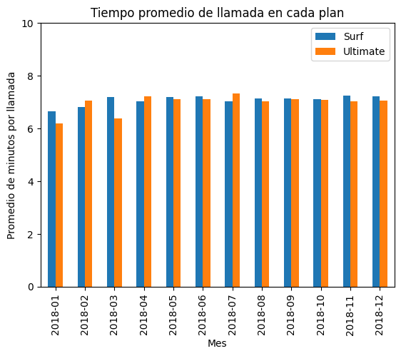
    


```python
# Comparar el número de minutos que tienden a usar cada mes los usuarios de cada plan

# Calcular el número de minutos usados al mes para el plan surf
# Filtrar los registros == surf
minutes_surf = consumo_mes_usuario[consumo_mes_usuario['plan_name'] == 'surf']

# Agrupamos los registros en el dataframe minutes_surf, usando month_x como pivote, y obteniendo el promedio de la columna 'minutes_per_user_per_month'
minutes_surf_group =minutes_surf.groupby(['month_x']).agg({'minutes_per_user_per_month': 'mean'})

# Calcular el número de minutos usados al mes para el plan ultimate
# Filtrar los registros == ultimate
minutes_ultimate = consumo_mes_usuario[consumo_mes_usuario['plan_name'] == 'ultimate']

# Agrupamos los registros en el dataframe minutes_ultimate, usando month_x como pivote, y obteniendo el promedio de la columna 'minutes_per_user_per_month'
minutes_ultimate_group =minutes_ultimate.groupby(['month_x']).agg({'minutes_per_user_per_month': 'mean'})


# Consolidamos un solo dataframe los datos de promedio de minutos en surf y ultimate, para poder graficarlo
minutes_mes = minutes_surf_group.merge(minutes_ultimate_group, on='month_x', how='left')
print(minutes_mes.head(15))
# graficamos en barras
minutes_mes.plot(kind='bar', stacked=False)
plt.title('Minutos usados por cada usuario al mes en cada plan')
plt.xlabel('Mes')
plt.ylabel('Promedio de minutos usados por cada usuario')
#plt.ylim(0,10)
plt.legend(['Surf','Ultimate'])
plt.show()
```

             minutes_per_user_per_month_x  minutes_per_user_per_month_y
    month_x                                                            
    2018-01                    203.000000                    193.500000
    2018-02                    297.000000                    470.333333
    2018-03                    330.000000                    304.250000
    2018-04                    351.540000                    336.857143
    2018-05                    410.240000                    406.241379
    2018-06                    435.791667                    387.444444
    2018-07                    453.733333                    427.067797
    2018-08                    417.849057                    421.436620
    2018-09                    420.732984                    437.511628
    2018-10                    438.991379                    455.028571
    2018-11                    432.494585                    448.730159
    2018-12                    484.501608                    465.261745
    


    
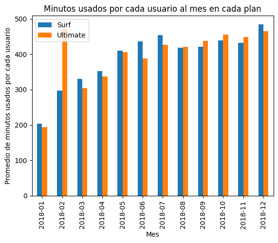
    


```python
# Comparar el número de minutos mensuales que necesitan los usuarios de cada plan. Trazar un histograma.

# Usaremos los df que antes creamos, llamadas_surf y llamadas_ultimate, que ya tiene filtrados los registros por cada plan
#    y en los que cada registro muestra el consumo de los usuarios sumarizado por mes.

# Definimos histograma de surf con eje x usando minutes_per_user_per_month y eje y usando la frecuencia
llamadas_surf['minutes_per_user_per_month'].plot(kind='hist', bins=20)
# Definimos histograma de ultimate con eje x usando minutes_per_user_per_month y eje y usando la frecuencia
llamadas_ultimate['minutes_per_user_per_month'].plot(kind='hist', bins=20,alpha=.5)
# Trazamos histograma
plt.legend(['Surf','Ultimate'])
plt.title('Minutos usados en promedio por usuario por cada mes en cada plan')
plt.xlabel('Minutos')
plt.ylabel('Frecuencia (Muestras por Usuario-Mes)')
plt.show()


```


    
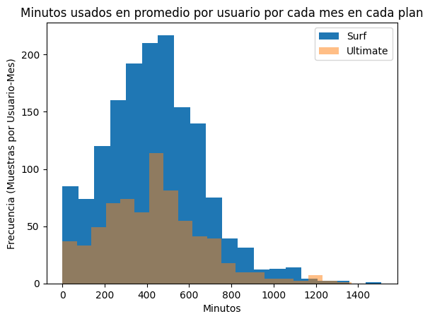
    


Calcularemos la media y la variable de la duración de las llamadas para averiguar si los usuarios de los distintos planes se comportan de forma diferente al realizar sus llamadas.


```python
# Calcular la media y la varianza de la duración mensual de llamadas.

# Calculamos la media y la varianza de 'minutes_per_user_per_month' en llamadas_surf['minutes_per_user_per_month']
print("Surf - Comportamiento de la variable 'minutes_per_user_per_month'")
print()
print("Media: ", llamadas_surf['minutes_per_user_per_month'].mean())
print("Varianza: ",llamadas_surf['minutes_per_user_per_month'].var())
print("Desv.Std.: ",llamadas_surf['minutes_per_user_per_month'].std())
print("Min: ",llamadas_surf['minutes_per_user_per_month'].min())
print("Max: ",llamadas_surf['minutes_per_user_per_month'].max())
print()

# Calculamos la media y la varianza de 'minutes_per_user_per_month' en llamadas_ultimate['minutes_per_user_per_month']
print("Ultimate - Comportamiento de la variable 'minutes_per_user_per_month'")
print()
print("Media: ", llamadas_ultimate['minutes_per_user_per_month'].mean())
print("Varianza: ",llamadas_ultimate['minutes_per_user_per_month'].var())
print("Desv.Std.: ",llamadas_ultimate['minutes_per_user_per_month'].std())
print("Min: ",llamadas_ultimate['minutes_per_user_per_month'].min())
print("Max: ",llamadas_ultimate['minutes_per_user_per_month'].max())
print()
```

    Surf - Comportamiento de la variable 'minutes_per_user_per_month'
    
    Media:  436.51974110032364
    Varianza:  52571.063243456105
    Desv.Std.:  229.28380501783397
    Min:  0.0
    Max:  1510.0
    
    Ultimate - Comportamiento de la variable 'minutes_per_user_per_month'
    
    Media:  434.67601683029454
    Varianza:  56573.632247033456
    Desv.Std.:  237.85212264563344
    Min:  0.0
    Max:  1369.0
    
    


```python
# Trazar un diagrama de caja para visualizar la distribución de la duración mensual de llamadas
# Surf - Boxplot para 'minutes_per_user_per_month'
print("Boxplot para 'minutes_per_user_per_month' Surf: ")
sns.boxplot(llamadas_surf['minutes_per_user_per_month'])

```

    Boxplot para 'minutes_per_user_per_month' Surf: 
    


    <Axes: ylabel='minutes_per_user_per_month'>


    
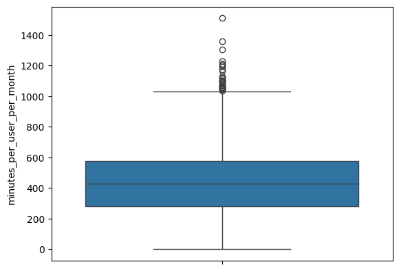
    


```python
# Ultimate - Boxplot para 'minutes_per_user_per_month'
print("Boxplot para 'minutes_per_user_per_month' Ultimate: ")
sns.boxplot(llamadas_ultimate['minutes_per_user_per_month'])
```

    Boxplot para 'minutes_per_user_per_month' Ultimate: 
    


    <Axes: ylabel='minutes_per_user_per_month'>


    
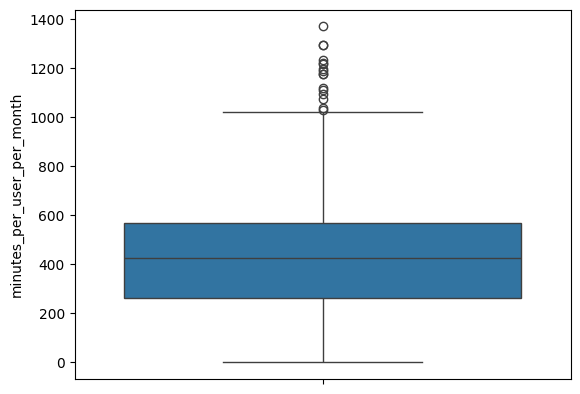
    


CONCLUSION GENERAL - LLAMADAS:

El comportamiento de llamadas en ambos planes resulta muy similar en todos los aspectos analizados, incluyendo: (1) tiempo-promedio por llamada por mes, (2) minutos usados por usuario al mes, (3) media, desv.std, máximo de la distribución de minutos usados por usuario por mes, (4) Analisis de cuartiles presentando los minutos usados por usuario por mes.

Consumo mensual: En ambos planes se tiene un tiempo promedio muy similar en cada mes, cercano a 7.2 minutos por llamada.

Medidas de posición y de variabilidad: Son muy similares (Surf,Ulimate): media (436,434), desv std (229,237), max (1510,1369). En analisis de cuartiles vemos que la mediana está cerca de 400 en ambos planes y la gráfica de caja es prácticamente igual.

### 5.2. Mensajes


```python
# Comparar el número de mensajes que tienden a enviar cada mes los usuarios de cada plan

# Calcular el número de mensajes usados al mes para el plan surf
# Filtrar los registros == surf
mensajes_surf = consumo_mes_usuario[consumo_mes_usuario['plan_name'] == 'surf']

# Agrupamos los registros en el dataframe messages_surf, usando month_x como pivote, y obteniendo el promedio de la columna 'messages_per_user_per_month'
mensajes_surf_group =mensajes_surf.groupby(['month_x']).agg({'messages_per_user_per_month': 'mean'})

# Calcular el número de mensajes usados al mes para el plan ultimate
# Filtrar los registros == ultimate
mensajes_ultimate = consumo_mes_usuario[consumo_mes_usuario['plan_name'] == 'ultimate']

# Agrupamos los registros en el dataframe messages_ultimate, usando month_x como pivote, y obteniendo el promedio de la columna 'messages_per_user_per_month'
mensajes_ultimate_group =mensajes_ultimate.groupby(['month_x']).agg({'messages_per_user_per_month': 'mean'})


# Consolidamos un solo dataframe los datos de promedio de mensajes en surf y ultimate, para poder graficarlo
mensajes_mes = mensajes_surf_group.merge(mensajes_ultimate_group, on='month_x', how='left')
print(mensajes_mes.head(15))
# graficamos en barras
mensajes_mes.plot(kind='bar', stacked=False)
plt.title('Mensajes enviados por cada usuario al mes en cada plan')
plt.xlabel('Mes')
plt.ylabel('Promedio de mensajes enviados por cada usuario')
#plt.ylim(0,10)
plt.legend(['Surf','Ultimate'])
plt.show()

```

             messages_per_user_per_month_x  messages_per_user_per_month_y
    month_x                                                              
    2018-01                      21.000000                      20.666667
    2018-02                      21.600000                      25.166667
    2018-03                      21.937500                      34.714286
    2018-04                      24.166667                      28.937500
    2018-05                      33.017857                      44.333333
    2018-06                      33.616438                      36.289474
    2018-07                      35.945055                      41.212766
    2018-08                      37.596774                      47.929825
    2018-09                      39.523179                      45.901408
    2018-10                      42.433862                      46.977528
    2018-11                      40.553097                      47.601942
    2018-12                      48.326772                      53.936508
    


    
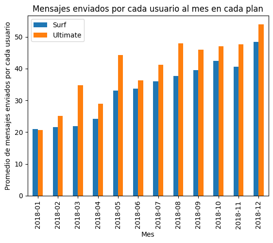
    


```python
# Ahora compararemos el número de mensajes mensuales que necesitan los usuarios de cada plan. Trazaremos un histograma.

# Usaremos los df que antes creamos, mensajes_surf y mensajes_ultimate, que ya tiene filtrados los registros por cada plan
#    y en los que cada registro muestra el consumo de los usuarios sumarizado por mes.
print(mensajes_surf.head(10))
mensajes_surf.info()


# Definimos histograma de surf con eje x usando minutes_per_user_per_month y eje y usando la frecuencia
mensajes_surf['messages_per_user_per_month'].plot(kind='hist', bins=[0,20, 40, 60,80,100,120,140,160,180,200,220,240,260,280,300,320,340,360,380,400])
# Definimos histograma de ultimate con eje x usando minutes_per_user_per_month y eje y usando la frecuencia
mensajes_ultimate['messages_per_user_per_month'].plot(kind='hist', bins=[0,20, 40, 60,80,100,120,140,160,180,200,220,240,260,280,300,320,340,360,380,400],alpha=.5)
# Trazamos histograma
plt.legend(['Surf','Ultimate'])
plt.title('Mensajes enviados por usuario por cada mes en cada plan')
plt.xlabel('Número de mensajes')
plt.ylabel('Frecuencia (Muestras por Usuario-Mes)')
plt.show()


```

        user_id  month_x  calls_per_user_per_month  minutes_per_user_per_month  \
    1      1001  2018-08                      27.0                       182.0   
    2      1001  2018-09                      49.0                       315.0   
    3      1001  2018-10                      65.0                       393.0   
    4      1001  2018-11                      64.0                       426.0   
    5      1001  2018-12                      56.0                       412.0   
    6      1002  2018-10                      11.0                        59.0   
    7      1002  2018-11                      55.0                       386.0   
    8      1002  2018-12                      47.0                       384.0   
    9      1003  2018-12                     149.0                      1104.0   
    10     1004  2018-05                      21.0                       193.0   
    
        messages_per_user_per_month  gb_per_user_per_month plan_name  \
    1                          30.0                    7.0      surf   
    2                          44.0                   14.0      surf   
    3                          53.0                   23.0      surf   
    4                          36.0                   19.0      surf   
    5                          44.0                   20.0      surf   
    6                          15.0                    7.0      surf   
    7                          32.0                   20.0      surf   
    8                          41.0                   15.0      surf   
    9                          50.0                   28.0      surf   
    10                          7.0                    7.0      surf   
    
        usd_monthly_pay  minutes_included  usd_per_minute  messages_included  \
    1              20.0               500            0.03                 50   
    2              20.0               500            0.03                 50   
    3              20.0               500            0.03                 50   
    4              20.0               500            0.03                 50   
    5              20.0               500            0.03                 50   
    6              20.0               500            0.03                 50   
    7              20.0               500            0.03                 50   
    8              20.0               500            0.03                 50   
    9              20.0               500            0.03                 50   
    10             20.0               500            0.03                 50   
    
        usd_per_message  gb_per_month_included  usd_per_gb  \
    1              0.03                   15.0        10.0   
    2              0.03                   15.0        10.0   
    3              0.03                   15.0        10.0   
    4              0.03                   15.0        10.0   
    5              0.03                   15.0        10.0   
    6              0.03                   15.0        10.0   
    7              0.03                   15.0        10.0   
    8              0.03                   15.0        10.0   
    9              0.03                   15.0        10.0   
    10             0.03                   15.0        10.0   
    
        costo_de_minutos_en_exceso  costo_de_mensajes_en_exceso  \
    1                         0.00                         0.00   
    2                         0.00                         0.00   
    3                         0.00                         0.09   
    4                         0.00                         0.00   
    5                         0.00                         0.00   
    6                         0.00                         0.00   
    7                         0.00                         0.00   
    8                         0.00                         0.00   
    9                        18.12                         0.00   
    10                        0.00                         0.00   
    
        costo_de_gb_en_exceso  
    1                     0.0  
    2                     0.0  
    3                    80.0  
    4                    40.0  
    5                    50.0  
    6                     0.0  
    7                    50.0  
    8                     0.0  
    9                   130.0  
    10                    0.0  
    <class 'pandas.core.frame.DataFrame'>
    Index: 1573 entries, 1 to 2292
    Data columns (total 17 columns):
     #   Column                       Non-Null Count  Dtype    
    ---  ------                       --------------  -----    
     0   user_id                      1573 non-null   int64    
     1   month_x                      1573 non-null   period[M]
     2   calls_per_user_per_month     1545 non-null   float64  
     3   minutes_per_user_per_month   1545 non-null   float64  
     4   messages_per_user_per_month  1222 non-null   float64  
     5   gb_per_user_per_month        1558 non-null   float64  
     6   plan_name                    1573 non-null   object   
     7   usd_monthly_pay              1573 non-null   float64  
     8   minutes_included             1573 non-null   int64    
     9   usd_per_minute               1573 non-null   float64  
     10  messages_included            1573 non-null   int64    
     11  usd_per_message              1573 non-null   float64  
     12  gb_per_month_included        1573 non-null   float64  
     13  usd_per_gb                   1573 non-null   float64  
     14  costo_de_minutos_en_exceso   1573 non-null   float64  
     15  costo_de_mensajes_en_exceso  1573 non-null   float64  
     16  costo_de_gb_en_exceso        1573 non-null   float64  
    dtypes: float64(12), int64(3), object(1), period[M](1)
    memory usage: 221.2+ KB
    


    
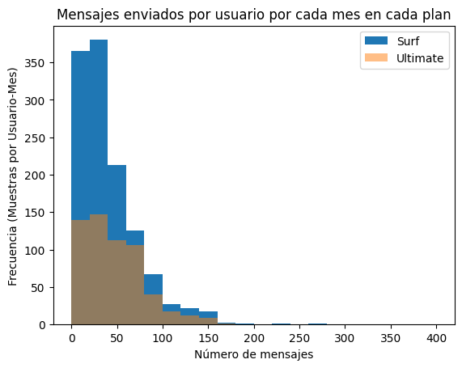
    


```python
# Calcula la media y la varianza de mensajes enviados.

# Calculamos la media y la varianza de 'messages_per_user_per_month' en llamadas_surf['messages_per_user_per_month']
print("Surf - Comportamiento de la variable 'messages_per_user_per_month'")
print()
print("Media: ", mensajes_surf['messages_per_user_per_month'].mean())
print("Varianza: ",mensajes_surf['messages_per_user_per_month'].var())
print("Desv.Std.: ",mensajes_surf['messages_per_user_per_month'].std())
print("Min.: ",mensajes_surf['messages_per_user_per_month'].min())
print("Max: ",mensajes_surf['messages_per_user_per_month'].max())
print()

# Calculamos la media y la varianza de 'messages_per_user_per_month' en llamadas_ultimate['messages_per_user_per_month']
print("Ultimate - Comportamiento de la variable 'messages_per_user_per_month'")
print()
print("Media: ", mensajes_ultimate['messages_per_user_per_month'].mean())
print("Varianza: ",mensajes_ultimate['messages_per_user_per_month'].var())
print("Desv.Std.: ",mensajes_ultimate['messages_per_user_per_month'].std())
print("Min.: ",mensajes_ultimate['messages_per_user_per_month'].min())
print("Max: ",mensajes_ultimate['messages_per_user_per_month'].max())
print()
```

    Surf - Comportamiento de la variable 'messages_per_user_per_month'
    
    Media:  40.10965630114566
    Varianza:  1091.3442310038074
    Desv.Std.:  33.03549955735205
    Min.:  1.0
    Max:  266.0
    
    Ultimate - Comportamiento de la variable 'messages_per_user_per_month'
    
    Media:  46.29623287671233
    Varianza:  1085.1831075683178
    Desv.Std.:  32.94211753315682
    Min.:  1.0
    Max:  166.0
    
    


```python
# Ahora trazaremos un diagrama de caja para visualizar la distribución mensual del envío de los mensajes
# Surf - Boxplot para 'messages_per_user_per_month'
print("Boxplot para 'messages_per_user_per_month' Surf: ")
sns.boxplot(mensajes_surf['messages_per_user_per_month'])
```

    Boxplot para 'messages_per_user_per_month' Surf: 
    


    <Axes: ylabel='messages_per_user_per_month'>


    
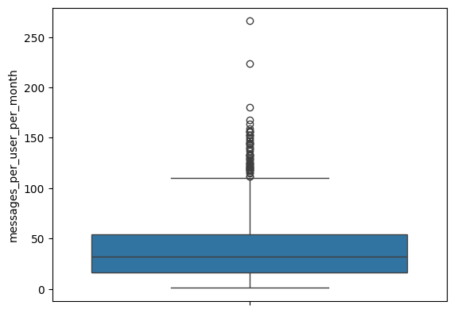
    


```python
# Ultimate - Boxplot para 'messages_per_user_per_month'
print("Boxplot para 'messages_per_user_per_month' Ultimate: ")
sns.boxplot(mensajes_ultimate['messages_per_user_per_month'])
```

    Boxplot para 'messages_per_user_per_month' Ultimate: 
    


    <Axes: ylabel='messages_per_user_per_month'>


    
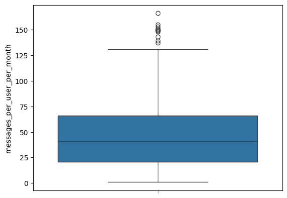
    


```python

```

CONCLUSIÓN GENERAL - MENSAJES SMS:

Los usuarios de ambos planes presentan comportamiento similar en cuanto al uso de los mensajes. Parece que tenamos oportunidad de reducir el límite máximo de mensajes de Ultimate, "de 1,000 a 75 mensajes" si es que queremos cobrar al 4o cuartil, o bien en "de 1,000 a 130 mensajes" si es que queremos cobrar a los usuarios que mandan exceso de mensajes en forma atípica.

- Consumo mensual: Ambos planes presentan un comportamiento creciente en cuanto al número de mensajes que se envían. Creciendo de enero 2018 a diciembre 2018, de cerca de 20 mensajes/mes a 50 mensajes/mes. Este dato parece sugerir que el límite de 50 establecido para Surf es correcto, mientras que el límite de 1,000 establecido para Ultimate parece excesivo.

- Medidas de posición y de variabilidad:
  - Los usuarios de Surf envían en promedio 40 mensajes al mes con Desv Est de 1085, min=1 y max=266. Vemos que todo el 4o Cuartil de las muestras, excede el número de mensajes disiponibles sin costo (50).

  - Los usuarios de Ultimate envían en promedio 46 mensajes al mes  con Desv Est de 1091, min=1 y max=166. Vemos que ningún usuario usa mas de 166 mensajes. Pareciera que el límite de 1,000, es demasiado grande.


### 5.3. Internet


```python
# ComparaR la cantidad de tráfico de Internet consumido por usuarios por plan

# Calcular el número de gb usados al mes para el plan surf
# Filtrar los registros == surf
datos_surf = consumo_mes_usuario[consumo_mes_usuario['plan_name'] == 'surf']

# Agrupamos los registros en el dataframe datos_surf, usando month_x como pivote, y obteniendo el promedio de la columna 'gb_per_user_per_month'
datos_surf_group =mensajes_surf.groupby(['month_x']).agg({'gb_per_user_per_month': 'mean'})

# Calcular el número de gb usados al mes para el plan ultimate
# Filtrar los registros == ultimate
datos_ultimate = consumo_mes_usuario[consumo_mes_usuario['plan_name'] == 'ultimate']

# Agrupamos los registros en el dataframe datos_ultimate, usando month_x como pivote, y obteniendo el promedio de la columna 'gb_per_user_per_month'
datos_ultimate_group =datos_ultimate.groupby(['month_x']).agg({'gb_per_user_per_month': 'mean'})


# Consolidamos un solo dataframe los datos de promedio de gb usados en surf y ultimate, para poder graficarlo
datos_mes = datos_surf_group.merge(datos_ultimate_group, on='month_x', how='left')
print(datos_mes.head(15))
# graficamos en barras
datos_mes.plot(kind='bar', stacked=False)
plt.title('Datos usados por cada usuario al mes en cada plan')
plt.xlabel('Mes')
plt.ylabel('Promedio de datous usados por cada usuario (gb)')
plt.ylim(0,20)
plt.legend(['Surf','Ultimate'])
plt.show()
```

             gb_per_user_per_month_x  gb_per_user_per_month_y
    month_x                                                  
    2018-01                 5.000000                 7.250000
    2018-02                12.666667                17.571429
    2018-03                13.782609                18.833333
    2018-04                12.673469                16.476190
    2018-05                14.644737                17.068966
    2018-06                16.094737                15.829787
    2018-07                17.441667                16.813559
    2018-08                17.578616                18.380282
    2018-09                17.160622                17.534884
    2018-10                18.000000                18.257143
    2018-11                16.957295                17.543307
    2018-12                18.671924                18.841060
    


    
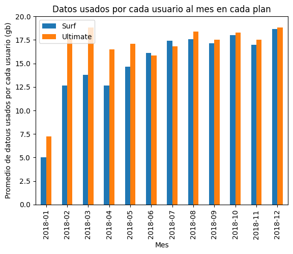
    


```python
# Ahora compararemos el número de datos que consumen los usuarios de cada plan mensualmente. Trazaremos un histograma.

# Usaremos los df que antes creamos, datos_surf y datos_ultimate, que ya tiene filtrados los registros por cada plan
#    y en los que cada registro muestra el consumo de los usuarios sumarizado por mes.
print(datos_surf.head(10))
datos_surf.info()

# Definimos histograma de surf con eje x usando gb_per_user_per_month y eje y usando la frecuencia
mensajes_surf['gb_per_user_per_month'].plot(kind='hist', bins= [0,5,10,15,20,25,30,35,40,45,50,55,60,65,70,75,80])
# Definimos histograma de ultimate con eje x usando gb_per_user_per_month y eje y usando la frecuencia
mensajes_ultimate['gb_per_user_per_month'].plot(kind='hist', bins=[0,5,10,15,20,25,30,35,40,45,50,55,60,65,70,75,80],alpha=.5)
# Trazamos histograma
plt.legend(['Surf','Ultimate'])
plt.title('Datos usados por usuario por cada mes en cada plan')
plt.xlabel('Datos usados (gb)')
plt.ylabel('Frecuencia (Muestras por Usuario-Mes)')
plt.show()
```

        user_id  month_x  calls_per_user_per_month  minutes_per_user_per_month  \
    1      1001  2018-08                      27.0                       182.0   
    2      1001  2018-09                      49.0                       315.0   
    3      1001  2018-10                      65.0                       393.0   
    4      1001  2018-11                      64.0                       426.0   
    5      1001  2018-12                      56.0                       412.0   
    6      1002  2018-10                      11.0                        59.0   
    7      1002  2018-11                      55.0                       386.0   
    8      1002  2018-12                      47.0                       384.0   
    9      1003  2018-12                     149.0                      1104.0   
    10     1004  2018-05                      21.0                       193.0   
    
        messages_per_user_per_month  gb_per_user_per_month plan_name  \
    1                          30.0                    7.0      surf   
    2                          44.0                   14.0      surf   
    3                          53.0                   23.0      surf   
    4                          36.0                   19.0      surf   
    5                          44.0                   20.0      surf   
    6                          15.0                    7.0      surf   
    7                          32.0                   20.0      surf   
    8                          41.0                   15.0      surf   
    9                          50.0                   28.0      surf   
    10                          7.0                    7.0      surf   
    
        usd_monthly_pay  minutes_included  usd_per_minute  messages_included  \
    1              20.0               500            0.03                 50   
    2              20.0               500            0.03                 50   
    3              20.0               500            0.03                 50   
    4              20.0               500            0.03                 50   
    5              20.0               500            0.03                 50   
    6              20.0               500            0.03                 50   
    7              20.0               500            0.03                 50   
    8              20.0               500            0.03                 50   
    9              20.0               500            0.03                 50   
    10             20.0               500            0.03                 50   
    
        usd_per_message  gb_per_month_included  usd_per_gb  \
    1              0.03                   15.0        10.0   
    2              0.03                   15.0        10.0   
    3              0.03                   15.0        10.0   
    4              0.03                   15.0        10.0   
    5              0.03                   15.0        10.0   
    6              0.03                   15.0        10.0   
    7              0.03                   15.0        10.0   
    8              0.03                   15.0        10.0   
    9              0.03                   15.0        10.0   
    10             0.03                   15.0        10.0   
    
        costo_de_minutos_en_exceso  costo_de_mensajes_en_exceso  \
    1                         0.00                         0.00   
    2                         0.00                         0.00   
    3                         0.00                         0.09   
    4                         0.00                         0.00   
    5                         0.00                         0.00   
    6                         0.00                         0.00   
    7                         0.00                         0.00   
    8                         0.00                         0.00   
    9                        18.12                         0.00   
    10                        0.00                         0.00   
    
        costo_de_gb_en_exceso  
    1                     0.0  
    2                     0.0  
    3                    80.0  
    4                    40.0  
    5                    50.0  
    6                     0.0  
    7                    50.0  
    8                     0.0  
    9                   130.0  
    10                    0.0  
    <class 'pandas.core.frame.DataFrame'>
    Index: 1573 entries, 1 to 2292
    Data columns (total 17 columns):
     #   Column                       Non-Null Count  Dtype    
    ---  ------                       --------------  -----    
     0   user_id                      1573 non-null   int64    
     1   month_x                      1573 non-null   period[M]
     2   calls_per_user_per_month     1545 non-null   float64  
     3   minutes_per_user_per_month   1545 non-null   float64  
     4   messages_per_user_per_month  1222 non-null   float64  
     5   gb_per_user_per_month        1558 non-null   float64  
     6   plan_name                    1573 non-null   object   
     7   usd_monthly_pay              1573 non-null   float64  
     8   minutes_included             1573 non-null   int64    
     9   usd_per_minute               1573 non-null   float64  
     10  messages_included            1573 non-null   int64    
     11  usd_per_message              1573 non-null   float64  
     12  gb_per_month_included        1573 non-null   float64  
     13  usd_per_gb                   1573 non-null   float64  
     14  costo_de_minutos_en_exceso   1573 non-null   float64  
     15  costo_de_mensajes_en_exceso  1573 non-null   float64  
     16  costo_de_gb_en_exceso        1573 non-null   float64  
    dtypes: float64(12), int64(3), object(1), period[M](1)
    memory usage: 221.2+ KB
    


    
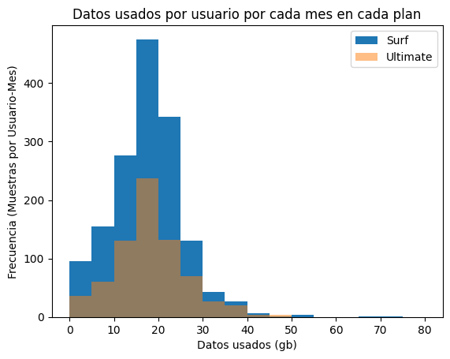
    


```python
# Calcular la media y la varianza de datos usados

# Calculamos la media y la varianza de 'gb_per_user_per_month' en datos_surf['gb_per_user_per_month']
print("Surf - Comportamiento de la variable 'gb_per_user_per_month'")
print()
print("Media: ", datos_surf['gb_per_user_per_month'].mean())
print("Varianza: ",datos_surf['gb_per_user_per_month'].var())
print("Desv.Std.: ",datos_surf['gb_per_user_per_month'].std())
print()

# Calculamos la media y la varianza de 'gb_per_user_per_month' en datos_ultimate['gb_per_user_per_month']
print("Ultimate - Comportamiento de la variable 'gb_per_user_per_month'")
print()
print("Media: ", datos_ultimate['gb_per_user_per_month'].mean())
print("Varianza: ",datos_ultimate['gb_per_user_per_month'].var())
print("Desv.Std.: ",datos_ultimate['gb_per_user_per_month'].std())
print()
```

    Surf - Comportamiento de la variable 'gb_per_user_per_month'
    
    Media:  17.201540436456995
    Varianza:  62.058263521485216
    Desv.Std.:  7.877706742541589
    
    Ultimate - Comportamiento de la variable 'gb_per_user_per_month'
    
    Media:  17.744089012517385
    Varianza:  61.51102002549187
    Desv.Std.:  7.84289615037021
    
    


```python
# Ahora trazaremos un diagrama de caja para visualizar la distribución mensual del consumo de datos
# Surf - Boxplot para 'gb_per_user_per_month'
print("Boxplot para 'gb_per_user_per_month' Surf: ")
sns.boxplot(datos_surf['gb_per_user_per_month'])
```

    Boxplot para 'gb_per_user_per_month' Surf: 
    


    <Axes: ylabel='gb_per_user_per_month'>


    
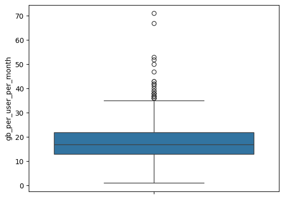
    


```python
# Ultimate - Boxplot para 'gb_per_user_per_month'
print("Boxplot para 'gb_per_user_per_month' Ultimate: ")
sns.boxplot(datos_ultimate['gb_per_user_per_month'])
```

    Boxplot para 'gb_per_user_per_month' Ultimate: 
    


    <Axes: ylabel='gb_per_user_per_month'>


    
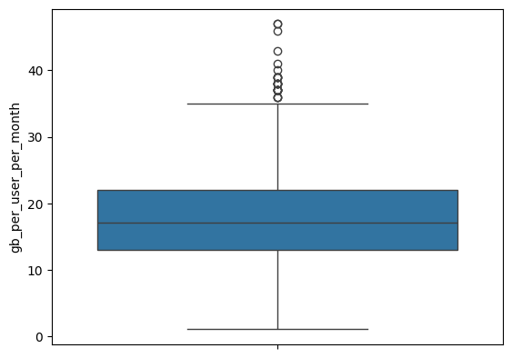
    


CONCLUSIONES GENERALES - CONSUMO DE DATOS:

Los usuarios de ambos planes presentan comportamiento similar en cuanto al consumo de datos para internet de internet.

- Consumo mensual: En ambos planes el consumo promedio de datos por usuario es cercano a los 19gb/mes. Esto nos da un indicativo de que los 15gb tope para usuarios Surf es razonable, sin embargo para usuarios Ultimate el límite de 30gb parece muy alto.

- Medidas de posición y de variabilidad: Los histogramas peresentan formas muy similares. La media y desviación estándar son casí iguales: surf (17.2,62.0) y ultimate (17.7,61.5). El análisis de cuartiles también es prácticamente igual en ambos planes.


```python

```

## 5.4. Ingreso

Similar a lo que hicimos antes con el consumo de llamadas, SMSs y consumo de datos, estudiaremos ahora el comportamiento estadístico de los ingresos.


```python
# INGRESOS POR MINUTOS USADOS

# Comparamos el INGRESO derivado del número de minutos que tienden a usar cada mes los usuarios de cada plan

# Calcular el número de minutos usados al mes para el plan surf
# Filtrar los registros == surf
minutes_surf = consumo_mes_usuario[consumo_mes_usuario['plan_name'] == 'surf']

# Agrupamos los registros en el dataframe minutes_surf, usando month_x como pivote, y obteniendo el promedio de la columna 'minutes_per_user_per_month'
minutes_surf_group_cost =minutes_surf.groupby(['month_x']).agg({'costo_de_minutos_en_exceso': 'mean'})

# Calcular el número de minutos usados al mes para el plan ultimate
# Filtrar los registros == ultimate
minutes_ultimate = consumo_mes_usuario[consumo_mes_usuario['plan_name'] == 'ultimate']

# Agrupamos los registros en el dataframe minutes_ultimate, usando month_x como pivote, y obteniendo el promedio de la columna 'minutes_per_user_per_month'
minutes_ultimate_group_cost =minutes_ultimate.groupby(['month_x']).agg({'costo_de_minutos_en_exceso': 'mean'})


# Consolidamos un solo dataframe los datos de promedio de minutos en surf y ultimate, para poder graficarlo
minutes_mes_cost = minutes_surf_group_cost.merge(minutes_ultimate_group_cost, on='month_x', how='left')
print(minutes_mes_cost.head(15))
# graficamos en barras
minutes_mes_cost.plot(kind='bar', stacked=False)
plt.title('Ingresos de minutos usados por cada usuario al mes en cada plan')
plt.xlabel('Mes')
plt.ylabel('Ingreso promedio de minutos por cada usuario (USD)')
#plt.ylim(0,10)
plt.legend(['Surf','Ultimate'])
plt.show()
```

             costo_de_minutos_en_exceso_x  costo_de_minutos_en_exceso_y
    month_x                                                            
    2018-01                      0.000000                           0.0
    2018-02                      1.036667                           0.0
    2018-03                      0.706957                           0.0
    2018-04                      1.058400                           0.0
    2018-05                      1.658571                           0.0
    2018-06                      1.601134                           0.0
    2018-07                      2.198182                           0.0
    2018-08                      1.652222                           0.0
    2018-09                      1.435979                           0.0
    2018-10                      1.794304                           0.0
    2018-11                      1.751131                           0.0
    2018-12                      2.533585                           0.0
    


    
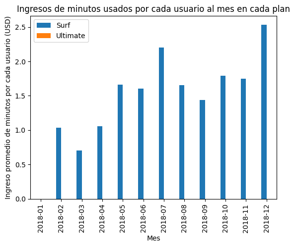
    


```python
# Comparamos ahora el ingreso por usuarios por mes en cada plan. Trazamos un histograma.

# Usaremos los df que antes creamos, minutes_surf y minutes_ultimate, que ya tiene filtrados los registros por cada plan
#    y en los que cada registro muestra el consumo de los usuarios sumarizado por mes.

# Definimos histograma de surf con eje x usando minutes_per_user_per_month y eje y usando la frecuencia
minutes_surf['costo_de_minutos_en_exceso'].plot(kind='hist', bins=40)
# Definimos histograma de ultimate con eje x usando minutes_per_user_per_month y eje y usando la frecuencia
minutes_ultimate['costo_de_minutos_en_exceso'].plot(kind='hist', bins=40,alpha=.5)
# Trazamos histograma
plt.legend(['Surf','Ultimate'])
plt.title('Ingresos por minutos usados, por usuario por cada mes, en cada plan')
plt.xlabel('USD')
plt.ylabel('Frecuencia (Muestras por Usuario-Mes)')
plt.show()
```


    
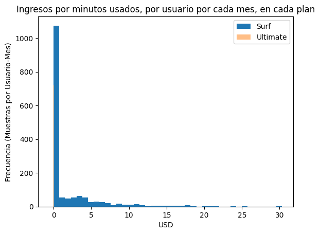
    


```python
# Calculamos ahora la media y la varianza de los ingresos por minutos de llamadas.

# Calculamos la media y la varianza de 'costo_de_minutos_en_exceso' en minutes_surf['costo_de_minutos_en_exceso']
print("Surf - Comportamiento de la variable 'costo_de_minutos_en_exceso'")
print()
print("Media: ", minutes_surf['costo_de_minutos_en_exceso'].mean())
print("Varianza: ",minutes_surf['costo_de_minutos_en_exceso'].var())
print("Desv.Std.: ",minutes_surf['costo_de_minutos_en_exceso'].std())
print("Min: ",minutes_surf['costo_de_minutos_en_exceso'].min())
print("Max: ",minutes_surf['costo_de_minutos_en_exceso'].max())
print()
print("Descripción: ", minutes_surf['costo_de_minutos_en_exceso'].describe())
print()

# Calculamos la media y la varianza de 'costo_de_minutos_en_exceso' en llamadas_ultimate['costo_de_minutos_en_exceso']
print("Ultimate - Comportamiento de la variable 'costo_de_minutos_en_exceso'")
print()
print("Media: ", minutes_ultimate['costo_de_minutos_en_exceso'].mean())
print("Varianza: ",minutes_ultimate['costo_de_minutos_en_exceso'].var())
print("Desv.Std.: ",minutes_ultimate['costo_de_minutos_en_exceso'].std())
print("Min: ",minutes_ultimate['costo_de_minutos_en_exceso'].min())
print("Max: ",minutes_ultimate['costo_de_minutos_en_exceso'].max())
print()
print("Descripción: ", minutes_ultimate['costo_de_minutos_en_exceso'].describe())
print()
```

    Surf - Comportamiento de la variable 'costo_de_minutos_en_exceso'
    
    Media:  1.8437698664971391
    Varianza:  14.180830880847152
    Desv.Std.:  3.765744399298385
    Min:  0.0
    Max:  30.299999999999997
    
    Descripción:  count    1573.000000
    mean        1.843770
    std         3.765744
    min         0.000000
    25%         0.000000
    50%         0.000000
    75%         2.280000
    max        30.300000
    Name: costo_de_minutos_en_exceso, dtype: float64
    
    Ultimate - Comportamiento de la variable 'costo_de_minutos_en_exceso'
    
    Media:  0.0
    Varianza:  0.0
    Desv.Std.:  0.0
    Min:  0.0
    Max:  0.0
    
    Descripción:  count    720.0
    mean       0.0
    std        0.0
    min        0.0
    25%        0.0
    50%        0.0
    75%        0.0
    max        0.0
    Name: costo_de_minutos_en_exceso, dtype: float64
    
    


```python
# Trazamos un diagrama de caja para visualizar la distribución de los ingresos por llamadas
# Surf - Boxplot para 'costo_de_minutos_en_exceso'
print("Boxplot para 'costo_de_minutos_en_exceso' Surf: ")
sns.boxplot(minutes_surf['costo_de_minutos_en_exceso'])

# Ultimate - No hacemos una gráfica, puesto que ya sabemos que ningún usuario pagó por llamadas.
```

    Boxplot para 'costo_de_minutos_en_exceso' Surf: 
    


    <Axes: ylabel='costo_de_minutos_en_exceso'>


    
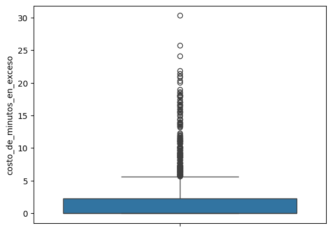
    


```python
# INGRESOS POR MENSAJES ENVIADOS

# Comparamos el INGRESO derivado de mensajes enviados que tienden a enviar cada mes los usuarios de cada plan

# Calcular el número de mensajes enviados al mes para el plan surf
# Filtrar los registros == surf
messages_surf = consumo_mes_usuario[consumo_mes_usuario['plan_name'] == 'surf']

# Agrupamos los registros en el dataframe messages_surf, usando month_x como pivote, y obteniendo el promedio de la columna 'costo_de_mensajes_en_exceso'
messages_surf_group_cost =messages_surf.groupby(['month_x']).agg({'costo_de_mensajes_en_exceso': 'mean'})

# Calcular el número de mensajes enviados al mes para el plan ultimate
# Filtrar los registros == ultimate
messages_ultimate = consumo_mes_usuario[consumo_mes_usuario['plan_name'] == 'ultimate']

# Agrupamos los registros en el dataframe messages_ultimate, usando month_x como pivote, y obteniendo el promedio de la columna 'costo_de_mensajes_en_exceso'
messages_ultimate_group_cost =messages_ultimate.groupby(['month_x']).agg({'costo_de_mensajes_en_exceso': 'mean'})


# Consolidamos un solo dataframe los datos de promedio de minutos en surf y ultimate, para poder graficarlo
messages_mes_cost = messages_surf_group_cost.merge(messages_ultimate_group_cost, on='month_x', how='left')
print(messages_mes_cost.head(15))
# graficamos en barras
messages_mes_cost.plot(kind='bar', stacked=False)
plt.title('Ingresos de mensajes enviados por cada usuario al mes en cada plan')
plt.xlabel('Mes')
plt.ylabel('Ingreso promedio de menajes enviados por cada usuario')
#plt.ylim(0,10)
plt.legend(['Surf','Ultimate'])
plt.show()
```

             costo_de_mensajes_en_exceso_x  costo_de_mensajes_en_exceso_y
    month_x                                                              
    2018-01                       0.000000                            0.0
    2018-02                       0.026667                            0.0
    2018-03                       0.016957                            0.0
    2018-04                       0.052200                            0.0
    2018-05                       0.125455                            0.0
    2018-06                       0.149381                            0.0
    2018-07                       0.145289                            0.0
    2018-08                       0.180185                            0.0
    2018-09                       0.186031                            0.0
    2018-10                       0.251392                            0.0
    2018-11                       0.210742                            0.0
    2018-12                       0.319057                            0.0
    


    
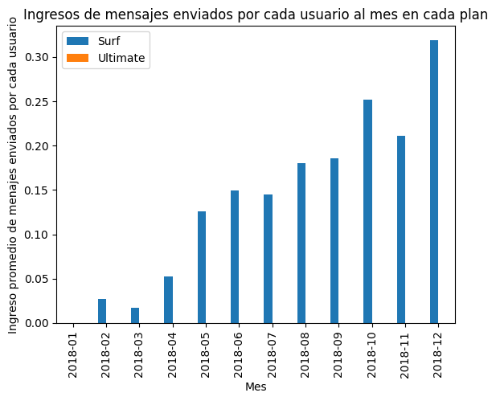
    


```python
# Comparamos ahora el ingreso por usuarios por mes en cada plan. Trazamos un histograma.

# Usaremos los df que antes creamos, messages_surf y messages_ultimate, que ya tiene filtrados los registros por cada plan
#    y en los que cada registro muestra el consumo de los usuarios sumarizado por mes.

# Definimos histograma de surf con eje x costo_de_mensajes_en_exceso y eje y usando la frecuencia
messages_surf['costo_de_mensajes_en_exceso'].plot(kind='hist', bins=50)
# Definimos histograma de ultimate con eje x usando costo_de_mensajes_en_exceso y eje y usando la frecuencia
messages_ultimate['costo_de_mensajes_en_exceso'].plot(kind='hist', bins=50,alpha=.5)
# Trazamos histograma
plt.legend(['Surf','Ultimate'])
plt.title('Ingresos por mensajes enviados, por usuario por cada mes, en cada plan')
plt.xlabel('USD')
plt.ylabel('Frecuencia (Muestras por Usuario-Mes)')
plt.show()
```


    
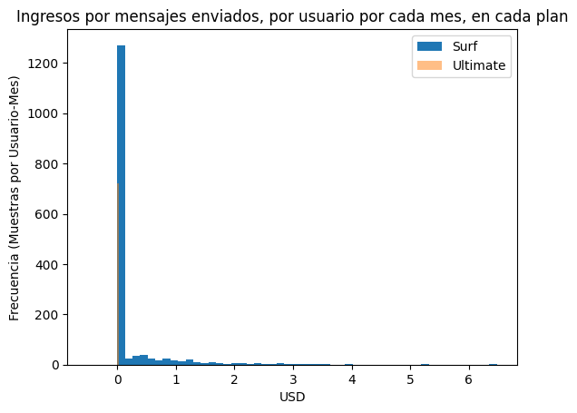
    


```python
# Calculamos ahora la media y la varianza de los ingresos por mensajes enviados.

# Calculamos la media y la varianza de 'costo_de_mensajes_en_exceso' en messages_surf['costo_de_mensajes_en_exceso']
print("Surf - Comportamiento de la variable 'costo_de_mensajes_en_exceso'")
print()
print("Media: ", messages_surf['costo_de_mensajes_en_exceso'].mean())
print("Varianza: ",messages_surf['costo_de_mensajes_en_exceso'].var())
print("Desv.Std.: ",messages_surf['costo_de_mensajes_en_exceso'].std())
print("Min: ",messages_surf['costo_de_mensajes_en_exceso'].min())
print("Max: ",messages_surf['costo_de_mensajes_en_exceso'].max())
print()
print("Descripción: ",messages_surf['costo_de_mensajes_en_exceso'].describe())
print()


# Calculamos la media y la varianza de 'costo_de_mensajes_en_exceso' en messages_ultimate['costo_de_mensajes_en_exceso']
print("Ultimate - Comportamiento de la variable 'costo_de_mensajes_en_exceso'")
print()
print("Media: ", messages_ultimate['costo_de_mensajes_en_exceso'].mean())
print("Varianza: ",messages_ultimate['costo_de_mensajes_en_exceso'].var())
print("Desv.Std.: ",messages_ultimate['costo_de_mensajes_en_exceso'].std())
print("Min: ",messages_ultimate['costo_de_mensajes_en_exceso'].min())
print("Max: ",messages_ultimate['costo_de_mensajes_en_exceso'].max())
print()
print("Descripción: ",messages_ultimate['costo_de_mensajes_en_exceso'].describe())
print()
```

    Surf - Comportamiento de la variable 'costo_de_mensajes_en_exceso'
    
    Media:  0.21038143674507306
    Varianza:  0.3412040528867361
    Desv.Std.:  0.5841267438550781
    Min:  0.0
    Max:  6.4799999999999995
    
    Descripción:  count    1573.000000
    mean        0.210381
    std         0.584127
    min         0.000000
    25%         0.000000
    50%         0.000000
    75%         0.000000
    max         6.480000
    Name: costo_de_mensajes_en_exceso, dtype: float64
    
    Ultimate - Comportamiento de la variable 'costo_de_mensajes_en_exceso'
    
    Media:  0.0
    Varianza:  0.0
    Desv.Std.:  0.0
    Min:  0.0
    Max:  0.0
    
    Descripción:  count    720.0
    mean       0.0
    std        0.0
    min        0.0
    25%        0.0
    50%        0.0
    75%        0.0
    max        0.0
    Name: costo_de_mensajes_en_exceso, dtype: float64
    
    


```python
# Trazamos un diagrama de caja para visualizar la distribución de los ingresos por mensajes
# Surf - Boxplot para 'costo_de_mensajes_en_exceso'
print("Boxplot para 'costo_de_mensajes_en_exceso' Surf: ")
sns.boxplot(minutes_surf['costo_de_mensajes_en_exceso'])

# Ultimate - No hacemos una gráfica, puesto que ya sabemos que ningún usuario pagó por mensajes.
```

    Boxplot para 'costo_de_mensajes_en_exceso' Surf: 
    


    <Axes: ylabel='costo_de_mensajes_en_exceso'>


    
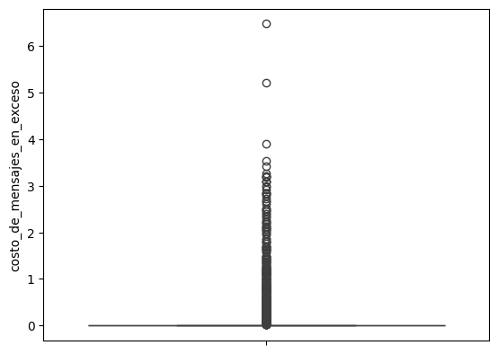
    


```python

```


```python
 # INGRESOS POR INTERNET
 # Comparamos el INGRESO derivado de uso de datos que tienden a usar cada mes los usuarios de cada plan

# Calcular el consumo de datos al mes para el plan surf
# Filtrar los registros == surf
datos_surf = consumo_mes_usuario[consumo_mes_usuario['plan_name'] == 'surf']

# Agrupamos los registros en el dataframe datos_surf, usando month_x como pivote, y obteniendo el promedio de la columna 'costo_de_gb_en_exceso'
datos_surf_group_cost =datos_surf.groupby(['month_x']).agg({'costo_de_gb_en_exceso': 'mean'})

# Calcular el número de gb usados al mes para el plan ultimate
# Filtrar los registros == ultimate
datos_ultimate = consumo_mes_usuario[consumo_mes_usuario['plan_name'] == 'ultimate']

# Agrupamos los registros en el dataframe datos_ultimate, usando month_x como pivote, y obteniendo el promedio de la columna 'costo_de_gb_en_exceso'
datos_ultimate_group_cost =datos_ultimate.groupby(['month_x']).agg({'costo_de_gb_en_exceso': 'mean'})


# Consolidamos un solo dataframe los datos de promedio de minutos en surf y ultimate, para poder graficarlo
datos_mes_cost = datos_surf_group_cost.merge(datos_ultimate_group_cost, on='month_x', how='left')
print(datos_mes_cost.head(15))
# graficamos en barras
datos_mes_cost.plot(kind='bar', stacked=False)
plt.title('Ingresos de datos usados por cada usuario al mes en cada plan')
plt.xlabel('Mes')
plt.ylabel('Ingreso promedio de datos usados por cada usuario')
#plt.ylim(0,10)
plt.legend(['Surf','Ultimate'])
plt.show()
```

             costo_de_gb_en_exceso_x  costo_de_gb_en_exceso_y
    month_x                                                  
    2018-01                 0.000000                 0.000000
    2018-02                16.666667                 0.000000
    2018-03                27.391304                 5.833333
    2018-04                21.000000                 3.666667
    2018-05                28.311688                 0.965517
    2018-06                29.587629                 1.787234
    2018-07                43.884298                 2.135593
    2018-08                45.308642                 3.450704
    2018-09                39.484536                 2.360465
    2018-10                46.118143                 2.641509
    2018-11                39.187279                 1.984252
    2018-12                50.817610                 3.847682
    


    
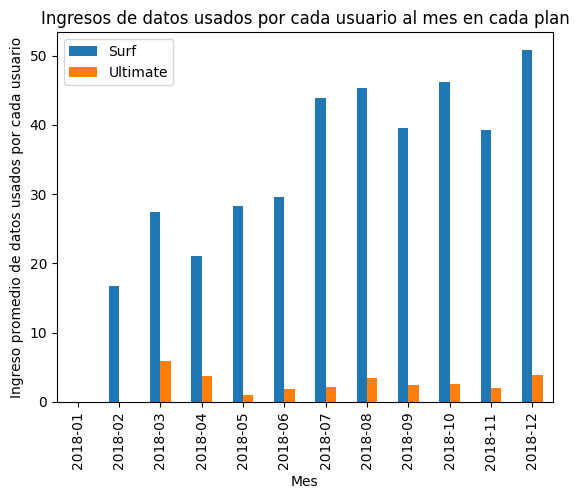
    


```python
# Comparamos ahora el ingreso por usuarios por mes en cada plan. Trazamos un histograma.

# Usaremos los df que antes creamos, datos_surf y datos_ultimate, que ya tiene filtrados los registros por cada plan
#    y en los que cada registro muestra el consumo de los usuarios sumarizado por mes.

# Definimos histograma de surf con eje x costo_de_gb_en_exceso y eje y usando la frecuencia
datos_surf['costo_de_gb_en_exceso'].plot(kind='hist', bins=[0,10,20,30,40,50,60,70,80,90,100,110,120,130,140,150,160,170,180,190,200,210,220,230,240,250,260,270,280,290,300,310,320,330,340,350,360,370,380,390,400,410])
# Definimos histograma de ultimate con eje x usando costo_de_gb_en_exceso y eje y usando la frecuencia
datos_ultimate['costo_de_gb_en_exceso'].plot(kind='hist', bins=[0,10,20,30,40,50,60,70,80,90,100,110,120,130,140,150,160,170,180,190,200,210,220,230,240,250,260,270,280,290,300,310,320,330,340,350,360,370,380,390,400,410],alpha=.5)
# Trazamos histograma
plt.legend(['Surf','Ultimate'])
plt.title('Ingresos por datos usados, por usuario por cada mes, en cada plan')
plt.xlabel('USD')
plt.ylabel('Frecuencia (Muestras por Usuario-Mes)')
plt.show()


```


    
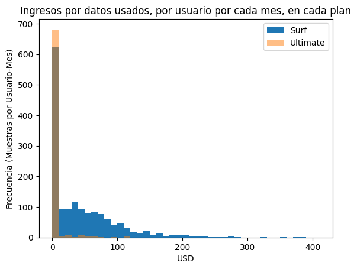
    


```python
# Calculamos ahora la media y la varianza de los ingresos por uso de datos

# Calculamos la media y la varianza de 'costo_de_gb_en_exceso' en datos_surf['costo_de_gb_en_exceso']
print("Surf - Comportamiento de la variable 'costo_de_gb_en_exceso'")
print()
print("Media: ", datos_surf['costo_de_gb_en_exceso'].mean())
print("Varianza: ",datos_surf['costo_de_gb_en_exceso'].var())
print("Desv.Std.: ",datos_surf['costo_de_gb_en_exceso'].std())
print("Min: ",datos_surf['costo_de_gb_en_exceso'].min())
print("Max: ",datos_surf['costo_de_gb_en_exceso'].max())
print()
print("Descripción: ", datos_surf['costo_de_gb_en_exceso'].describe())
print()

# Calculamos la media y la varianza de 'costo_de_gb_en_exceso' en datos_ultimate['costo_de_gb_en_exceso']
print("Ultimate - Comportamiento de la variable 'costo_de_gb_en_exceso'")
print()
print("Media: ", datos_ultimate['costo_de_gb_en_exceso'].mean())
print("Varianza: ",datos_ultimate['costo_de_gb_en_exceso'].var())
print("Desv.Std.: ",datos_ultimate['costo_de_gb_en_exceso'].std())
print("Min: ",datos_ultimate['costo_de_gb_en_exceso'].min())
print("Max: ",datos_ultimate['costo_de_gb_en_exceso'].max())
print()
print("Descripción: ", datos_ultimate['costo_de_gb_en_exceso'].describe())
```

    Surf - Comportamiento de la variable 'costo_de_gb_en_exceso'
    
    Media:  41.557533375715195
    Varianza:  3189.6208926396007
    Desv.Std.:  56.47672877070343
    Min:  0.0
    Max:  560.0
    
    Descripción:  count    1573.000000
    mean       41.557533
    std        56.476729
    min         0.000000
    25%         0.000000
    50%        20.000000
    75%        60.000000
    max       560.000000
    Name: costo_de_gb_en_exceso, dtype: float64
    
    Ultimate - Comportamiento de la variable 'costo_de_gb_en_exceso'
    
    Media:  2.702777777777778
    Varianza:  160.6069463761367
    Desv.Std.:  12.673079593221875
    Min:  0.0
    Max:  119.0
    
    Descripción:  count    720.000000
    mean       2.702778
    std       12.673080
    min        0.000000
    25%        0.000000
    50%        0.000000
    75%        0.000000
    max      119.000000
    Name: costo_de_gb_en_exceso, dtype: float64
    


```python
# Trazamos un diagrama de caja para visualizar la distribución de los ingresos por uso de datos
# Surf - Boxplot para 'costo_de_gb_en_exceso'
print("Boxplot para 'costo_de_gb_en_exceso' Surf: ")
sns.boxplot(datos_surf['costo_de_gb_en_exceso'])


```

    Boxplot para 'costo_de_gb_en_exceso' Surf: 
    


    <Axes: ylabel='costo_de_gb_en_exceso'>


    
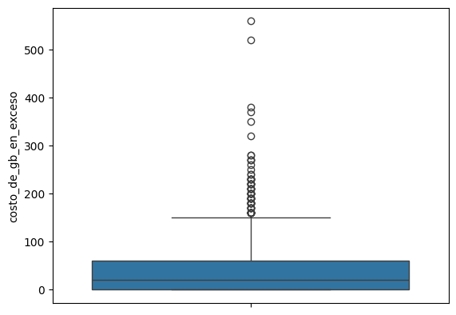
    


```python
# Verificamos los casos que son mas extremos para confirmar que no haya algún problema en los cálculos
print(datos_surf[datos_surf['costo_de_gb_en_exceso']==560].head())
# Verificamos al usuario 1379 que tiene el mayor consumo de datos en un mes...y confirmamos que calculos son correctos.
print(internet[internet['user_id']==1379].head(200))
```

          user_id  month_x  calls_per_user_per_month  minutes_per_user_per_month  \
    1756     1379  2018-12                     144.0                      1103.0   
    
          messages_per_user_per_month  gb_per_user_per_month plan_name  \
    1756                        126.0                   71.0      surf   
    
          usd_monthly_pay  minutes_included  usd_per_minute  messages_included  \
    1756             20.0               500            0.03                 50   
    
          usd_per_message  gb_per_month_included  usd_per_gb  \
    1756             0.03                   15.0        10.0   
    
          costo_de_minutos_en_exceso  costo_de_mensajes_en_exceso  \
    1756                       18.09                         2.28   
    
          costo_de_gb_en_exceso  
    1756                  560.0  
                 id  user_id session_date  gb_used    month
    80936    1379_0     1379   2018-12-17  0.43408  2018-12
    80937    1379_1     1379   2018-12-22  0.55974  2018-12
    80938    1379_2     1379   2018-12-18  0.38297  2018-12
    80939    1379_3     1379   2018-12-26  0.44535  2018-12
    80940    1379_4     1379   2018-12-14  0.07893  2018-12
    ...         ...      ...          ...      ...      ...
    81097  1379_161     1379   2018-12-14  0.43109  2018-12
    81098  1379_162     1379   2018-11-27  0.74194  2018-11
    81099  1379_163     1379   2018-11-26  0.68944  2018-11
    81100  1379_164     1379   2018-12-09  0.54335  2018-12
    81101  1379_165     1379   2018-12-28  0.57100  2018-12
    
    [166 rows x 5 columns]
    


```python
# Ultimate - Boxplot para 'costo_de_gb_en_exceso'
print("Boxplot para 'costo_de_gb_en_exceso' Ultimate: ")
sns.boxplot(datos_ultimate['costo_de_gb_en_exceso'])
```

    Boxplot para 'costo_de_gb_en_exceso' Ultimate: 
    


    <Axes: ylabel='costo_de_gb_en_exceso'>


    
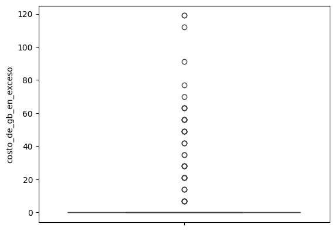
    


CONCLUSIONES GENERALES - COMPORTAMIENTO DEL INGRESO EN CADA PLAN:

- Ingresos extra en plan Surf:
  - Llamadas: Son muy limitados con Media: 1.84usd por usuario al mes y una dispersión muy amplia Desv.Std.: 3.76usd.
  - Mensajes: Son muy limitados con Media: 0.21usd por usuario al mes y dispersión Desv.Std.: 0.58usd
  - Datos: Son muy altos. Tienen una media: 41.55usd por usuario y desviación estándar de Desv Std.: 56.47usd
- Ingresos extra en plan Ultimate:
  - Llamadas: No hay ingresos.
  - Mensajes: No hay ingresos.
  - Datos: Son muy limitados, con Media: 2.70usd y dispersión Desv.Std.: 12.67usd

## 6. Prueba las hipótesis estadísticas

Aplicaremos una prueba de hipótesis para confirmar que son diferentes los ingresos promedio procedentes de los usuarios de los planes de llamada Ultimate y Surf.

Hipótesis Nula (H0): No hay diferencia
"Los ingresos promedio de Surf y Ultimate son IGUALES"
H0: promedio_surf = promedio_ultimate

Hipótesis Alternativa (H1): Sí hay diferencia  
"Los ingresos promedio de Surf y Ultimate son DIFERENTES"
H1: promedio_surf ≠ promedio_ultimate

Usaremos la prueba t-student que pemite comparar dos muestras. Usaremos la función st.stats.ttest_ind

Usaremos alfa = .05 considerando que es un buen nivel de certidumbre para sacar conclusiones (.05 se traduce en que, en una de cada 20 pruebas, podríamos tener un error del tipo "concluímos que los datos son iguales cuando no era cierto")


```python
# Prueba las hipótesis
# **********************************************************************************************************

# Vamos a calcular:

#         I. PRUEBA DE HIPOTESIS PARA COMPARAR PLANES EN INGRESOS EXTRA
#         II. PRUEBA DE HIPOTESIS PARA COMPARAR PLANES EN INGRESOS TOTALES

# **********************************************************************************************************

# I. PRUEBA DE HIPOTESIS PARA COMPARAR PLANES EN INGRESOS EXTRA POR: (1) LLAMADAS, (2) MENSAJES, E (3) INTERNET

# Creamos los arrays que vamos a probar

array_surf_llamadas = minutes_surf_group_cost ['costo_de_minutos_en_exceso'].values
print("Array de llamadas surf")
print(array_surf_llamadas)
print()
array_ultimate_llamadas = minutes_ultimate_group_cost ['costo_de_minutos_en_exceso'].values
print("Array de llamadas ultimate")
print(array_ultimate_llamadas)
print()
array_surf_mensajes = messages_surf_group_cost ['costo_de_mensajes_en_exceso'].values
print("Array de mensajes surf")
print(array_surf_mensajes)
print()
array_ultimate_mensajes = messages_ultimate_group_cost['costo_de_mensajes_en_exceso'].values
print("Array de mensajes ultimate")
print(array_ultimate_mensajes)
print()
array_surf_internet = datos_surf_group_cost ['costo_de_gb_en_exceso'].values
print("Array de internet surf")
print(array_surf_internet)
print()
array_ultimate_internet =datos_ultimate_group_cost ['costo_de_gb_en_exceso'].values
print("Array de internet ultimate")
print(array_ultimate_internet)
print()

```

    Array de llamadas surf
    [0.         1.03666667 0.70695652 1.0584     1.65857143 1.60113402
     2.19818182 1.65222222 1.43597938 1.7943038  1.75113074 2.53358491]
    
    Array de llamadas ultimate
    [0. 0. 0. 0. 0. 0. 0. 0. 0. 0. 0. 0.]
    
    Array de mensajes surf
    [0.         0.02666667 0.01695652 0.0522     0.12545455 0.14938144
     0.14528926 0.18018519 0.18603093 0.25139241 0.21074205 0.3190566 ]
    
    Array de mensajes ultimate
    [0. 0. 0. 0. 0. 0. 0. 0. 0. 0. 0. 0.]
    
    Array de internet surf
    [ 0.         16.66666667 27.39130435 21.         28.31168831 29.58762887
     43.88429752 45.30864198 39.48453608 46.11814346 39.18727915 50.81761006]
    
    Array de internet ultimate
    [0.         0.         5.83333333 3.66666667 0.96551724 1.78723404
     2.13559322 3.45070423 2.36046512 2.64150943 1.98425197 3.84768212]
    
    


```python
# Realizaremos la prueba sobre los arrays de LLAMADAS

#Obtenemos el estadístico de prueba
results = st.stats.ttest_ind(array_surf_llamadas, array_ultimate_llamadas)

#Definimos valor de alpha
alpha = .05

#Resultado
print('valor p: ', results.pvalue)
if results.pvalue < alpha:
  print("Rechazamos la hipótesis nula. Los ingresos extra por llamada en surf y ultimate son diferentes.")
else:
  print("No podemos rechazar la hipótesis nula")


```

    valor p:  1.9267936423923818e-07
    Rechazamos la hipótesis nula. Los ingresos extra por llamada en surf y ultimate son diferentes.
    

    /tmp/ipython-input-1906763578.py:4: DeprecationWarning: Please import `ttest_ind` from the `scipy.stats` namespace; the `scipy.stats.stats` namespace is deprecated and will be removed in SciPy 2.0.0.
      results = st.stats.ttest_ind(array_surf_llamadas, array_ultimate_llamadas)
    


```python
# Realizaremos la prueba sobre los arrays de MENSAJES

#Obtenemos el estadístico de prueba
results = st.stats.ttest_ind(array_surf_mensajes, array_ultimate_mensajes)

#Definimos valor de alpha
alpha = .05

#Resultado
print('valor p: ', results.pvalue)
if results.pvalue < alpha:
  print("Rechazamos la hipótesis nula. Los ingresos extra por mensajes en surf y ultimate son diferentes.")
else:
  print("No podemos rechazar la hipótesis nula")

```

    valor p:  7.997137393355217e-05
    Rechazamos la hipótesis nula. Los ingresos extra por mensajes en surf y ultimate son diferentes.
    

    /tmp/ipython-input-3884185053.py:4: DeprecationWarning: Please import `ttest_ind` from the `scipy.stats` namespace; the `scipy.stats.stats` namespace is deprecated and will be removed in SciPy 2.0.0.
      results = st.stats.ttest_ind(array_surf_mensajes, array_ultimate_mensajes)
    


```python
# Realizaremos la prueba sobre los arrays de INTERNET

#Obtenemos el estadístico de prueba
results = st.stats.ttest_ind(array_surf_internet, array_ultimate_internet)

#Definimos valor de alpha
alpha = .05

#Resultado
print('valor p: ', results.pvalue)
if results.pvalue < alpha:
  print("Rechazamos la hipótesis nula. Los ingresos extra por internet en surf y ultimate son diferentes.")
else:
  print("No podemos rechazar la hipótesis nula")

```

    valor p:  5.319545300122321e-07
    Rechazamos la hipótesis nula. Los ingresos extra por internet en surf y ultimate son diferentes.
    

    /tmp/ipython-input-2617971466.py:4: DeprecationWarning: Please import `ttest_ind` from the `scipy.stats` namespace; the `scipy.stats.stats` namespace is deprecated and will be removed in SciPy 2.0.0.
      results = st.stats.ttest_ind(array_surf_internet, array_ultimate_internet)
    


```python
# II. PRUEBA DE HIPOTESIS PARA COMPARAR INGRESOS TOTALES QUE INCLUYEN: (1) PAGO MENSUAL, (2) LLAMADAS, (3) MENSAJES, E (4) INTERNET

# Incorporamos al dataframe consumo_mes_usuario una columna que suma las columnas: usd_monthly_pay , costo_de_minutos_en_exceso, costo_de_mensajes_en_exceso, costo_de_gb_en_exceso
consumo_mes_usuario['ingreso_total'] = consumo_mes_usuario[['usd_monthly_pay', 'costo_de_minutos_en_exceso',
                           'costo_de_mensajes_en_exceso', 'costo_de_gb_en_exceso']].sum(axis=1)

# Hacemos un array con los valores de la columna 'costo_total_en_exceso' que incluya sólamente los registros de consumo_mes_usuario ['plan'] = surf
array_surf_total = consumo_mes_usuario[consumo_mes_usuario['plan_name'] == 'surf']['ingreso_total'].values
print("Array de ingresos totales por plan surf")
print(array_surf_total)
print()

# Hacemos un array con los valores de la columna 'costo_total_en_exceso' que incluya sólamente los registros de consumo_mes_usuario ['plan'] = ultimate
array_ultimate_total = consumo_mes_usuario[consumo_mes_usuario['plan_name'] == 'ultimate']['ingreso_total'].values
print("Array de ingresos totales por plan ultimate")
print(array_ultimate_total)
print()


```

    Array de ingresos totales por plan surf
    [ 20.    20.   100.09 ...  70.    40.   100.  ]
    
    Array de ingresos totales por plan ultimate
    [ 70.  70.  91.  70.  70.  70.  70.  70.  70.  70.  70.  70.  70.  70.
      70.  70.  70. 119. 126.  91. 126. 133. 147.  70. 189. 161. 126.  70.
      70.  70.  70.  70.  70.  70.  70.  70.  70.  70.  70.  70.  70.  70.
      70.  70.  70.  70.  70.  70.  70.  70.  70. 126. 182.  70.  70.  70.
      70.  70.  70.  70.  70.  70.  70.  70.  70.  70.  70.  70.  70.  70.
      70.  70.  77.  91.  84.  98. 133.  70.  70.  70.  70.  70.  70.  70.
      70.  70.  70.  70.  70.  70. 112.  70.  70.  70.  70.  70.  70.  70.
      70.  70.  70.  70.  70.  70.  70.  70.  70.  70.  70.  70.  70.  70.
      70.  70.  70.  70.  70.  70.  70.  70.  70.  70.  70.  70.  70.  70.
      70.  70.  70.  70.  70.  70.  70.  70.  70.  70.  70.  70.  70.  70.
      70.  70.  70.  70.  70.  70.  70.  70.  70.  70.  70.  70.  70.  70.
      70.  70.  70.  70.  70.  70.  70.  70.  70.  70.  70.  70.  70.  70.
      70.  70.  70.  70.  70.  70.  70.  70.  70. 105.  70.  70.  70.  70.
      70.  70.  70.  70.  70.  70.  70.  70.  77.  70.  70.  70.  70.  70.
      70.  70.  70.  70.  70.  70.  70.  70.  70.  70.  70.  70. 133. 119.
     126. 133.  77.  98.  70.  70.  70.  70.  70.  70.  70.  70.  70.  70.
      70.  70.  70.  70.  70.  70.  70.  70.  70.  70.  70.  70.  70.  70.
      70.  70.  70.  70.  70.  70.  70.  70.  70.  70.  70.  70.  70.  70.
      70.  70.  70.  70.  70.  70.  70.  70.  70.  91.  70.  70.  70.  70.
      70.  70.  70.  70.  70.  70.  70.  70.  70.  70.  70.  70.  70.  70.
      70.  70.  70.  70.  70.  70.  77.  70.  70.  70.  70.  77.  70.  70.
      70.  70.  70.  70.  70.  70.  70.  70.  70.  70.  70. 119.  70.  70.
      70.  70.  70.  70.  70.  70.  70.  70.  70.  70.  70.  70.  70.  70.
      70.  70.  70.  70.  70.  70.  70.  70.  70.  70.  70.  70.  70.  70.
      70.  70.  70.  70.  70.  70.  70.  70.  70.  70.  70.  70.  70.  70.
      70.  70.  70.  70.  70.  70.  70.  70.  70.  70.  70.  84.  70.  70.
      70.  70.  70.  70.  70.  70.  70.  70.  70.  70.  70.  70.  70.  70.
      70.  70.  70.  70.  70.  70.  70.  70.  70.  70.  70.  70.  70.  70.
      70.  70.  70.  70.  70.  70.  70.  70.  70.  70.  70.  70.  70.  70.
      70.  70.  70.  70.  70.  70.  70.  70.  98.  70.  70.  70.  70.  70.
      70. 112.  70.  70.  70.  70.  70.  70.  70.  70.  70.  70.  70.  70.
      70.  70.  70.  70.  70.  70.  70.  70.  70.  70.  70.  70.  70.  70.
      70.  70.  70.  70.  70.  70.  70.  70.  70.  70.  70.  70.  70.  70.
      70.  70.  70.  70.  70.  70.  70.  70.  70.  70.  70.  70.  70.  70.
      70.  70.  70.  70.  70.  70.  70.  70.  70.  70.  70.  70.  70.  70.
      91.  70. 119.  70.  70.  70.  70.  70.  70.  70.  70.  70.  70.  70.
      70.  70.  70.  70.  70.  70.  70.  70.  70.  70.  70.  70.  70.  70.
      70.  70.  70.  70.  70.  70.  70.  70.  70.  70.  70.  70.  70.  70.
      70.  70.  70.  70.  70.  70.  70.  70.  70.  70.  70.  70.  70.  70.
      70.  70.  70.  70. 112.  84.  70.  70.  70.  70.  70.  70.  70.  70.
      70.  70.  70.  70.  70.  70.  70.  70.  70.  70.  70.  70.  70.  70.
      70.  70.  70.  70.  70.  70.  70.  70.  70.  70.  70.  70.  70.  70.
      70.  70.  77.  70.  70.  70.  70.  70.  70.  70.  70.  70.  70.  70.
      70.  70.  70.  70.  70.  70.  70.  70.  98.  70.  70.  70.  70.  70.
      70.  70.  70.  70.  70.  70.  70.  70.  70.  70.  70.  70.  70.  70.
      70.  70.  70.  70.  70.  70.  70.  70.  70.  70.  70.  70.  70.  70.
      70.  70.  70.  70.  70.  70.  70.  70.  70.  70.  70.  70.  70.  98.
      70.  70. 105.  70.  70.  77.  70.  70.  70.  70.  70.  70.  70.  70.
      70.  70.  70.  70.  70.  70.  70.  70.  70.  70.  70.  70.  70.  70.
      70.  70.  70.  70.  70.  70.  70.  70.  70.  70.  70.  70.  70.  70.
      70.  70.  70.  70.  70.  70.  70.  70.  70. 140. 119. 119.  70. 189.
      70.  70.  70.  70.  70.  70.]
    
    


```python
# Realizaremos la prueba sobre los arrays

#Obtenemos el estadístico de prueba
results = st.stats.ttest_ind(array_surf_total, array_ultimate_total)

#Definimos valor de alpha
alpha = .05

#Resultado
print('valor p: ', results.pvalue)
if results.pvalue < alpha:
  print("Rechazamos la hipótesis nula. Los ingresos totales por planes surf y ultimate son diferentes.")
else:
  print("No podemos rechazar la hipótesis nula. Sí es posible que los datos de ingresos surf y ultimate estén relacionados.")
```

    valor p:  2.744649278514165e-05
    Rechazamos la hipótesis nula. Los ingresos totales por planes surf y ultimate son diferentes.
    

    /tmp/ipython-input-1135535936.py:4: DeprecationWarning: Please import `ttest_ind` from the `scipy.stats` namespace; the `scipy.stats.stats` namespace is deprecated and will be removed in SciPy 2.0.0.
      results = st.stats.ttest_ind(array_surf_total, array_ultimate_total)
    

Realizaremos ahora la prueba de hipótesis de que el ingreso promedio de los usuarios del área NY-NJ es diferente al de los usuarios de otras regiones.

Hipótesis Nula (H0): No hay diferencia
"Los ingresos promedio en NY-NJ son IGUALES que otras regiones"
H0: promedio_NY_NJ = promedio_otras_regiones

Hipótesis Alternativa (H1): Sí hay diferencia  
"Los ingresos promedio en NY-NJ son DIFERENTES a otras regiones"
H1: promedio_NY_NJ ≠ promedio_otras_regiones

Usaremos la prueba t-student que pemite comparar dos muestras. Usaremos la función st.stats.ttest_ind

Usaremos alfa = .05 considerando que es un buen nivel de certidumbre para sacar conclusiones (.05 se traduce en que, en una de cada 20 pruebas, podríamos tener un error del tipo "concluímos que los datos son iguales cuando no era cierto")


```python
# Prueba las hipótesis

# Enriquecemos el df consumo_mes_usuario para incluír la columna 'city'
consumo_mes_usuario = consumo_mes_usuario.merge(users, on='user_id', how='left')

# Obtenemos el array de ingresos internet para NJ-NY
array_nj_ny = consumo_mes_usuario[consumo_mes_usuario['city'] == 'New York-Newark-Jersey City, NY-NJ-PA MSA']['costo_de_gb_en_exceso'].values
print("Array de internet NJ-NY")
print(array_nj_ny)
print()

# Obtenemos el array de ingresos internet para todas las regiones excepto NJ-NY
array_otras_regiones = consumo_mes_usuario[consumo_mes_usuario['city'] != 'New York-Newark-Jersey City, NY-NJ-PA MSA']['costo_de_gb_en_exceso'].values
print("Array de internet de otras regiones")
print(array_otras_regiones)


```

    Array de internet NJ-NY
    [  0.   0.   0.  90.   0.  70.   0.  40.  80.  40.   0.   0.  60.  30.
       0.  10.   0.   0.   0.   0.   0.   0.   0.   0.   0.   0.   7.  21.
      14.  28.  63.   0. 100.  30.   0.   0.   0.   0.   0.   0.   0.   0.
       0.   0.  70.  80.  20.  60.  10.   0.   0.   0.  10.  80.  30.  40.
      10.  40.   0.  10.   0.   0.   0.  50.   0.  30.   0.   0.  50.   0.
       0.   0.   0.  60.   0.  70.  30.  30.   0.   0.  60. 110. 160. 190.
     100.   0.   0.   0.  60.  10.  60.   0.   0.  20.  30.  60.  10.  20.
      10.  40.  20. 100.  70.   0.  40.  40.  90. 140.  50. 110.  80.   0.
       0.   0.   0.   0.  60.   0.   0.   0.   0.   0.   0.   0.   0.   0.
       0.   0.   0.   0.  70.   0.  10. 120.  40.  90.  80.  70.  70.  50.
     140.  30.  70.  40.   0.  70.  70. 120. 100. 140.  70.   0. 100.  60.
       0.  20.   0.   0.  10.  20.   0.  10.  30.  40.   0.   0.   0.  63.
      49.  56.  63.   7.  28.   0.  50.  30.   0.   0.  60.  20.   0.   0.
       0.  30.  80.  30.  20.   0. 140. 110.   0.   0.   0.  30.  10.  10.
      50.  40.  20.  30.   0.  30.   0.  90.   0.   0.   0.  50.   0.   0.
       0.   0.   0.   0.  40. 160. 210. 200.   0.   0.   0.   0.   0.   0.
       0.   0.   0.   0.   0.   0.  80.  70. 150.  80. 200.  70. 140.  40.
      60.   0.  10.   0.   0.   0.   0.  10.  60.  20.   0.  30.   0.  90.
      70.  90. 120.  30.  60. 100.  60.   0.  20.   0.  40.  20.   0.  30.
       0.   0.   0. 160.   0.   0.  20.  40.  40.  40.   0.  30.  10.   0.
       0.   0.   0. 100.   0.  50. 120. 110.  40.   0.   0.   0.   0.   0.
       0.   0.  40.  20.  40.  30.  40.  20.  20.   0.  40.   0.   0.  10.
       0.  30.  10.  30.  20.  60.  20.   0.   0.   0.   0.   0.   0.   0.
      30.   0.  10.  70.  30.  90.   0.  70.   0.   0.   0. 190. 190. 220.
     270.   0.  70.  20.   0.   0.   0.   0.  10.  10.   0.   0.  30.   0.
       0.   0. 160.   0.   0.   0.   0.  20.  20.   0.  40.  10.  80. 120.
     100. 100.  50.  50.  50.  80.   0. 100.  60.  80.  60.  50.  90.]
    
    Array de internet de otras regiones
    [ 0.  0.  0. ... 50. 20. 80.]
    


```python
# Realizaremos la prueba sobre los arrays

#Obtenemos el estadístico de prueba
results = st.stats.ttest_ind(array_nj_ny, array_otras_regiones)

#Definimos valor de alpha
alpha = .05

#Resultado
print('valor p: ', results.pvalue)
if results.pvalue < alpha:
  print("Rechazamos la hipótesis nula. Los ingresos extra por internet en NY-NJ y otras-regiones son diferentes.")
else:
  print("No podemos rechazar la hipótesis nula. Sí es posible que los datos de ingresos extra por internet en NY-NJ y otras-regiones estén relacionados.")


```

    valor p:  0.16380959674212944
    No podemos rechazar la hipótesis nula. Sí es posible que los datos de ingresos extra por internet en NY-NJ y otras-regiones estén relacionados.
    

    /tmp/ipython-input-1402936290.py:4: DeprecationWarning: Please import `ttest_ind` from the `scipy.stats` namespace; the `scipy.stats.stats` namespace is deprecated and will be removed in SciPy 2.0.0.
      results = st.stats.ttest_ind(array_nj_ny, array_otras_regiones)
    

## 7. Conclusiones


- Volúmen de operaciones
  - Llamadas:
    - El comportamiento de usuarios en ambos planes resulta muy similar. El uso de minutos es así:
      - Surf: media: 436, desv std: 229, max: 1510. Varios pagos mensuales realizados por clientes exceden de los 500 minutos disponibles (De acuerdo las gráficas que se presentan mas abajo ~570 de 1570 pagos mensuales se excedieron)
      - Ulimate: media: 434, desv std: 237, max: 1369. Ningún cliente exceden los 3,000 minutos disponibles.

  - Mensajes:
    - El comportamiento de usuarios en ambos planes resulta muy similar. El envío de mensajes es así:
      - Surf:
        - media: 40, Desv Est: 1085, min=1 y max=266.
        - De acuerdo las gráficas que se presentan mas abajo ~341 de 1570 pagos mensuales se excedieron del límite establecido. Esto representa el 22% de los pagos mensuales realizados. Es un indicativo de que el límite de 50 mensajes es adecuado, pero restringido.
      - Ultimate:
        - Media: 46 mensajes al mes con Desv Est: 1091, min=1 y max=166.
        - Ningún cliente excede los 1,000 mensajes disponibles.
        - El límite de 1,000 mensajes establecido para el plan Ultimate es muy alto. Puede reducirse a 130 sin afectar a los usuarios, o bien mantenerse en 1,000 como argumento de venta psicológico (aunque no un valor real para el usuario).
  - Internet:
    - En ambos planes el consumo promedio de datos por usuario es cercano a los 17gb/mes. Se comporta así:
      - Surf:
        - Media: 17.2, desviación estándar: 62.0.
        - De acuerdo las gráficas que se presentan mas abajo ~950 de 1570 pagos mensuales se excedieron del límite establecido. Esto representa el 60% de los pagos mensuales realizados por clientes. Esto es una clara señal de que el límite establecido en 15gb resulta insuficiente para los usuarios.
        -
      - Ultimate:
        - Media: 17.7, desviación estándar: 61.5
        - De acuerdo las gráficas que se presentan mas abajo, ~50 de 720 pagos mensuales se excedieron. Esto representa el 7%. Lo cual es un indicativo de que los 30gb disponibles son un parámetro razonable.


- Ingresos.
  - Pago Mensual:
    - Surf:
      - De acuerdo a las gráficas que se presentan mas abajo, ~560 de 1573 pagos mensuales, son por un monto mayor a $70, lo cual implica que les convendría pagar por el plan Ultimate. Es decir 35% de los usuarios de Surf estan en un plan que no les conviene. Este exceso de pago se deriva del uso de internet.
    - Ultimate:
      - De acuerdo las gráficas que se presentan mas abajo, ~50 de 720 pagos mensuales fueron mas allá de los $70. Esto derivado de uso de internet.


- Conclusión
  - No hay una tarifa mejor que la otra. Cada una atiende a un segemento de mercado con necesidades distintas.
  - Existe un segmento importante de usuarios que demandan mayor disponiblidad de internet en sus paquetes. Hoy estan limitados a 15gb y 30gb respectivamente.

  - 60% de los pagos que se reciben en Surf pagan extra por el uso de internet. Esto es bueno para la compañía, por recibir ingresos extra, pero existe un riesgo de que otra compañía competidora les ofrezca mejores planes y los perdamos.
  
  - 35% de los pagos recibidos en Surf estan en el plan incorrecto. Son de usuarios intensivos de internet. Es bueno para la compañía que estos clientes paguen en exceso, sin embargo existe riesgo de que otra compañía les ofrezca un mejor paquete y los perdamos.
  
  - Se recomienda a la compañía analizar la posibilidad de crear un nuevo paquete, dirigido al segmento de usuarios intensivos en el uso de internet, con un precio mensual aproximado a $45 con capacidad de navegar en internet hasta 30gb, a la vez ampliar la capacidad del plan Ultimate a 40gb. Con ello tendría opción de atender mejor a los clientes Surf y dar un plan que cubra bien las necesidades de Ultimate. El nuevo paquete debe promocionarse agresivamente para traer nuevos clientes, y debe usarse defensivamente para evitar que los clientes actuales se vayan.


```python
# Graficaremos los ingresos totales de ambos planes, usando el tipo de gráfico x,y, donde el eje x tiene cada usuario y el eje y tiene el ingreso. La gráfica debe presentar en un color los puntos x,y para el plan surf y en otro color los puntos para el plan ultimate. Los puntos deben presentarse en orden creciente en el eje x de acuerdo al ingreso
# Ordenar los datos por valor creciente en el array_surf_total
array_surf_total.sort()
array_surf_total = array_surf_total.tolist()
print(len(array_surf_total))
# Ordenar los datos por valor creciente en el array_ultimate_total
array_ultimate_total.sort()
array_ultimate_total = array_ultimate_total.tolist()
print(len(array_ultimate_total))
# rellenar con ceros el array ultimate para que tengan la misma longitud, la diferencia es 853
for i in range(853):
  array_ultimate_total.append(np.nan)
print()
print()
print(len(array_surf_total))
print(len(array_ultimate_total))

# crear un dataframe con 2 columnas, una para los valores array_surf_total y otra para array_ultimate_total
df_ingresos = pd.DataFrame({'surf ingresos totales': array_surf_total, 'ultimate ingresos totales': array_ultimate_total})
print(df_ingresos.head())


#grafica de puntos del array_surf_total
df_ingresos.plot()
plt.title("Ingresos totales - cada punto es un pago de un usuario al final de mes")
plt.xlabel("Usuario")
plt.ylabel("Ingresos por usuario por mes por plan (usd)")
plt.grid(True)
plt.show()

#zoom grafica de puntos del array_surf_total
df_ingresos = pd.DataFrame({'surf ingresos totales': array_surf_total, 'ultimate ingresos totales': array_ultimate_total})
print(df_ingresos.head())
df_ingresos.plot()
plt.title("Ingresos totales - cada punto es un pago de un usuario al final de mes")
plt.xlabel("Usuario")
plt.ylabel("Ingresos por usuario por mes por plan (usd)")
plt.grid(True)
plt.xlim(600,1100)
plt.ylim(0,200)
plt.show()

```

    1573
    720
    
    
    1573
    1573
       surf ingresos totales  ultimate ingresos totales
    0                   20.0                       70.0
    1                   20.0                       70.0
    2                   20.0                       70.0
    3                   20.0                       70.0
    4                   20.0                       70.0
    


    
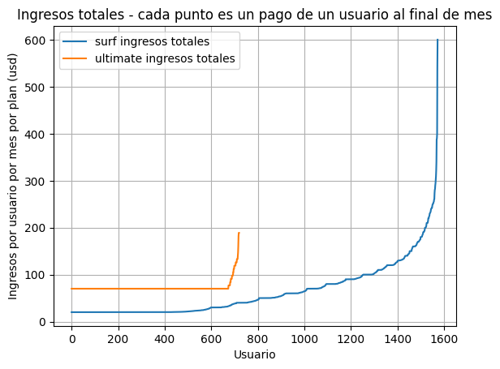
    


       surf ingresos totales  ultimate ingresos totales
    0                   20.0                       70.0
    1                   20.0                       70.0
    2                   20.0                       70.0
    3                   20.0                       70.0
    4                   20.0                       70.0
    


    
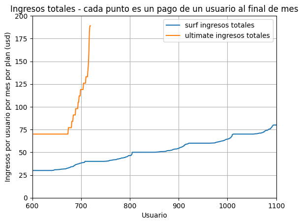
    


CONCLUSIONES INGRESOS TOTALES

Surf:
~560 de 1573 pagos mensuales, son por un monto mayor a $70, lo cual implica que les convendría pagar por el plan Ultimate. Es decir 35% de los usuarios de Surf estan en un plan que no les conviene. Este exceso de pago se deriva del uso de internet.

Ultimate:
~50 de 720 pagos mensuales fueron mas allá de los $70. Esto derivado de uso de internet.


```python
# Graficaremos los ingresos de llamadas de ambos planes, usando el tipo de gráfico x,y, donde el eje x tiene cada usuario y el eje y tiene el ingreso. La gráfica debe presentar en un color los puntos x,y para el plan surf y en otro color los puntos para el plan ultimate. Los puntos deben presentarse en orden creciente en el eje x de acuerdo al ingreso

# Ordenar los datos por valor creciente en el array_surf_llamadas
array_surf_llamadas = consumo_mes_usuario[consumo_mes_usuario['plan_name_x'] == 'surf']['costo_de_minutos_en_exceso']
array_surf_llamadas = array_surf_llamadas.tolist()
array_surf_llamadas.sort()
print(len(array_surf_llamadas))

# Ordenar los datos por valor creciente en el array_ultimate_llamadas
array_ultimate_llamadas = consumo_mes_usuario[consumo_mes_usuario['plan_name_x'] == 'ultimate']['costo_de_minutos_en_exceso']
array_ultimate_llamadas = array_ultimate_llamadas.tolist()
array_ultimate_llamadas.sort()
print(len(array_ultimate_llamadas))

# rellenar con ceros el array ultimate para que tengan la misma longitud, la diferencia es 853
for i in range(853):
  array_ultimate_llamadas.append(np.nan)
print()
print()
print(len(array_surf_llamadas))
print(len(array_ultimate_llamadas))

# crear un dataframe con 2 columnas, una para los valores array_surf_llamadas y otra para array_ultimate_llamadas
df_ingresos_llamadas = pd.DataFrame({'surf ingresos llamadas': array_surf_llamadas, 'ultimate ingresos llamadas': array_ultimate_llamadas})
print(df_ingresos_llamadas.head())


#grafica de puntos del array_surf_llamadas
df_ingresos_llamadas.plot()
plt.title("Ingresos llamadas - cada punto es un pago de un usuario al final de mes")
plt.xlabel("Usuario")
plt.ylabel("Ingresos por usuario por mes por plan (usd)")
plt.grid(True)
plt.show()

```

    1573
    720
    
    
    1573
    1573
       surf ingresos llamadas  ultimate ingresos llamadas
    0                     0.0                         0.0
    1                     0.0                         0.0
    2                     0.0                         0.0
    3                     0.0                         0.0
    4                     0.0                         0.0
    


    
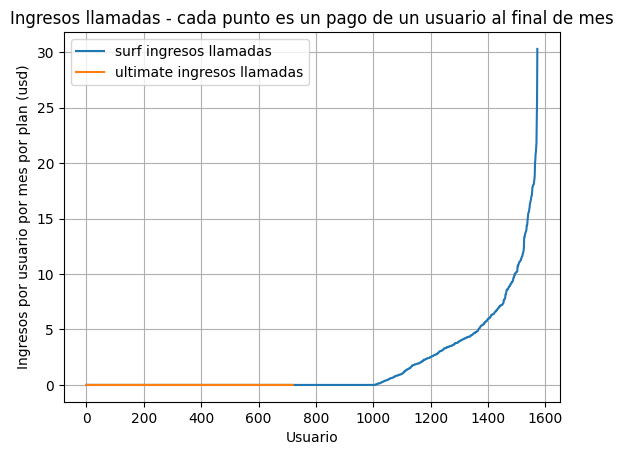
    


```python
# Graficaremos los ingresos de MENSAJES de ambos planes, usando el tipo de gráfico x,y, donde el eje x tiene cada usuario y el eje y tiene el ingreso. La gráfica debe presentar en un color los puntos x,y para el plan surf y en otro color los puntos para el plan ultimate. Los puntos deben presentarse en orden creciente en el eje x de acuerdo al ingreso

# Ordenar los datos por valor creciente en el array_surf_mensajes
array_surf_mensajes = consumo_mes_usuario[consumo_mes_usuario['plan_name_x'] == 'surf']['costo_de_mensajes_en_exceso']
array_surf_mensajes = array_surf_mensajes.tolist()
array_surf_mensajes.sort()
print(len(array_surf_mensajes))

# Ordenar los datos por valor creciente en el array_ultimate_mensajes
array_ultimate_mensajes = consumo_mes_usuario[consumo_mes_usuario['plan_name_x'] == 'ultimate']['costo_de_mensajes_en_exceso']
array_ultimate_mensajes = array_ultimate_mensajes.tolist()
array_ultimate_mensajes.sort()
print(len(array_ultimate_mensajes))

# rellenar con ceros el array ultimate para que tengan la misma longitud, la diferencia es 853
for i in range(853):
  array_ultimate_mensajes.append(np.nan)
print()
print()
print(len(array_surf_mensajes))
print(len(array_ultimate_mensajes))

# crear un dataframe con 2 columnas, una para los valores array_surf_mensajes y otra para array_ultimate_mensajes
df_ingresos_mensajes = pd.DataFrame({'surf ingresos mensajes': array_surf_mensajes, 'ultimate ingresos mensajes': array_ultimate_mensajes})
print(df_ingresos_mensajes.head())


#grafica de puntos del array_surf_mensajes
df_ingresos_mensajes.plot()
plt.title("Ingresos mensajes - cada punto es un pago de un usuario al final de mes")
plt.xlabel("Usuario")
plt.ylabel("Ingresos por usuario por mes por plan (usd)")
plt.grid(True)
plt.show()

#zoom grafica de puntos del array_surf_mensajes
df_ingresos_mensajes = pd.DataFrame({'surf ingresos mensajes': array_surf_mensajes, 'ultimate ingresos mensajes': array_ultimate_mensajes})
print(df_ingresos_mensajes.head())
df_ingresos_mensajes.plot()
plt.title("Ingresos mensajes - cada punto es un pago de un usuario al final de mes")
plt.xlabel("Usuario")
plt.ylabel("Ingresos por usuario por mes por plan (usd)")
plt.grid(True)
plt.xlim(1210,1250)
plt.ylim(0,.2)
plt.show()
```

    1573
    720
    
    
    1573
    1573
       surf ingresos mensajes  ultimate ingresos mensajes
    0                     0.0                         0.0
    1                     0.0                         0.0
    2                     0.0                         0.0
    3                     0.0                         0.0
    4                     0.0                         0.0
    


    
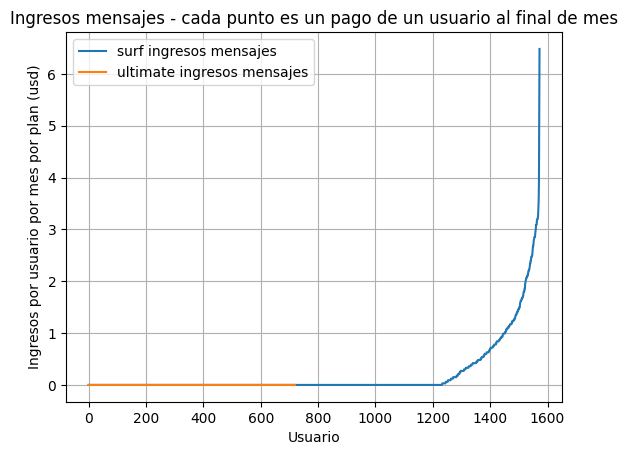
    


       surf ingresos mensajes  ultimate ingresos mensajes
    0                     0.0                         0.0
    1                     0.0                         0.0
    2                     0.0                         0.0
    3                     0.0                         0.0
    4                     0.0                         0.0
    


    
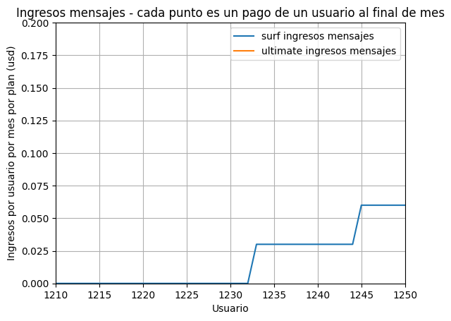
    


CONCLUSIÓN EN MENSAJES: ~341 de 1570 pagos mensuales se excedieron del límite establecido. Esto representa el 22% de los pagos mensuales realizados. Es un indicativo de que el límite de 50 mensajes es adecuado, pero restringido.


```python
# Graficaremos los ingresos de INTERNET de ambos planes, usando el tipo de gráfico x,y, donde el eje x tiene cada usuario y el eje y tiene el ingreso. La gráfica debe presentar en un color los puntos x,y para el plan surf y en otro color los puntos para el plan ultimate. Los puntos deben presentarse en orden creciente en el eje x de acuerdo al ingreso

# Ordenar los datos por valor creciente en el array_surf_gb
array_surf_gb = consumo_mes_usuario[consumo_mes_usuario['plan_name_x'] == 'surf']['costo_de_gb_en_exceso']
array_surf_gb = array_surf_gb.tolist()
array_surf_gb.sort()
print(len(array_surf_gb))

# Ordenar los datos por valor creciente en el array_ultimate_gb
array_ultimate_gb = consumo_mes_usuario[consumo_mes_usuario['plan_name_x'] == 'ultimate']['costo_de_gb_en_exceso']
array_ultimate_gb = array_ultimate_gb.tolist()
array_ultimate_gb.sort()
print(len(array_ultimate_gb))

# rellenar con ceros el array ultimate para que tengan la misma longitud, la diferencia es 853
for i in range(853):
  array_ultimate_gb.append(np.nan)
print()
print()
print(len(array_surf_gb))
print(len(array_ultimate_gb))

# crear un dataframe con 2 columnas, una para los valores array_surf_gb y otra para array_ultimate_gb
df_ingresos_gb = pd.DataFrame({'surf ingresos gb': array_surf_gb, 'ultimate ingresos gb': array_ultimate_gb})
print(df_ingresos_gb.head())


#grafica de puntos del array_surf_mensajes
df_ingresos_gb.plot()
plt.title("Ingresos internet - cada punto es un pago de un usuario al final de mes")
plt.xlabel("Usuario")
plt.ylabel("Ingresos por usuario por mes por plan (usd)")
plt.grid(True)
plt.show()

#grafica de puntos del array_surf_mensajes
df_ingresos_gb = pd.DataFrame({'surf ingresos gb': array_surf_gb, 'ultimate ingresos gb': array_ultimate_gb})
print(df_ingresos_gb.head())
df_ingresos_gb.plot()
plt.title("Ingresos internet - cada punto es un pago de un usuario al final de mes")
plt.xlabel("Usuario")
plt.ylabel("Ingresos por usuario por mes por plan (usd)")
plt.grid(True)
plt.xlim(610,700)
plt.ylim(0,20)
plt.show()
```

    1573
    720
    
    
    1573
    1573
       surf ingresos gb  ultimate ingresos gb
    0               0.0                   0.0
    1               0.0                   0.0
    2               0.0                   0.0
    3               0.0                   0.0
    4               0.0                   0.0
    


    
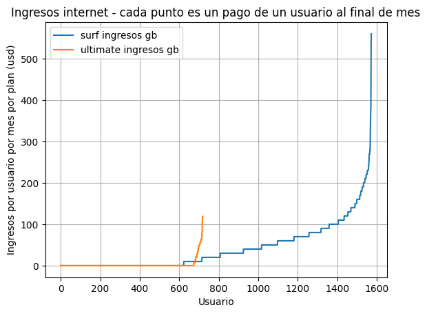
    


       surf ingresos gb  ultimate ingresos gb
    0               0.0                   0.0
    1               0.0                   0.0
    2               0.0                   0.0
    3               0.0                   0.0
    4               0.0                   0.0
    


    
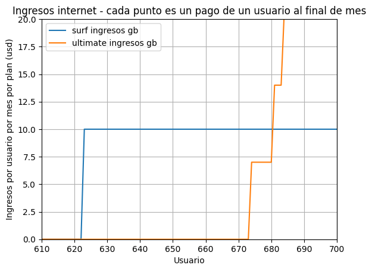
    


CONCLUSIONES INTERNET:

Surf:
~950 de 1570 pagos mensuales se excedieron del límite establecido. Esto representa el 60% de los pagos mensuales realizados por clientes. Esto es una clara señal de que el límite establecido en 15gb resulta insuficiente para los usuarios.

Ultimate:
 ~50 de 720 pagos mensuales se excedieron. Esto representa el 7%. Lo cual es un indicativo de que los 30gb disponibles son un parámetro razonable.
