# PROYECTO: VIDEOJUEGOS

## Contexto del proyecto:

Esta es una tienda online que vende videojuegos por todo el mundo. Las reseñas de usuarios y expertos, los géneros, las plataformas (por ejemplo, Xbox o PlayStation) y los datos históricos sobre las ventas de juegos están disponibles en fuentes abiertas. Se deben identificar patrones que determinen si un juego tiene éxito o no. Esto permite detectar proyectos prometedores y planificar campañas publicitarias.

Los datos provistos corresponden al año 2016. Se requiere completar un análisis que lleve a tomar decisiones de negocio en diciembre de 2016, para ser ejecutadas en 2017.

El dataset contiene una columna "rating" que almacena la clasificación ESRB de cada juego. El Entertainment Software Rating Board (la Junta de clasificación de software de entretenimiento) evalúa el contenido de un juego y asigna una clasificación de edad como Adolescente o Adulto.

## 1. Inicialización


```python
from google.colab import drive
drive.mount('/content/drive')
```

    Drive already mounted at /content/drive; to attempt to forcibly remount, call drive.mount("/content/drive", force_remount=True).
    


```python
# Cargar todas las librerías
import pandas as pd
import numpy as np
import seaborn as sns
from scipy import stats as st
from math import factorial
import math as mt
from matplotlib import pyplot as plt
```


```python
# Carga los archivos de datos en diferentes DataFrames
df = pd.read_csv('/content/games.csv')
```

## 2. Entendimiento de los datos


```python
# Revisamos el tamaño del archvio, nombre de campos, valores validos (non-null) y tipo de datos
df.info()

```

    <class 'pandas.core.frame.DataFrame'>
    RangeIndex: 16715 entries, 0 to 16714
    Data columns (total 11 columns):
     #   Column           Non-Null Count  Dtype  
    ---  ------           --------------  -----  
     0   Name             16713 non-null  object 
     1   Platform         16715 non-null  object 
     2   Year_of_Release  16446 non-null  float64
     3   Genre            16713 non-null  object 
     4   NA_sales         16715 non-null  float64
     5   EU_sales         16715 non-null  float64
     6   JP_sales         16715 non-null  float64
     7   Other_sales      16715 non-null  float64
     8   Critic_Score     8137 non-null   float64
     9   User_Score       10014 non-null  object 
     10  Rating           9949 non-null   object 
    dtypes: float64(6), object(5)
    memory usage: 1.4+ MB
    


```python

```

Observaciones:

- Necesario ajustar nombre de campos, para ponerlos en minúsculas
- Los campos critic_score, user_score y rating tienen un % muy bajo de valores válidos. Necesario revisar su contenido y determinar cómo proceder.
- Revisar la opción de cambiar year_of_release y critic_score a tipo de dato entero.
- Necesario revisar mas a detalle el contenido de los campos name, year_of_release y genre, para corregir valores nulos.


```python
# Revisamos el contenido de los campos para entenderlos mejor y determinar qué campos hacen la llave única por registro
df.sample(5)
```


  <div id="df-14fb54e4-5003-4ce0-9e10-ffbe798b7d55" class="colab-df-container">
    <div>
<style scoped>
    .dataframe tbody tr th:only-of-type {
        vertical-align: middle;
    }

    .dataframe tbody tr th {
        vertical-align: top;
    }

    .dataframe thead th {
        text-align: right;
    }
</style>
<table border="1" class="dataframe">
  <thead>
    <tr style="text-align: right;">
      <th></th>
      <th>Name</th>
      <th>Platform</th>
      <th>Year_of_Release</th>
      <th>Genre</th>
      <th>NA_sales</th>
      <th>EU_sales</th>
      <th>JP_sales</th>
      <th>Other_sales</th>
      <th>Critic_Score</th>
      <th>User_Score</th>
      <th>Rating</th>
    </tr>
  </thead>
  <tbody>
    <tr>
      <th>8117</th>
      <td>Metal Gear Ac!d 2</td>
      <td>PSP</td>
      <td>2005.0</td>
      <td>Strategy</td>
      <td>0.11</td>
      <td>0.00</td>
      <td>0.05</td>
      <td>0.01</td>
      <td>NaN</td>
      <td>NaN</td>
      <td>NaN</td>
    </tr>
    <tr>
      <th>2370</th>
      <td>Star Wars: The Force Unleashed</td>
      <td>DS</td>
      <td>2008.0</td>
      <td>Action</td>
      <td>0.50</td>
      <td>0.28</td>
      <td>0.00</td>
      <td>0.09</td>
      <td>61.0</td>
      <td>5.5</td>
      <td>T</td>
    </tr>
    <tr>
      <th>14998</th>
      <td>ZooCube</td>
      <td>GC</td>
      <td>2002.0</td>
      <td>Puzzle</td>
      <td>0.02</td>
      <td>0.00</td>
      <td>0.00</td>
      <td>0.00</td>
      <td>67.0</td>
      <td>6.1</td>
      <td>E</td>
    </tr>
    <tr>
      <th>8108</th>
      <td>Ben 10 Ultimate Alien: Cosmic Destruction</td>
      <td>X360</td>
      <td>2010.0</td>
      <td>Platform</td>
      <td>0.10</td>
      <td>0.06</td>
      <td>0.00</td>
      <td>0.02</td>
      <td>51.0</td>
      <td>5.3</td>
      <td>E10+</td>
    </tr>
    <tr>
      <th>1281</th>
      <td>Bratz: Forever Diamondz</td>
      <td>DS</td>
      <td>2006.0</td>
      <td>Adventure</td>
      <td>0.43</td>
      <td>0.88</td>
      <td>0.00</td>
      <td>0.18</td>
      <td>NaN</td>
      <td>6.5</td>
      <td>E</td>
    </tr>
  </tbody>
</table>
</div>
    <div class="colab-df-buttons">

  <div class="colab-df-container">
    <button class="colab-df-convert" onclick="convertToInteractive('df-14fb54e4-5003-4ce0-9e10-ffbe798b7d55')"
            title="Convert this dataframe to an interactive table."
            style="display:none;">

  <svg xmlns="http://www.w3.org/2000/svg" height="24px" viewBox="0 -960 960 960">
    <path d="M120-120v-720h720v720H120Zm60-500h600v-160H180v160Zm220 220h160v-160H400v160Zm0 220h160v-160H400v160ZM180-400h160v-160H180v160Zm440 0h160v-160H620v160ZM180-180h160v-160H180v160Zm440 0h160v-160H620v160Z"/>
  </svg>
    </button>

  <style>
    .colab-df-container {
      display:flex;
      gap: 12px;
    }

    .colab-df-convert {
      background-color: #E8F0FE;
      border: none;
      border-radius: 50%;
      cursor: pointer;
      display: none;
      fill: #1967D2;
      height: 32px;
      padding: 0 0 0 0;
      width: 32px;
    }

    .colab-df-convert:hover {
      background-color: #E2EBFA;
      box-shadow: 0px 1px 2px rgba(60, 64, 67, 0.3), 0px 1px 3px 1px rgba(60, 64, 67, 0.15);
      fill: #174EA6;
    }

    .colab-df-buttons div {
      margin-bottom: 4px;
    }

    [theme=dark] .colab-df-convert {
      background-color: #3B4455;
      fill: #D2E3FC;
    }

    [theme=dark] .colab-df-convert:hover {
      background-color: #434B5C;
      box-shadow: 0px 1px 3px 1px rgba(0, 0, 0, 0.15);
      filter: drop-shadow(0px 1px 2px rgba(0, 0, 0, 0.3));
      fill: #FFFFFF;
    }
  </style>

    <script>
      const buttonEl =
        document.querySelector('#df-14fb54e4-5003-4ce0-9e10-ffbe798b7d55 button.colab-df-convert');
      buttonEl.style.display =
        google.colab.kernel.accessAllowed ? 'block' : 'none';

      async function convertToInteractive(key) {
        const element = document.querySelector('#df-14fb54e4-5003-4ce0-9e10-ffbe798b7d55');
        const dataTable =
          await google.colab.kernel.invokeFunction('convertToInteractive',
                                                    [key], {});
        if (!dataTable) return;

        const docLinkHtml = 'Like what you see? Visit the ' +
          '<a target="_blank" href=https://colab.research.google.com/notebooks/data_table.ipynb>data table notebook</a>'
          + ' to learn more about interactive tables.';
        element.innerHTML = '';
        dataTable['output_type'] = 'display_data';
        await google.colab.output.renderOutput(dataTable, element);
        const docLink = document.createElement('div');
        docLink.innerHTML = docLinkHtml;
        element.appendChild(docLink);
      }
    </script>
  </div>


    <div id="df-3fee207b-569b-416f-9b62-4ea71bcddfec">
      <button class="colab-df-quickchart" onclick="quickchart('df-3fee207b-569b-416f-9b62-4ea71bcddfec')"
                title="Suggest charts"
                style="display:none;">

<svg xmlns="http://www.w3.org/2000/svg" height="24px"viewBox="0 0 24 24"
     width="24px">
    <g>
        <path d="M19 3H5c-1.1 0-2 .9-2 2v14c0 1.1.9 2 2 2h14c1.1 0 2-.9 2-2V5c0-1.1-.9-2-2-2zM9 17H7v-7h2v7zm4 0h-2V7h2v10zm4 0h-2v-4h2v4z"/>
    </g>
</svg>
      </button>

<style>
  .colab-df-quickchart {
      --bg-color: #E8F0FE;
      --fill-color: #1967D2;
      --hover-bg-color: #E2EBFA;
      --hover-fill-color: #174EA6;
      --disabled-fill-color: #AAA;
      --disabled-bg-color: #DDD;
  }

  [theme=dark] .colab-df-quickchart {
      --bg-color: #3B4455;
      --fill-color: #D2E3FC;
      --hover-bg-color: #434B5C;
      --hover-fill-color: #FFFFFF;
      --disabled-bg-color: #3B4455;
      --disabled-fill-color: #666;
  }

  .colab-df-quickchart {
    background-color: var(--bg-color);
    border: none;
    border-radius: 50%;
    cursor: pointer;
    display: none;
    fill: var(--fill-color);
    height: 32px;
    padding: 0;
    width: 32px;
  }

  .colab-df-quickchart:hover {
    background-color: var(--hover-bg-color);
    box-shadow: 0 1px 2px rgba(60, 64, 67, 0.3), 0 1px 3px 1px rgba(60, 64, 67, 0.15);
    fill: var(--button-hover-fill-color);
  }

  .colab-df-quickchart-complete:disabled,
  .colab-df-quickchart-complete:disabled:hover {
    background-color: var(--disabled-bg-color);
    fill: var(--disabled-fill-color);
    box-shadow: none;
  }

  .colab-df-spinner {
    border: 2px solid var(--fill-color);
    border-color: transparent;
    border-bottom-color: var(--fill-color);
    animation:
      spin 1s steps(1) infinite;
  }

  @keyframes spin {
    0% {
      border-color: transparent;
      border-bottom-color: var(--fill-color);
      border-left-color: var(--fill-color);
    }
    20% {
      border-color: transparent;
      border-left-color: var(--fill-color);
      border-top-color: var(--fill-color);
    }
    30% {
      border-color: transparent;
      border-left-color: var(--fill-color);
      border-top-color: var(--fill-color);
      border-right-color: var(--fill-color);
    }
    40% {
      border-color: transparent;
      border-right-color: var(--fill-color);
      border-top-color: var(--fill-color);
    }
    60% {
      border-color: transparent;
      border-right-color: var(--fill-color);
    }
    80% {
      border-color: transparent;
      border-right-color: var(--fill-color);
      border-bottom-color: var(--fill-color);
    }
    90% {
      border-color: transparent;
      border-bottom-color: var(--fill-color);
    }
  }
</style>

      <script>
        async function quickchart(key) {
          const quickchartButtonEl =
            document.querySelector('#' + key + ' button');
          quickchartButtonEl.disabled = true;  // To prevent multiple clicks.
          quickchartButtonEl.classList.add('colab-df-spinner');
          try {
            const charts = await google.colab.kernel.invokeFunction(
                'suggestCharts', [key], {});
          } catch (error) {
            console.error('Error during call to suggestCharts:', error);
          }
          quickchartButtonEl.classList.remove('colab-df-spinner');
          quickchartButtonEl.classList.add('colab-df-quickchart-complete');
        }
        (() => {
          let quickchartButtonEl =
            document.querySelector('#df-3fee207b-569b-416f-9b62-4ea71bcddfec button');
          quickchartButtonEl.style.display =
            google.colab.kernel.accessAllowed ? 'block' : 'none';
        })();
      </script>
    </div>

    </div>
  </div>


Observaciones

- Necesario crear columna total_sales para facilitar análisis
- Se deduce que los campos llave (que hacen un registro único) son: Name	+ Platform	+ Year_of_Release +	Genre


```python
df.describe()
```


  <div id="df-ea9926b2-d103-4d40-ad40-0193c84b34e0" class="colab-df-container">
    <div>
<style scoped>
    .dataframe tbody tr th:only-of-type {
        vertical-align: middle;
    }

    .dataframe tbody tr th {
        vertical-align: top;
    }

    .dataframe thead th {
        text-align: right;
    }
</style>
<table border="1" class="dataframe">
  <thead>
    <tr style="text-align: right;">
      <th></th>
      <th>Year_of_Release</th>
      <th>NA_sales</th>
      <th>EU_sales</th>
      <th>JP_sales</th>
      <th>Other_sales</th>
      <th>Critic_Score</th>
    </tr>
  </thead>
  <tbody>
    <tr>
      <th>count</th>
      <td>16446.000000</td>
      <td>16715.000000</td>
      <td>16715.000000</td>
      <td>16715.000000</td>
      <td>16715.000000</td>
      <td>8137.000000</td>
    </tr>
    <tr>
      <th>mean</th>
      <td>2006.484616</td>
      <td>0.263377</td>
      <td>0.145060</td>
      <td>0.077617</td>
      <td>0.047342</td>
      <td>68.967679</td>
    </tr>
    <tr>
      <th>std</th>
      <td>5.877050</td>
      <td>0.813604</td>
      <td>0.503339</td>
      <td>0.308853</td>
      <td>0.186731</td>
      <td>13.938165</td>
    </tr>
    <tr>
      <th>min</th>
      <td>1980.000000</td>
      <td>0.000000</td>
      <td>0.000000</td>
      <td>0.000000</td>
      <td>0.000000</td>
      <td>13.000000</td>
    </tr>
    <tr>
      <th>25%</th>
      <td>2003.000000</td>
      <td>0.000000</td>
      <td>0.000000</td>
      <td>0.000000</td>
      <td>0.000000</td>
      <td>60.000000</td>
    </tr>
    <tr>
      <th>50%</th>
      <td>2007.000000</td>
      <td>0.080000</td>
      <td>0.020000</td>
      <td>0.000000</td>
      <td>0.010000</td>
      <td>71.000000</td>
    </tr>
    <tr>
      <th>75%</th>
      <td>2010.000000</td>
      <td>0.240000</td>
      <td>0.110000</td>
      <td>0.040000</td>
      <td>0.030000</td>
      <td>79.000000</td>
    </tr>
    <tr>
      <th>max</th>
      <td>2016.000000</td>
      <td>41.360000</td>
      <td>28.960000</td>
      <td>10.220000</td>
      <td>10.570000</td>
      <td>98.000000</td>
    </tr>
  </tbody>
</table>
</div>
    <div class="colab-df-buttons">

  <div class="colab-df-container">
    <button class="colab-df-convert" onclick="convertToInteractive('df-ea9926b2-d103-4d40-ad40-0193c84b34e0')"
            title="Convert this dataframe to an interactive table."
            style="display:none;">

  <svg xmlns="http://www.w3.org/2000/svg" height="24px" viewBox="0 -960 960 960">
    <path d="M120-120v-720h720v720H120Zm60-500h600v-160H180v160Zm220 220h160v-160H400v160Zm0 220h160v-160H400v160ZM180-400h160v-160H180v160Zm440 0h160v-160H620v160ZM180-180h160v-160H180v160Zm440 0h160v-160H620v160Z"/>
  </svg>
    </button>

  <style>
    .colab-df-container {
      display:flex;
      gap: 12px;
    }

    .colab-df-convert {
      background-color: #E8F0FE;
      border: none;
      border-radius: 50%;
      cursor: pointer;
      display: none;
      fill: #1967D2;
      height: 32px;
      padding: 0 0 0 0;
      width: 32px;
    }

    .colab-df-convert:hover {
      background-color: #E2EBFA;
      box-shadow: 0px 1px 2px rgba(60, 64, 67, 0.3), 0px 1px 3px 1px rgba(60, 64, 67, 0.15);
      fill: #174EA6;
    }

    .colab-df-buttons div {
      margin-bottom: 4px;
    }

    [theme=dark] .colab-df-convert {
      background-color: #3B4455;
      fill: #D2E3FC;
    }

    [theme=dark] .colab-df-convert:hover {
      background-color: #434B5C;
      box-shadow: 0px 1px 3px 1px rgba(0, 0, 0, 0.15);
      filter: drop-shadow(0px 1px 2px rgba(0, 0, 0, 0.3));
      fill: #FFFFFF;
    }
  </style>

    <script>
      const buttonEl =
        document.querySelector('#df-ea9926b2-d103-4d40-ad40-0193c84b34e0 button.colab-df-convert');
      buttonEl.style.display =
        google.colab.kernel.accessAllowed ? 'block' : 'none';

      async function convertToInteractive(key) {
        const element = document.querySelector('#df-ea9926b2-d103-4d40-ad40-0193c84b34e0');
        const dataTable =
          await google.colab.kernel.invokeFunction('convertToInteractive',
                                                    [key], {});
        if (!dataTable) return;

        const docLinkHtml = 'Like what you see? Visit the ' +
          '<a target="_blank" href=https://colab.research.google.com/notebooks/data_table.ipynb>data table notebook</a>'
          + ' to learn more about interactive tables.';
        element.innerHTML = '';
        dataTable['output_type'] = 'display_data';
        await google.colab.output.renderOutput(dataTable, element);
        const docLink = document.createElement('div');
        docLink.innerHTML = docLinkHtml;
        element.appendChild(docLink);
      }
    </script>
  </div>


    <div id="df-51112e5b-ec9d-475d-be14-628b74cab482">
      <button class="colab-df-quickchart" onclick="quickchart('df-51112e5b-ec9d-475d-be14-628b74cab482')"
                title="Suggest charts"
                style="display:none;">

<svg xmlns="http://www.w3.org/2000/svg" height="24px"viewBox="0 0 24 24"
     width="24px">
    <g>
        <path d="M19 3H5c-1.1 0-2 .9-2 2v14c0 1.1.9 2 2 2h14c1.1 0 2-.9 2-2V5c0-1.1-.9-2-2-2zM9 17H7v-7h2v7zm4 0h-2V7h2v10zm4 0h-2v-4h2v4z"/>
    </g>
</svg>
      </button>

<style>
  .colab-df-quickchart {
      --bg-color: #E8F0FE;
      --fill-color: #1967D2;
      --hover-bg-color: #E2EBFA;
      --hover-fill-color: #174EA6;
      --disabled-fill-color: #AAA;
      --disabled-bg-color: #DDD;
  }

  [theme=dark] .colab-df-quickchart {
      --bg-color: #3B4455;
      --fill-color: #D2E3FC;
      --hover-bg-color: #434B5C;
      --hover-fill-color: #FFFFFF;
      --disabled-bg-color: #3B4455;
      --disabled-fill-color: #666;
  }

  .colab-df-quickchart {
    background-color: var(--bg-color);
    border: none;
    border-radius: 50%;
    cursor: pointer;
    display: none;
    fill: var(--fill-color);
    height: 32px;
    padding: 0;
    width: 32px;
  }

  .colab-df-quickchart:hover {
    background-color: var(--hover-bg-color);
    box-shadow: 0 1px 2px rgba(60, 64, 67, 0.3), 0 1px 3px 1px rgba(60, 64, 67, 0.15);
    fill: var(--button-hover-fill-color);
  }

  .colab-df-quickchart-complete:disabled,
  .colab-df-quickchart-complete:disabled:hover {
    background-color: var(--disabled-bg-color);
    fill: var(--disabled-fill-color);
    box-shadow: none;
  }

  .colab-df-spinner {
    border: 2px solid var(--fill-color);
    border-color: transparent;
    border-bottom-color: var(--fill-color);
    animation:
      spin 1s steps(1) infinite;
  }

  @keyframes spin {
    0% {
      border-color: transparent;
      border-bottom-color: var(--fill-color);
      border-left-color: var(--fill-color);
    }
    20% {
      border-color: transparent;
      border-left-color: var(--fill-color);
      border-top-color: var(--fill-color);
    }
    30% {
      border-color: transparent;
      border-left-color: var(--fill-color);
      border-top-color: var(--fill-color);
      border-right-color: var(--fill-color);
    }
    40% {
      border-color: transparent;
      border-right-color: var(--fill-color);
      border-top-color: var(--fill-color);
    }
    60% {
      border-color: transparent;
      border-right-color: var(--fill-color);
    }
    80% {
      border-color: transparent;
      border-right-color: var(--fill-color);
      border-bottom-color: var(--fill-color);
    }
    90% {
      border-color: transparent;
      border-bottom-color: var(--fill-color);
    }
  }
</style>

      <script>
        async function quickchart(key) {
          const quickchartButtonEl =
            document.querySelector('#' + key + ' button');
          quickchartButtonEl.disabled = true;  // To prevent multiple clicks.
          quickchartButtonEl.classList.add('colab-df-spinner');
          try {
            const charts = await google.colab.kernel.invokeFunction(
                'suggestCharts', [key], {});
          } catch (error) {
            console.error('Error during call to suggestCharts:', error);
          }
          quickchartButtonEl.classList.remove('colab-df-spinner');
          quickchartButtonEl.classList.add('colab-df-quickchart-complete');
        }
        (() => {
          let quickchartButtonEl =
            document.querySelector('#df-51112e5b-ec9d-475d-be14-628b74cab482 button');
          quickchartButtonEl.style.display =
            google.colab.kernel.accessAllowed ? 'block' : 'none';
        })();
      </script>
    </div>

    </div>
  </div>


Observaciones:
- Necesario poner user_score en la misma escala de critic_score para hacerlos comparables.


```python
df.describe(include=object)
```


  <div id="df-32833238-58ac-4c5a-af6f-de1669ba1993" class="colab-df-container">
    <div>
<style scoped>
    .dataframe tbody tr th:only-of-type {
        vertical-align: middle;
    }

    .dataframe tbody tr th {
        vertical-align: top;
    }

    .dataframe thead th {
        text-align: right;
    }
</style>
<table border="1" class="dataframe">
  <thead>
    <tr style="text-align: right;">
      <th></th>
      <th>Name</th>
      <th>Platform</th>
      <th>Genre</th>
      <th>User_Score</th>
      <th>Rating</th>
    </tr>
  </thead>
  <tbody>
    <tr>
      <th>count</th>
      <td>16713</td>
      <td>16715</td>
      <td>16713</td>
      <td>10014</td>
      <td>9949</td>
    </tr>
    <tr>
      <th>unique</th>
      <td>11559</td>
      <td>31</td>
      <td>12</td>
      <td>96</td>
      <td>8</td>
    </tr>
    <tr>
      <th>top</th>
      <td>Need for Speed: Most Wanted</td>
      <td>PS2</td>
      <td>Action</td>
      <td>tbd</td>
      <td>E</td>
    </tr>
    <tr>
      <th>freq</th>
      <td>12</td>
      <td>2161</td>
      <td>3369</td>
      <td>2424</td>
      <td>3990</td>
    </tr>
  </tbody>
</table>
</div>
    <div class="colab-df-buttons">

  <div class="colab-df-container">
    <button class="colab-df-convert" onclick="convertToInteractive('df-32833238-58ac-4c5a-af6f-de1669ba1993')"
            title="Convert this dataframe to an interactive table."
            style="display:none;">

  <svg xmlns="http://www.w3.org/2000/svg" height="24px" viewBox="0 -960 960 960">
    <path d="M120-120v-720h720v720H120Zm60-500h600v-160H180v160Zm220 220h160v-160H400v160Zm0 220h160v-160H400v160ZM180-400h160v-160H180v160Zm440 0h160v-160H620v160ZM180-180h160v-160H180v160Zm440 0h160v-160H620v160Z"/>
  </svg>
    </button>

  <style>
    .colab-df-container {
      display:flex;
      gap: 12px;
    }

    .colab-df-convert {
      background-color: #E8F0FE;
      border: none;
      border-radius: 50%;
      cursor: pointer;
      display: none;
      fill: #1967D2;
      height: 32px;
      padding: 0 0 0 0;
      width: 32px;
    }

    .colab-df-convert:hover {
      background-color: #E2EBFA;
      box-shadow: 0px 1px 2px rgba(60, 64, 67, 0.3), 0px 1px 3px 1px rgba(60, 64, 67, 0.15);
      fill: #174EA6;
    }

    .colab-df-buttons div {
      margin-bottom: 4px;
    }

    [theme=dark] .colab-df-convert {
      background-color: #3B4455;
      fill: #D2E3FC;
    }

    [theme=dark] .colab-df-convert:hover {
      background-color: #434B5C;
      box-shadow: 0px 1px 3px 1px rgba(0, 0, 0, 0.15);
      filter: drop-shadow(0px 1px 2px rgba(0, 0, 0, 0.3));
      fill: #FFFFFF;
    }
  </style>

    <script>
      const buttonEl =
        document.querySelector('#df-32833238-58ac-4c5a-af6f-de1669ba1993 button.colab-df-convert');
      buttonEl.style.display =
        google.colab.kernel.accessAllowed ? 'block' : 'none';

      async function convertToInteractive(key) {
        const element = document.querySelector('#df-32833238-58ac-4c5a-af6f-de1669ba1993');
        const dataTable =
          await google.colab.kernel.invokeFunction('convertToInteractive',
                                                    [key], {});
        if (!dataTable) return;

        const docLinkHtml = 'Like what you see? Visit the ' +
          '<a target="_blank" href=https://colab.research.google.com/notebooks/data_table.ipynb>data table notebook</a>'
          + ' to learn more about interactive tables.';
        element.innerHTML = '';
        dataTable['output_type'] = 'display_data';
        await google.colab.output.renderOutput(dataTable, element);
        const docLink = document.createElement('div');
        docLink.innerHTML = docLinkHtml;
        element.appendChild(docLink);
      }
    </script>
  </div>


    <div id="df-671bc14a-a936-448c-a817-8a10a9b280ed">
      <button class="colab-df-quickchart" onclick="quickchart('df-671bc14a-a936-448c-a817-8a10a9b280ed')"
                title="Suggest charts"
                style="display:none;">

<svg xmlns="http://www.w3.org/2000/svg" height="24px"viewBox="0 0 24 24"
     width="24px">
    <g>
        <path d="M19 3H5c-1.1 0-2 .9-2 2v14c0 1.1.9 2 2 2h14c1.1 0 2-.9 2-2V5c0-1.1-.9-2-2-2zM9 17H7v-7h2v7zm4 0h-2V7h2v10zm4 0h-2v-4h2v4z"/>
    </g>
</svg>
      </button>

<style>
  .colab-df-quickchart {
      --bg-color: #E8F0FE;
      --fill-color: #1967D2;
      --hover-bg-color: #E2EBFA;
      --hover-fill-color: #174EA6;
      --disabled-fill-color: #AAA;
      --disabled-bg-color: #DDD;
  }

  [theme=dark] .colab-df-quickchart {
      --bg-color: #3B4455;
      --fill-color: #D2E3FC;
      --hover-bg-color: #434B5C;
      --hover-fill-color: #FFFFFF;
      --disabled-bg-color: #3B4455;
      --disabled-fill-color: #666;
  }

  .colab-df-quickchart {
    background-color: var(--bg-color);
    border: none;
    border-radius: 50%;
    cursor: pointer;
    display: none;
    fill: var(--fill-color);
    height: 32px;
    padding: 0;
    width: 32px;
  }

  .colab-df-quickchart:hover {
    background-color: var(--hover-bg-color);
    box-shadow: 0 1px 2px rgba(60, 64, 67, 0.3), 0 1px 3px 1px rgba(60, 64, 67, 0.15);
    fill: var(--button-hover-fill-color);
  }

  .colab-df-quickchart-complete:disabled,
  .colab-df-quickchart-complete:disabled:hover {
    background-color: var(--disabled-bg-color);
    fill: var(--disabled-fill-color);
    box-shadow: none;
  }

  .colab-df-spinner {
    border: 2px solid var(--fill-color);
    border-color: transparent;
    border-bottom-color: var(--fill-color);
    animation:
      spin 1s steps(1) infinite;
  }

  @keyframes spin {
    0% {
      border-color: transparent;
      border-bottom-color: var(--fill-color);
      border-left-color: var(--fill-color);
    }
    20% {
      border-color: transparent;
      border-left-color: var(--fill-color);
      border-top-color: var(--fill-color);
    }
    30% {
      border-color: transparent;
      border-left-color: var(--fill-color);
      border-top-color: var(--fill-color);
      border-right-color: var(--fill-color);
    }
    40% {
      border-color: transparent;
      border-right-color: var(--fill-color);
      border-top-color: var(--fill-color);
    }
    60% {
      border-color: transparent;
      border-right-color: var(--fill-color);
    }
    80% {
      border-color: transparent;
      border-right-color: var(--fill-color);
      border-bottom-color: var(--fill-color);
    }
    90% {
      border-color: transparent;
      border-bottom-color: var(--fill-color);
    }
  }
</style>

      <script>
        async function quickchart(key) {
          const quickchartButtonEl =
            document.querySelector('#' + key + ' button');
          quickchartButtonEl.disabled = true;  // To prevent multiple clicks.
          quickchartButtonEl.classList.add('colab-df-spinner');
          try {
            const charts = await google.colab.kernel.invokeFunction(
                'suggestCharts', [key], {});
          } catch (error) {
            console.error('Error during call to suggestCharts:', error);
          }
          quickchartButtonEl.classList.remove('colab-df-spinner');
          quickchartButtonEl.classList.add('colab-df-quickchart-complete');
        }
        (() => {
          let quickchartButtonEl =
            document.querySelector('#df-671bc14a-a936-448c-a817-8a10a9b280ed button');
          quickchartButtonEl.style.display =
            google.colab.kernel.accessAllowed ? 'block' : 'none';
        })();
      </script>
    </div>

    </div>
  </div>


Observaciones:

- Necesario agrupar platform en categorías mas grandes

## 2. Preparación de datos

### PREPARACIÓN DE DATOS - PLAN DE ACCIÓN

- Ajustar títulos de columnas
- Revisar contenido de campos con alto % de null: critic_score, user_score y rating; determinar cómo proceder.
- Revisar la opción de cambiar year_of_release y critic_score a tipo de dato entero.
- Corregir valores nulos en campos: name, year_of_release y genre.
- Revisar si hay duplicidad en registros, tomando en cuenta los campos llave: Name + Platform + Year_of_Release + Genre

### ENRIQUECER DATOS - PLAN DE ACCIÓN

  - Crear columna total_sales para facilitar análisis
  - Agrupar platform en categorías mas grandes
  - Poner user_score en la misma escala de critic_score para hacerlos comparables.


```python
#Ajustar títulos de columnas
df.columns = [x.lower().replace(" ","_") for x in df.columns]
df.info()
```

    <class 'pandas.core.frame.DataFrame'>
    RangeIndex: 16715 entries, 0 to 16714
    Data columns (total 11 columns):
     #   Column           Non-Null Count  Dtype  
    ---  ------           --------------  -----  
     0   name             16713 non-null  object 
     1   platform         16715 non-null  object 
     2   year_of_release  16446 non-null  float64
     3   genre            16713 non-null  object 
     4   na_sales         16715 non-null  float64
     5   eu_sales         16715 non-null  float64
     6   jp_sales         16715 non-null  float64
     7   other_sales      16715 non-null  float64
     8   critic_score     8137 non-null   float64
     9   user_score       10014 non-null  object 
     10  rating           9949 non-null   object 
    dtypes: float64(6), object(5)
    memory usage: 1.4+ MB
    


```python
# Revisar contenido de campos con alto % de null: critic_score, user_score y rating; determinar cómo proceder.

# Revisar critic_score

df['critic_score'].value_counts(dropna=False)

```


<div>
<style scoped>
    .dataframe tbody tr th:only-of-type {
        vertical-align: middle;
    }

    .dataframe tbody tr th {
        vertical-align: top;
    }

    .dataframe thead th {
        text-align: right;
    }
</style>
<table border="1" class="dataframe">
  <thead>
    <tr style="text-align: right;">
      <th></th>
      <th>count</th>
    </tr>
    <tr>
      <th>critic_score</th>
      <th></th>
    </tr>
  </thead>
  <tbody>
    <tr>
      <th>NaN</th>
      <td>8578</td>
    </tr>
    <tr>
      <th>70.0</th>
      <td>256</td>
    </tr>
    <tr>
      <th>71.0</th>
      <td>254</td>
    </tr>
    <tr>
      <th>75.0</th>
      <td>245</td>
    </tr>
    <tr>
      <th>78.0</th>
      <td>240</td>
    </tr>
    <tr>
      <th>...</th>
      <td>...</td>
    </tr>
    <tr>
      <th>20.0</th>
      <td>3</td>
    </tr>
    <tr>
      <th>21.0</th>
      <td>1</td>
    </tr>
    <tr>
      <th>17.0</th>
      <td>1</td>
    </tr>
    <tr>
      <th>22.0</th>
      <td>1</td>
    </tr>
    <tr>
      <th>13.0</th>
      <td>1</td>
    </tr>
  </tbody>
</table>
<p>83 rows × 1 columns</p>
</div><br><label><b>dtype:</b> int64</label>


Observaciones:

- Podemos dejar los valores como están. Los nan no influyen en sumas o promedios que podamos llegar a hacer. No hay un valor promedio, media u otro que podamos sustituir agregando valor al análisis.

- Pienso que los datos ausentes se deben a que son juegos que no tienen mucho uso o demanda entre los usuarios y por ello no se establece una calificación de la crítica especializada.


```python
# Revisar user_score

df['user_score'].value_counts(dropna=False)
```


<div>
<style scoped>
    .dataframe tbody tr th:only-of-type {
        vertical-align: middle;
    }

    .dataframe tbody tr th {
        vertical-align: top;
    }

    .dataframe thead th {
        text-align: right;
    }
</style>
<table border="1" class="dataframe">
  <thead>
    <tr style="text-align: right;">
      <th></th>
      <th>count</th>
    </tr>
    <tr>
      <th>user_score</th>
      <th></th>
    </tr>
  </thead>
  <tbody>
    <tr>
      <th>NaN</th>
      <td>6701</td>
    </tr>
    <tr>
      <th>tbd</th>
      <td>2424</td>
    </tr>
    <tr>
      <th>7.8</th>
      <td>324</td>
    </tr>
    <tr>
      <th>8</th>
      <td>290</td>
    </tr>
    <tr>
      <th>8.2</th>
      <td>282</td>
    </tr>
    <tr>
      <th>...</th>
      <td>...</td>
    </tr>
    <tr>
      <th>1.3</th>
      <td>2</td>
    </tr>
    <tr>
      <th>1</th>
      <td>2</td>
    </tr>
    <tr>
      <th>0.9</th>
      <td>2</td>
    </tr>
    <tr>
      <th>0</th>
      <td>1</td>
    </tr>
    <tr>
      <th>9.7</th>
      <td>1</td>
    </tr>
  </tbody>
</table>
<p>97 rows × 1 columns</p>
</div><br><label><b>dtype:</b> int64</label>


Observaciones:

- Debemos sustituir el valor "tbd" por nan.
- Podemos dejar los valores nan como están. Los nan no influyen en sumas o promedios que podamos llegar a hacer. No hay un valor promedio, media u otro que podamos sustituir agregando valor al análisis.
- Pienso que los datos ausentes se deben a que son juegos que no tienen mucho uso o demanda entre los usuarios y por ello no se tiene un número suficiente de calificaciones que ameriten fijar una calificación del tipo user_score.


```python

#Ajustar valores user-score y cambiar tipo a float
# Sustituir valores tbd
df['user_score'] = df['user_score'].replace('tbd',np.nan)
df['user_score'] = df['user_score'].astype(float)
df['user_score'].value_counts(dropna=False)

```


<div>
<style scoped>
    .dataframe tbody tr th:only-of-type {
        vertical-align: middle;
    }

    .dataframe tbody tr th {
        vertical-align: top;
    }

    .dataframe thead th {
        text-align: right;
    }
</style>
<table border="1" class="dataframe">
  <thead>
    <tr style="text-align: right;">
      <th></th>
      <th>count</th>
    </tr>
    <tr>
      <th>user_score</th>
      <th></th>
    </tr>
  </thead>
  <tbody>
    <tr>
      <th>NaN</th>
      <td>9125</td>
    </tr>
    <tr>
      <th>7.8</th>
      <td>324</td>
    </tr>
    <tr>
      <th>8.0</th>
      <td>290</td>
    </tr>
    <tr>
      <th>8.2</th>
      <td>282</td>
    </tr>
    <tr>
      <th>8.3</th>
      <td>254</td>
    </tr>
    <tr>
      <th>...</th>
      <td>...</td>
    </tr>
    <tr>
      <th>1.3</th>
      <td>2</td>
    </tr>
    <tr>
      <th>1.0</th>
      <td>2</td>
    </tr>
    <tr>
      <th>0.9</th>
      <td>2</td>
    </tr>
    <tr>
      <th>0.0</th>
      <td>1</td>
    </tr>
    <tr>
      <th>9.7</th>
      <td>1</td>
    </tr>
  </tbody>
</table>
<p>96 rows × 1 columns</p>
</div><br><label><b>dtype:</b> int64</label>


```python
# Revisar rating
df['rating'].value_counts(dropna=False)
```


<div>
<style scoped>
    .dataframe tbody tr th:only-of-type {
        vertical-align: middle;
    }

    .dataframe tbody tr th {
        vertical-align: top;
    }

    .dataframe thead th {
        text-align: right;
    }
</style>
<table border="1" class="dataframe">
  <thead>
    <tr style="text-align: right;">
      <th></th>
      <th>count</th>
    </tr>
    <tr>
      <th>rating</th>
      <th></th>
    </tr>
  </thead>
  <tbody>
    <tr>
      <th>NaN</th>
      <td>6766</td>
    </tr>
    <tr>
      <th>E</th>
      <td>3990</td>
    </tr>
    <tr>
      <th>T</th>
      <td>2961</td>
    </tr>
    <tr>
      <th>M</th>
      <td>1563</td>
    </tr>
    <tr>
      <th>E10+</th>
      <td>1420</td>
    </tr>
    <tr>
      <th>EC</th>
      <td>8</td>
    </tr>
    <tr>
      <th>K-A</th>
      <td>3</td>
    </tr>
    <tr>
      <th>RP</th>
      <td>3</td>
    </tr>
    <tr>
      <th>AO</th>
      <td>1</td>
    </tr>
  </tbody>
</table>
</div><br><label><b>dtype:</b> int64</label>


Observaciones:

- Sería conveniente cambiar los valores por algo que aporte mayor claridad.

- Tratandose de un campo tipo string, podemos cambiar el valor "nan" por "pending" para ser mas claros.

- Pienso que los datos ausentes se deben a que son juegos que no tienen mucho uso o demanda entre los usuarios y por ello no tienen un rating asignado. También podría tratarse de juegos nuevos en etapa de pruebas.


```python
# Ajustar valores rating
# Cambiar valores de rating por algo mas ilustrativo
def adjust_rating (x):
    if x == "E" or x == "K-A":
        return "2.Everyone"
    elif x == "T":
        return "4.Teens"
    elif x == "M":
        return "5.Mature"
    elif x == "E10+":
        return "3.From 10 years"
    elif x == "EC":
        return "1.Early Childhood"
    elif x == "RP":
        return "99.Pending"
    elif x == "AO":
        return "6.Adults Only"
    else:
        return "99.Pending"

df['rating'] = df['rating'].apply(adjust_rating)
df['rating'].value_counts(dropna=False).sort_index(ascending=True)
```


<div>
<style scoped>
    .dataframe tbody tr th:only-of-type {
        vertical-align: middle;
    }

    .dataframe tbody tr th {
        vertical-align: top;
    }

    .dataframe thead th {
        text-align: right;
    }
</style>
<table border="1" class="dataframe">
  <thead>
    <tr style="text-align: right;">
      <th></th>
      <th>count</th>
    </tr>
    <tr>
      <th>rating</th>
      <th></th>
    </tr>
  </thead>
  <tbody>
    <tr>
      <th>1.Early Childhood</th>
      <td>8</td>
    </tr>
    <tr>
      <th>2.Everyone</th>
      <td>3993</td>
    </tr>
    <tr>
      <th>3.From 10 years</th>
      <td>1420</td>
    </tr>
    <tr>
      <th>4.Teens</th>
      <td>2961</td>
    </tr>
    <tr>
      <th>5.Mature</th>
      <td>1563</td>
    </tr>
    <tr>
      <th>6.Adults Only</th>
      <td>1</td>
    </tr>
    <tr>
      <th>99.Pending</th>
      <td>6769</td>
    </tr>
  </tbody>
</table>
</div><br><label><b>dtype:</b> int64</label>


```python
# - Revisar la opción de cambiar year_of_release y critic_score a tipo de dato entero.

# Ajustar tipo de datos en year_of_release

df['year_of_release'].value_counts(dropna=False).sort_index(ascending=True)


```


<div>
<style scoped>
    .dataframe tbody tr th:only-of-type {
        vertical-align: middle;
    }

    .dataframe tbody tr th {
        vertical-align: top;
    }

    .dataframe thead th {
        text-align: right;
    }
</style>
<table border="1" class="dataframe">
  <thead>
    <tr style="text-align: right;">
      <th></th>
      <th>count</th>
    </tr>
    <tr>
      <th>year_of_release</th>
      <th></th>
    </tr>
  </thead>
  <tbody>
    <tr>
      <th>1980.0</th>
      <td>9</td>
    </tr>
    <tr>
      <th>1981.0</th>
      <td>46</td>
    </tr>
    <tr>
      <th>1982.0</th>
      <td>36</td>
    </tr>
    <tr>
      <th>1983.0</th>
      <td>17</td>
    </tr>
    <tr>
      <th>1984.0</th>
      <td>14</td>
    </tr>
    <tr>
      <th>1985.0</th>
      <td>14</td>
    </tr>
    <tr>
      <th>1986.0</th>
      <td>21</td>
    </tr>
    <tr>
      <th>1987.0</th>
      <td>16</td>
    </tr>
    <tr>
      <th>1988.0</th>
      <td>15</td>
    </tr>
    <tr>
      <th>1989.0</th>
      <td>17</td>
    </tr>
    <tr>
      <th>1990.0</th>
      <td>16</td>
    </tr>
    <tr>
      <th>1991.0</th>
      <td>41</td>
    </tr>
    <tr>
      <th>1992.0</th>
      <td>43</td>
    </tr>
    <tr>
      <th>1993.0</th>
      <td>62</td>
    </tr>
    <tr>
      <th>1994.0</th>
      <td>121</td>
    </tr>
    <tr>
      <th>1995.0</th>
      <td>219</td>
    </tr>
    <tr>
      <th>1996.0</th>
      <td>263</td>
    </tr>
    <tr>
      <th>1997.0</th>
      <td>289</td>
    </tr>
    <tr>
      <th>1998.0</th>
      <td>379</td>
    </tr>
    <tr>
      <th>1999.0</th>
      <td>338</td>
    </tr>
    <tr>
      <th>2000.0</th>
      <td>350</td>
    </tr>
    <tr>
      <th>2001.0</th>
      <td>482</td>
    </tr>
    <tr>
      <th>2002.0</th>
      <td>829</td>
    </tr>
    <tr>
      <th>2003.0</th>
      <td>775</td>
    </tr>
    <tr>
      <th>2004.0</th>
      <td>762</td>
    </tr>
    <tr>
      <th>2005.0</th>
      <td>939</td>
    </tr>
    <tr>
      <th>2006.0</th>
      <td>1006</td>
    </tr>
    <tr>
      <th>2007.0</th>
      <td>1197</td>
    </tr>
    <tr>
      <th>2008.0</th>
      <td>1427</td>
    </tr>
    <tr>
      <th>2009.0</th>
      <td>1426</td>
    </tr>
    <tr>
      <th>2010.0</th>
      <td>1255</td>
    </tr>
    <tr>
      <th>2011.0</th>
      <td>1136</td>
    </tr>
    <tr>
      <th>2012.0</th>
      <td>653</td>
    </tr>
    <tr>
      <th>2013.0</th>
      <td>544</td>
    </tr>
    <tr>
      <th>2014.0</th>
      <td>581</td>
    </tr>
    <tr>
      <th>2015.0</th>
      <td>606</td>
    </tr>
    <tr>
      <th>2016.0</th>
      <td>502</td>
    </tr>
    <tr>
      <th>NaN</th>
      <td>269</td>
    </tr>
  </tbody>
</table>
</div><br><label><b>dtype:</b> int64</label>


Observaciones:

- La columna year_of_release se va a mantener como object. Esto porque tiene un número importante de valores nan. Python no permite cambiar el tipo de datos a int o int64. Los nan no influyen en sumas o promedios que podamos llegar a hacer. No hay un valor promedio, media u otro que podamos sustituir agregando valor al análisis.
- Llama la atención que el número de juegos liberados va aumentando cada año hasta el 2009 (=1426) y luego baja súbitamente hasta llegar a 502 en el año 2016.


```python
# Ajustar tipo de datos en critic_score
df['critic_score'].value_counts(dropna=False).sort_index(ascending=True)


```


<div>
<style scoped>
    .dataframe tbody tr th:only-of-type {
        vertical-align: middle;
    }

    .dataframe tbody tr th {
        vertical-align: top;
    }

    .dataframe thead th {
        text-align: right;
    }
</style>
<table border="1" class="dataframe">
  <thead>
    <tr style="text-align: right;">
      <th></th>
      <th>count</th>
    </tr>
    <tr>
      <th>critic_score</th>
      <th></th>
    </tr>
  </thead>
  <tbody>
    <tr>
      <th>13.0</th>
      <td>1</td>
    </tr>
    <tr>
      <th>17.0</th>
      <td>1</td>
    </tr>
    <tr>
      <th>19.0</th>
      <td>6</td>
    </tr>
    <tr>
      <th>20.0</th>
      <td>3</td>
    </tr>
    <tr>
      <th>21.0</th>
      <td>1</td>
    </tr>
    <tr>
      <th>...</th>
      <td>...</td>
    </tr>
    <tr>
      <th>95.0</th>
      <td>16</td>
    </tr>
    <tr>
      <th>96.0</th>
      <td>18</td>
    </tr>
    <tr>
      <th>97.0</th>
      <td>11</td>
    </tr>
    <tr>
      <th>98.0</th>
      <td>4</td>
    </tr>
    <tr>
      <th>NaN</th>
      <td>8578</td>
    </tr>
  </tbody>
</table>
<p>83 rows × 1 columns</p>
</div><br><label><b>dtype:</b> int64</label>


Observaciones:

- La columna critic_score se va a mantener como object. Esto porque tiene un número importante de valores nan. Python no permite cambiar el tipo de datos a int o int64


```python
# Corregir valores nulos en campos: name, year_of_release y genre.
# Corregir nulos en name

print("Valores nulos antes: ", df['name'].isna().sum())
df['name'] = df['name'].fillna('Unknown')
print("Valores nulos después: ",df['name'].isna().sum())


```

    Valores nulos antes:  2
    Valores nulos después:  0
    

Observaciones:

Los valores faltantes se sustituyeron por "unknown" al tratarse de una columna del tipo float.


```python
# Corregir nulos en year_of_release

print("Valores nulos antes: ", df['year_of_release'].isna().sum())
#df['year_of_release'] = df['year_of_release'].fillna('Unknown')
#print("Valores nulos después: ",df['year_of_release'].isna().sum())
```

    Valores nulos antes:  269
    

Observaciones:

- Lo mejor es dejar los valores nan tal cual. Son 269 valores.


```python
# Corregir nulos en genre
print("Valores nulos antes: ",df['genre'].isna().sum())
df['genre'] = df['genre'].fillna('Unknown')
print("Valores nulos después: ",df['genre'].isna().sum())

```

    Valores nulos antes:  2
    Valores nulos después:  0
    

Observaciones:
- Había 2 valores nan que se sustituyeron por "unknown"


```python
# Revisar si hay duplicidad en registros, tomando en cuenta los campos llave: Name + Platform + Year_of_Release + Genre
print("Registros antes :", len(df))
print("Registros duplicados:",df.duplicated(subset = ["name", "platform", "year_of_release","genre"]).sum())
df= df.drop_duplicates(subset = ["name", "platform", "year_of_release","genre"])
print("Registros despues :",len(df))
df = df.reset_index(drop=True)
```

    Registros antes : 16715
    Registros duplicados: 2
    Registros despues : 16713
    

Observaciones:

Había 2 registros duplicados que fueron eliminados


```python
# Verificación final antes de pasar a enriquecer datos
df.info()
```

    <class 'pandas.core.frame.DataFrame'>
    RangeIndex: 16713 entries, 0 to 16712
    Data columns (total 11 columns):
     #   Column           Non-Null Count  Dtype  
    ---  ------           --------------  -----  
     0   name             16713 non-null  object 
     1   platform         16713 non-null  object 
     2   year_of_release  16444 non-null  float64
     3   genre            16713 non-null  object 
     4   na_sales         16713 non-null  float64
     5   eu_sales         16713 non-null  float64
     6   jp_sales         16713 non-null  float64
     7   other_sales      16713 non-null  float64
     8   critic_score     8136 non-null   float64
     9   user_score       7589 non-null   float64
     10  rating           16713 non-null  object 
    dtypes: float64(7), object(4)
    memory usage: 1.4+ MB
    

Observaciones:

- No se identifican mas acciones para preparar los datos
- A continuación vamos a crear una columna auxiliar 'total_sales' para consolidar las ventas en las distintas regiones. Esto nos servirá para análisis posteriores.


```python
# Crear columna total_sales para facilitar análisis
df['total_sales'] = df['na_sales'] + df['eu_sales'] + df['jp_sales']
```


```python
# Agrupar platform en categorías mas grandes
df['platform'].unique()
# Crear nueva columna 'company'
def agrupar_por_empresa (x):
    if x == "Wii" or x == "NES" or x== "SNES" or x == "GB" or x == "GBA" or x == "DS" or x == "3DS" or x == "N64" or x == "WiiU" or x == "GC":
        return "1.Nintendo"
    elif x == "PS" or x == "PS2" or x== "PS3" or x == "PS4" or x == "PSP" or x == "PSV":
        return "2.Sony"
    elif x == "XB" or x == "X360" or x== "XOne":
        return "3.Microsoft"
    elif x == "GEN" or x == "SAT" or x== "SCD" or x == "GG" or x == "DC":
        return "4.Sega"
    elif x == "2600":
        return "5.Atari"
    elif x == "TG16" or x == "PCFX" or x== "NG" or x == "WS" or x == "3DO":
        return "7.Other"
    elif x == "PC":
        return "6.Computadora"
    else:
        return "99.Pending"

df['company'] = df['platform']
df['company'] = df['platform'].apply(agrupar_por_empresa)
df['company'].value_counts(dropna=False).sort_index(ascending=True)
```


<div>
<style scoped>
    .dataframe tbody tr th:only-of-type {
        vertical-align: middle;
    }

    .dataframe tbody tr th {
        vertical-align: top;
    }

    .dataframe thead th {
        text-align: right;
    }
</style>
<table border="1" class="dataframe">
  <thead>
    <tr style="text-align: right;">
      <th></th>
      <th>count</th>
    </tr>
    <tr>
      <th>company</th>
      <th></th>
    </tr>
  </thead>
  <tbody>
    <tr>
      <th>1.Nintendo</th>
      <td>6270</td>
    </tr>
    <tr>
      <th>2.Sony</th>
      <td>6719</td>
    </tr>
    <tr>
      <th>3.Microsoft</th>
      <td>2333</td>
    </tr>
    <tr>
      <th>4.Sega</th>
      <td>260</td>
    </tr>
    <tr>
      <th>5.Atari</th>
      <td>133</td>
    </tr>
    <tr>
      <th>6.Computadora</th>
      <td>974</td>
    </tr>
    <tr>
      <th>7.Other</th>
      <td>24</td>
    </tr>
  </tbody>
</table>
</div><br><label><b>dtype:</b> int64</label>


```python
# Poner user_score en la misma escala de critic_score para hacerlos comparables. Sumar los valores de la columna 'user_score'
print("Suma de valores antes: ",df['user_score'].sum())
df['user_score'] = df['user_score']*10
print("Suma de valores despues: ",df['user_score'].sum())
```

    Suma de valores antes:  54073.59999999999
    Suma de valores despues:  540736.0
    


```python
# Revisar cómo se ven los datos enriquecidos
print(df.sample(20))
```

                                        name platform  year_of_release  \
    9345                  Paperboy / Rampage      GBA           2005.0   
    8726       Tak: The Great Juju Challenge       GC           2005.0   
    3869                         Omega Boost       PS           1999.0   
    13615       Little Battlers eXperience W      PSV           2012.0   
    13137                     Arcana Heart 3     X360           2011.0   
    7480                    MLB 10: The Show      PSP           2010.0   
    10825           One Piece: Burning Blood      PSV           2016.0   
    15046                      Omega Quintet      PS4           2014.0   
    14201         Suzumiya Haruhi no Tsuisou      PS3           2011.0   
    9455                           Legendary      PS3           2008.0   
    9586                         Torino 2006      PS2           2006.0   
    16277  Brain Exercise With Dr. Kawashima       PC           2009.0   
    15191                               DiRT       PC           2007.0   
    7710      Castlevania: Lords of Shadow 2      PS3           2014.0   
    1457              Monster Hunter Freedom      PSP           2005.0   
    1045          Need for Speed Underground       XB           2003.0   
    15875                  Storm Lover 2nd V      PSV           2016.0   
    5403                 Disney Infinity 3.0     XOne           2015.0   
    10093      Sega Touring Car Championship      SAT           1996.0   
    8839                          Darksiders       PC           2010.0   
    
                  genre  na_sales  eu_sales  jp_sales  other_sales  critic_score  \
    9345           Misc      0.10      0.04      0.00         0.00           NaN   
    8726       Platform      0.12      0.03      0.00         0.00          75.0   
    3869        Shooter      0.17      0.11      0.20         0.03           NaN   
    13615  Role-Playing      0.00      0.00      0.04         0.00           NaN   
    13137      Fighting      0.00      0.02      0.02         0.00          68.0   
    7480         Sports      0.19      0.00      0.00         0.02          79.0   
    10825      Fighting      0.00      0.02      0.07         0.00          62.0   
    15046  Role-Playing      0.00      0.00      0.02         0.00          58.0   
    14201     Adventure      0.00      0.00      0.03         0.00           NaN   
    9455        Shooter      0.08      0.03      0.00         0.02          50.0   
    9586         Sports      0.06      0.05      0.00         0.02           NaN   
    16277        Puzzle      0.00      0.01      0.00         0.00           NaN   
    15191        Racing      0.00      0.02      0.00         0.00          84.0   
    7710         Action      0.03      0.12      0.02         0.03          63.0   
    1457   Role-Playing      0.24      0.03      1.03         0.04          71.0   
    1045         Racing      1.09      0.55      0.00         0.07          83.0   
    15875     Adventure      0.00      0.00      0.02         0.00           NaN   
    5403         Action      0.20      0.11      0.00         0.03           NaN   
    10093        Racing      0.00      0.00      0.11         0.00           NaN   
    8839         Action      0.07      0.06      0.00         0.02          83.0   
    
           user_score      rating  total_sales        company  
    9345          NaN  2.Everyone         0.14     1.Nintendo  
    8726         93.0  2.Everyone         0.15     1.Nintendo  
    3869          NaN  99.Pending         0.48         2.Sony  
    13615         NaN  99.Pending         0.04         2.Sony  
    13137         NaN     4.Teens         0.04    3.Microsoft  
    7480         66.0  2.Everyone         0.19         2.Sony  
    10825        78.0     4.Teens         0.09         2.Sony  
    15046        71.0     4.Teens         0.02         2.Sony  
    14201         NaN  99.Pending         0.03         2.Sony  
    9455         71.0    5.Mature         0.11         2.Sony  
    9586          NaN  99.Pending         0.11         2.Sony  
    16277         NaN  99.Pending         0.01  6.Computadora  
    15191        73.0  2.Everyone         0.02  6.Computadora  
    7710         78.0    5.Mature         0.17         2.Sony  
    1457         86.0     4.Teens         1.30         2.Sony  
    1045         87.0  2.Everyone         1.64    3.Microsoft  
    15875         NaN  99.Pending         0.02         2.Sony  
    5403          NaN  99.Pending         0.31    3.Microsoft  
    10093         NaN  99.Pending         0.11         4.Sega  
    8839         78.0    5.Mature         0.13  6.Computadora  
    

## 3. Analizar los datos

3.1. Juegos lanzados en cada año.
  - ¿Son significativos los datos de cada período?

3.2. Variación de ventas de una plataforma a otra.
  - Elegir las plataformas con las mayores ventas totales y construír una distribución basada en los datos de cada año.
  - Buscar las plataformas que solían ser populares pero que ahora no tienen ventas.
  ¿Cuánto tardan generalmente las nuevas plataformas en aparecer y las antiguas en desaparecer?

3.3. Determinar cuál es el periodo adecuado para valorar datos.

3.4. Trabajar solo con los datos de años relevantes.

3.4.1. ¿Qué plataformas son líderes en ventas?
¿Cuáles crecen y cuáles se reducen?
Elegir varias plataformas potencialmente rentables.

3.5. Crear un diagrama de caja para las ventas globales de todos los juegos, desglosados por plataforma. ¿Son significativas las diferencias en las ventas? ¿Qué sucede con las ventas promedio en varias plataformas? Describir hallazgos.

3.6. Identificar cómo las reseñas de usuarios y profesionales afectan las ventas de una plataforma popular. Crear un gráfico de dispersión y calcular la correlación entre las reseñas y las ventas. Saca conclusiones.

3.7. Teniendo en cuenta las conclusiones previas, comparar las ventas de los mismos juegos en otras plataformas.

3.8. Observar la distribución general de los juegos por género. ¿Qué se puede decir de los géneros más rentables? ¿acerca de los géneros con ventas altas y bajas?


```python
# 3.1. Juegos lanzados en cada año.¿Son significativos los datos de cada período?
df_games_per_year = df['year_of_release'].value_counts(dropna=False).sort_index(ascending=True)
df_games_per_year.plot(kind='bar', stacked=False)
plt.title("Gráfica 1: Juegos lanzados por año")
plt.xlabel("Año")
plt.ylabel("Número de Juegos")
plt.show()

```


    
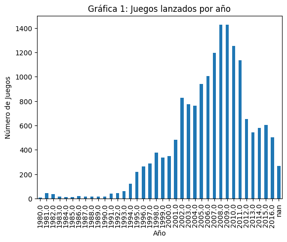
    


Observaciones:

- Los datos que parecen significativos para sacar una proyección son 2012 en adelante. Los datos previos tenían una escala mucho mas alta.


```python
# Profundicemos mas. Revisando la gráfica anterior por cada marca en barras apiladas
df_games_per_year_per_company = df.groupby(['year_of_release','company']).size().unstack()
df_games_per_year_per_company.plot(kind='bar', stacked=True)
plt.title("Gráfica 2: Juegos lanzados por año por empresa")
plt.xlabel("Año")
plt.ylabel("Número de Juegos")
plt.show()
```


    
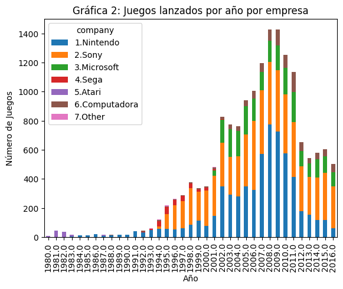
    


```python
print(df_games_per_year_per_company.tail(15))
```

    company          1.Nintendo  2.Sony  3.Microsoft  4.Sega  5.Atari  \
    year_of_release                                                     
    2002.0                351.0   300.0        158.0     1.0      NaN   
    2003.0                294.0   259.0        189.0     NaN      NaN   
    2004.0                281.0   274.0        177.0     NaN      NaN   
    2005.0                350.0   355.0        197.0     NaN      NaN   
    2006.0                324.0   475.0        155.0     NaN      NaN   
    2007.0                571.0   437.0        126.0     1.0      NaN   
    2008.0                774.0   429.0        147.0     1.0      NaN   
    2009.0                728.0   419.0        172.0     NaN      NaN   
    2010.0                576.0   407.0        182.0     NaN      NaN   
    2011.0                412.0   379.0        206.0     NaN      NaN   
    2012.0                179.0   306.0        106.0     NaN      NaN   
    2013.0                153.0   259.0         94.0     NaN      NaN   
    2014.0                117.0   293.0        124.0     NaN      NaN   
    2015.0                118.0   323.0        115.0     NaN      NaN   
    2016.0                 61.0   287.0        100.0     NaN      NaN   
    
    company          6.Computadora  7.Other  
    year_of_release                          
    2002.0                    19.0      NaN  
    2003.0                    33.0      NaN  
    2004.0                    30.0      NaN  
    2005.0                    37.0      NaN  
    2006.0                    52.0      NaN  
    2007.0                    62.0      NaN  
    2008.0                    76.0      NaN  
    2009.0                   107.0      NaN  
    2010.0                    90.0      NaN  
    2011.0                   139.0      NaN  
    2012.0                    61.0      NaN  
    2013.0                    38.0      NaN  
    2014.0                    47.0      NaN  
    2015.0                    50.0      NaN  
    2016.0                    54.0      NaN  
    

Observaciones:
- La caída en el número de juegos lanzados esta ampliamente vinculada a Nintendo


```python
# 3.2. Observar cómo varían las ventas de una plataforma a otra.

# 3.2.1. Elige las plataformas con las mayores ventas totales y construye una distribución basada en los datos de cada año.
df_2005_en_adelante = df[df['year_of_release'] >= 2005]
df_sales_per_year_per_company = df_2005_en_adelante.groupby(['year_of_release','company'])['total_sales'].sum().unstack()
df_sales_per_year_per_company.plot(kind='bar', stacked=False)
plt.title("Gráfica 3: Ingresos anuales por cada compañía (agrupado)")
plt.xlabel("Año")
plt.ylabel("Ingresos (M-USD)")
plt.show()


```


    
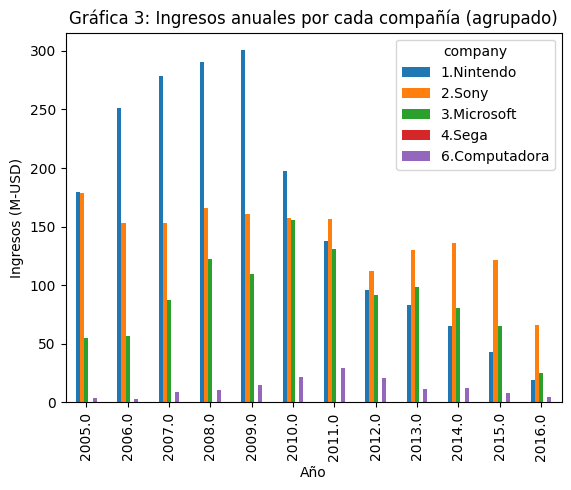
    


Observaciones sobre ingresos de cada compañía:

- Las compañías con mayores ingresos son Sony, Microsoft y Nintendo.

1.Nintendo (azul): Claramente a la baja en los últimos 7 años

2.Sony (amarillo): Después de tener ingresos estables de cerca de 130 M-USD en los últimos 4 años, en 2016 caen sus ingresos Estables, excepto que en 2016 parece caer. Es necesario confirmar si disponemos de los datos completos en el año 216.

3. Microsoft (verde): Claramente a la baja en los últimos 7 años

4. Sega: Ingresos insignificantes.

6. Computadora (rojo): Claramente a la baja, con escala muy pequeña frente a plataformas. Sin embargo, creemos que es un nicho de negocio que no compite directamente con plataformas.


```python
print(df_sales_per_year_per_company.tail(15))
```

    company          1.Nintendo  2.Sony  3.Microsoft  4.Sega  6.Computadora
    year_of_release                                                        
    2005.0               179.57  178.92        54.96     NaN           4.08
    2006.0               251.46  152.83        56.92     NaN           2.55
    2007.0               278.69  153.10        87.21    0.02           8.98
    2008.0               290.70  166.18       122.73    0.04          10.43
    2009.0               300.42  160.78       109.26     NaN          14.92
    2010.0               197.21  157.24       155.80     NaN          21.31
    2011.0               137.47  156.55       131.11     NaN          29.70
    2012.0                95.71  112.07        91.45     NaN          20.41
    2013.0                83.38  130.21        98.03     NaN          11.27
    2014.0                65.55  135.90        80.87     NaN          12.38
    2015.0                43.02  121.19        65.53     NaN           7.93
    2016.0                18.92   66.34        25.31     NaN           4.89
    


```python
# 3.2. Observar cómo varían las ventas de una plataforma a otra.

# 3.2.2. Busca las plataformas que solían ser populares pero que ahora no tienen ventas.
#     ¿Cuánto tardan generalmente las nuevas plataformas en aparecer y las antiguas en desaparecer?


df_sales_per_year_per_company = df.groupby(['year_of_release','company'])['total_sales'].sum().unstack()
df_sales_per_year_per_company.plot(kind='bar', stacked=True)
plt.title("Gráfica 4: Ingresos anuales por cada compañía (apilado)")
plt.xlabel("Año")
plt.ylabel("Ingresos (M-USD)")
plt.show()
```


    
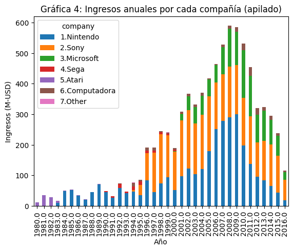
    


Observaciones:

1.Nintendo (azul): Le toma 19 años comenzar a despegar. 9 años llegar a máximos. Lleva 7 años en declive y está a punto de desaparecer.

2.Sony (amarillo): Le toma 2 años comenzar a despegar. Lleva 20 años con ventas exitosas (30% a 50% del marketshare). En 2016 caen sus ventas pero aumenta el marketshare a 58%.

3.Microsoft (verde): Le toma 2 años comenzar a despegar. Lleva 13 años con ventas exitosas (15% a 30% del marketshare). En 2016 caen sus ventas y tiene marketshare a 22%.

4.Sega (rojo): Estuvo en el mercado 11 años con participación marginal. Nunca despegó.

5.Atari (morado): Los datos no permiten establecer cuando inició operaciones y que volúmen de mercado tomó.

6.Computadora (cafe): Ocupa un nico de mercado minoritario durante mas de 22 años.


```python
# 3.3. Determinar para qué período se deben tomar datos.
```

Observaciones:

En base a los datos anteriores se determina, que para construir un model prodictivo tendríamos que tomar en cuenta los datos a partir del año 2012, en el que se ajustó el mercado de a la baja y ya no hubo una recuperación a los niveles de ingreso que previamente se habían tenido. El año 2016 es notablemente bajo, por lo que debería verificarse si los datos son correctos y abarcan 12 meses completos.


```python
#3.4. Trabaja solo con los datos relevantes.
#3.4.1. ¿Qué plataformas son líderes en ventas?
#    ¿Cuáles crecen y cuáles se reducen?

```

Observaciones:

Las plataformas líderes en ventas son Sony y Microsoft. Son también las plataformas en las que se recomienda enfocarse por representar juntas el 80% del marketshare de ingresos en 2016.

En la sección 3.2.2. se explica cuales crecen y cuales se reducen.


```python
# 3.5. Crear un diagrama de caja para las ventas globales de todos los juegos, desglosados por plataforma.
#     ¿Son significativas las diferencias en las ventas?
#     ¿Qué sucede con las ventas promedio en varias plataformas?
#     Describe tus hallazgos.


df.boxplot(column='total_sales', by='company')
plt.title("Gráfica 5: Ingresos por plataforma (boxplot)")
plt.xlabel("Plataforma")
plt.ylim(0, 1.5)
plt.show()

#print(df[df['company']== '1.Nintendo']['total_sales'])
#type(df[df['company']== '1.Nintendo']['total_sales'])


```


    
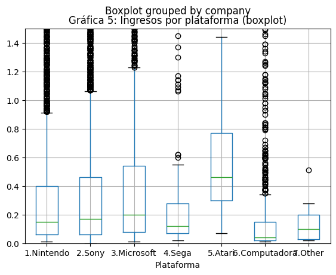
    


```python
# Adicionalmente vamos hacer una gráfica de puntos para revisar la dispersión de los datos de Nintendo
df_ingresos_nintendo = df[df['company']== '1.Nintendo']['total_sales'].sort_values().reset_index()
df_ingresos_nintendo = df_ingresos_nintendo.drop(columns=['index'])
print(df_ingresos_nintendo.head(10))
df_ingresos_nintendo.plot()
plt.title("Gráfica 6: Ingresos por plataforma Nintendo (dispersión)")
plt.xlabel("Juegos publicados")
plt.ylabel("Ingresos (M-USD)")
plt.show()


```

       total_sales
    0         0.01
    1         0.01
    2         0.01
    3         0.01
    4         0.01
    5         0.01
    6         0.01
    7         0.01
    8         0.01
    9         0.01
    


    
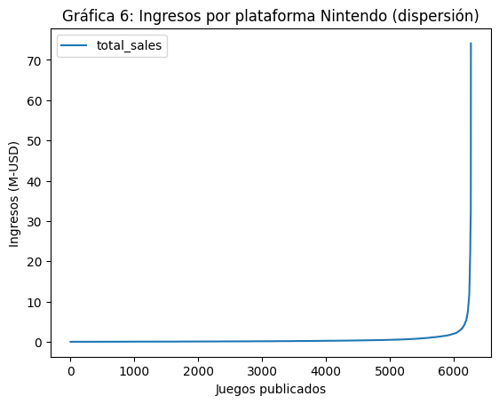
    


```python
# Revisemos ahora informacion mas reciente de Nintendo (2015 y 2016)
df_ingresos_nintendo_2016 = df[(df['company']== '1.Nintendo') & ((df['year_of_release']== 2015) | (df['year_of_release']== 2016))]['total_sales'].sort_values().reset_index()
df_ingresos_nintendo_2016 = df_ingresos_nintendo_2016.drop(columns=['index'])
print(df_ingresos_nintendo_2016.head(10))
df_ingresos_nintendo_2016.plot()
plt.title("Gráfica 7: Ingresos por plataforma Nintendo 2015-2016 (dispersión)")
plt.xlabel("Juegos publicados")
plt.ylabel("Ingresos (M-USD)")
plt.show()
```

       total_sales
    0         0.01
    1         0.01
    2         0.01
    3         0.01
    4         0.01
    5         0.01
    6         0.01
    7         0.01
    8         0.01
    9         0.01
    


    
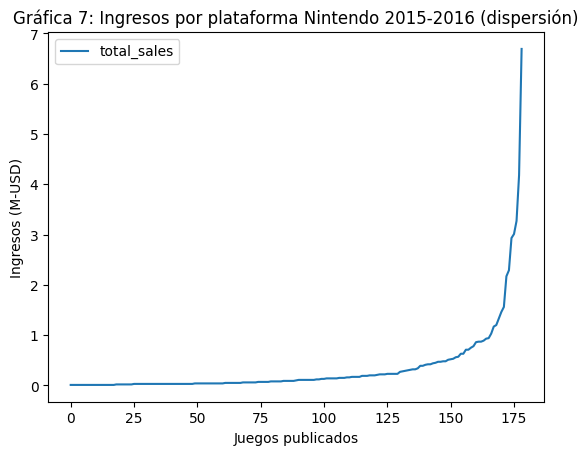
    


Observaciones:

Analisis de cuartiles:

- Hacia arriba destaca 5.Atari, con ingresos por juego que superan los .4 M-USD en la mediana, llegando casi a .8 M-USD en el tercer cuartil y mas de 1.8 M-USD en el cuarto cuartil. Eran tiempos donde había mejores márgenes.

- Hacia abajo destcan los juegos de computadora donde se ve que los márgenes son muy apretados.

- Para 1.Nintendo, 2.Sony y 3.Microsoft se concluye la gran mayoría de los juegos generan muy poco ingreso, siendo la mediana entre .1 y .2 M-USD. Lo interesante de los ingresos proviene de juegos destacados que mueven los ingresos hacia arriba, llegando a generarse entre .4 y .6 M-USD en el tercer cuartil, y .9 a 1.3 M-USD para el cuarto cuartil. Así mismo, exiten muchos casos de juegos que se vuelven virales representando valores atípicos,que se vuelvan virales y que aunque son pocos juegos en cantidad, estos generan la mayor parte de las utilidades.


```python
#3.6. Analizar cómo las reseñas de usuarios y profesionales afectan las ventas de una plataforma popular.
#    Crear un gráfico de dispersión y calcular la correlación entre las reseñas y las ventas.
#    Sacar conclusiones.

# 3.6.1. Correlacion con critic_score
# Primero vamos a crear un df con las columnas que necesitamos
correlacion_reseñas_ventas = df[['total_sales','critic_score','name','company']]
# ahora seleccionamos los registros con 'company' == '1.Nintendo'
correlacion_reseñas_ventas_nintendo = correlacion_reseñas_ventas[correlacion_reseñas_ventas['company'] == '1.Nintendo']
print(correlacion_reseñas_ventas_nintendo.head(10))
correlacion_reseñas_ventas_nintendo.plot.scatter(x='critic_score', y='total_sales')
plt.title("Gráfica 8: Correlación critic_score vs total_sales plataforma Nintendo")
plt.xlabel("critic_score")
plt.ylabel("total_sales (M-USD)")
plt.xlim(0, 100)
plt.ylim(0, 25)
plt.show()

print(  "El coeficiente de correlacion es: ",    df['total_sales'].corr(    df['critic_score']       )          )
```

       total_sales  critic_score                       name     company
    0        74.09          76.0                 Wii Sports  1.Nintendo
    1        39.47           NaN          Super Mario Bros.  1.Nintendo
    2        32.23          82.0             Mario Kart Wii  1.Nintendo
    3        29.82          80.0          Wii Sports Resort  1.Nintendo
    4        30.38           NaN   Pokemon Red/Pokemon Blue  1.Nintendo
    5        29.68           NaN                     Tetris  1.Nintendo
    6        26.92          89.0      New Super Mario Bros.  1.Nintendo
    7        26.07          58.0                   Wii Play  1.Nintendo
    8        26.08          87.0  New Super Mario Bros. Wii  1.Nintendo
    9        27.84           NaN                  Duck Hunt  1.Nintendo
    


    
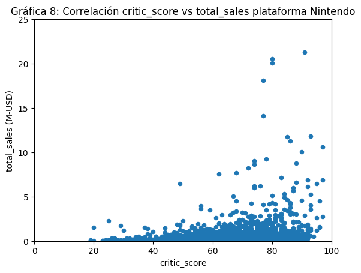
    


    El coeficiente de correlacion es:  0.2444293007701472
    

Observaciones:

Exite correlación positiva entre las variables critic_score y total_sales, sin embargo el coeficiente es .244 lo cual nos dice que la correlación no es tan marcada. En la gráfica lo comprobamos porque muchos juegos con alto score sulen tener malos resultados en ventas.


```python
# 3.6.2. Correlacion con user_score
# Primero vamos a crear un df con las columnas que necesitamos
correlacion_reseñas_ventas = df[['total_sales','user_score','name','company']]
# ahora seleccionamos los registros con 'company' == '1.Nintendo'
correlacion_reseñas_ventas_nintendo = correlacion_reseñas_ventas[correlacion_reseñas_ventas['company'] == '1.Nintendo']
print(correlacion_reseñas_ventas_nintendo.head(10))
correlacion_reseñas_ventas_nintendo.plot.scatter(x='user_score', y='total_sales')
plt.title("Gráfica 9: Correlación user_score vs total_sales Nintendo")
plt.xlabel("user_score")
plt.ylabel("total_sales (M-USD)")
plt.xlim(0, 100)
plt.ylim(0, 25)
plt.show()

print(  "El coeficiente de correlacion es: ",    df['total_sales'].corr(    df['user_score']       )          )
```

       total_sales  user_score                       name     company
    0        74.09        80.0                 Wii Sports  1.Nintendo
    1        39.47         NaN          Super Mario Bros.  1.Nintendo
    2        32.23        83.0             Mario Kart Wii  1.Nintendo
    3        29.82        80.0          Wii Sports Resort  1.Nintendo
    4        30.38         NaN   Pokemon Red/Pokemon Blue  1.Nintendo
    5        29.68         NaN                     Tetris  1.Nintendo
    6        26.92        85.0      New Super Mario Bros.  1.Nintendo
    7        26.07        66.0                   Wii Play  1.Nintendo
    8        26.08        84.0  New Super Mario Bros. Wii  1.Nintendo
    9        27.84         NaN                  Duck Hunt  1.Nintendo
    


    
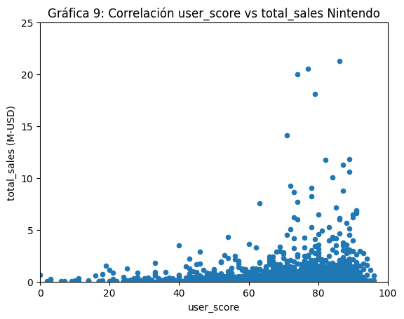
    


    El coeficiente de correlacion es:  0.08986307423444424
    

Observaciones:

El coeficiente entre user_score y total_sales, sigue siendo positivo pero muy cercano a cero: .089. Esto nos indica que el score otorgado nos habla poco de lo que pueden ser las ventas.


```python
# 3.7. Teniendo en cuenta las conclusiones previas, comparar las ventas de los mismos juegos en otras plataformas.

#Se requiere:
#   Identificar juegos que existen en múltiples plataformas (mismo nombre, diferentes plataformas)
#   Comparar sus ventas entre esas plataformas
#   Buscar patrones: ¿Hay géneros que funcionan mejor en ciertas plataformas?

# Vamos a usar los nombres mas repetidos de información posterior a 2014
df_info_reciente = df[df['year_of_release'] >= 2015]
df_juegos_repetidos = df_info_reciente['name'].value_counts()
print("Lista de juegos mas repetidos en distintas plataformas: ",df_juegos_repetidos.head(10))
print()


```

    Lista de juegos mas repetidos en distintas plataformas:  name
    LEGO Jurassic World                           8
    LEGO Marvel's Avengers                        7
    Skylanders: SuperChargers                     7
    Lego Star Wars: The Force Awakens             7
    Adventure Time: Finn & Jake Investigations    6
    Rugby World Cup 2015                          6
    Just Dance 2017                               6
    Just Dance 2016                               6
    Rugby 15                                      5
    Skylanders Imaginators                        5
    Name: count, dtype: int64
    
    


```python
# Vamos a agregar una nueva columna al dataset original (df) que indique el núm veces que se repite 'name'
df_con_column_repetidos = df.merge(df_juegos_repetidos, on='name', how='left')
print("Así se ve el nuevo dataframe con columna de veces que se repite cada 'name':")
print(df_con_column_repetidos.head(10))
print()
print("Confirmamos que los valores en la nueva columna 'count' se hayan incorporado bien:")
print(df_con_column_repetidos['count'].value_counts())
#
```

    Así se ve el nuevo dataframe con columna de veces que se repite cada 'name':
                            name platform  year_of_release         genre  \
    0                 Wii Sports      Wii           2006.0        Sports   
    1          Super Mario Bros.      NES           1985.0      Platform   
    2             Mario Kart Wii      Wii           2008.0        Racing   
    3          Wii Sports Resort      Wii           2009.0        Sports   
    4   Pokemon Red/Pokemon Blue       GB           1996.0  Role-Playing   
    5                     Tetris       GB           1989.0        Puzzle   
    6      New Super Mario Bros.       DS           2006.0      Platform   
    7                   Wii Play      Wii           2006.0          Misc   
    8  New Super Mario Bros. Wii      Wii           2009.0      Platform   
    9                  Duck Hunt      NES           1984.0       Shooter   
    
       na_sales  eu_sales  jp_sales  other_sales  critic_score  user_score  \
    0     41.36     28.96      3.77         8.45          76.0        80.0   
    1     29.08      3.58      6.81         0.77           NaN         NaN   
    2     15.68     12.76      3.79         3.29          82.0        83.0   
    3     15.61     10.93      3.28         2.95          80.0        80.0   
    4     11.27      8.89     10.22         1.00           NaN         NaN   
    5     23.20      2.26      4.22         0.58           NaN         NaN   
    6     11.28      9.14      6.50         2.88          89.0        85.0   
    7     13.96      9.18      2.93         2.84          58.0        66.0   
    8     14.44      6.94      4.70         2.24          87.0        84.0   
    9     26.93      0.63      0.28         0.47           NaN         NaN   
    
           rating  total_sales     company  count  
    0  2.Everyone        74.09  1.Nintendo    NaN  
    1  99.Pending        39.47  1.Nintendo    NaN  
    2  2.Everyone        32.23  1.Nintendo    NaN  
    3  2.Everyone        29.82  1.Nintendo    NaN  
    4  99.Pending        30.38  1.Nintendo    NaN  
    5  99.Pending        29.68  1.Nintendo    NaN  
    6  2.Everyone        26.92  1.Nintendo    NaN  
    7  2.Everyone        26.07  1.Nintendo    NaN  
    8  2.Everyone        26.08  1.Nintendo    NaN  
    9  99.Pending        27.84  1.Nintendo    NaN  
    
    Confirmamos que los valores en la nueva columna 'count' se hayan incorporado bien:
    count
    1.0    462
    2.0    296
    3.0    240
    5.0     90
    4.0     73
    6.0     24
    7.0     21
    8.0      8
    Name: count, dtype: int64
    


```python


# ajustamos el nombre de la nueva columna que indica las repeticiones que tiene
df_con_column_repetidos=df_con_column_repetidos.rename(columns={'count': 'num_repeticion_name'})
# vamos a eliminar los registros con 'num_repeticion_name' menor a 2
df_con_column_repetidos = df_con_column_repetidos[df_con_column_repetidos['num_repeticion_name'] > 1]
df_con_column_repetidos = df_con_column_repetidos.sort_values(['num_repeticion_name', 'name'], ascending=[False, False])
#reseteamos los indices
df_con_column_repetidos = df_con_column_repetidos.reset_index(drop=True)
print(df_con_column_repetidos.head(10))

```

                            name platform  year_of_release   genre  na_sales  \
    0        LEGO Jurassic World      PS4           2015.0  Action      0.32   
    1        LEGO Jurassic World     X360           2015.0  Action      0.47   
    2        LEGO Jurassic World      PS3           2015.0  Action      0.35   
    3        LEGO Jurassic World     XOne           2015.0  Action      0.38   
    4        LEGO Jurassic World      3DS           2015.0  Action      0.31   
    5        LEGO Jurassic World     WiiU           2015.0  Action      0.27   
    6        LEGO Jurassic World      PSV           2015.0  Action      0.05   
    7        LEGO Jurassic World       PC           2015.0  Action      0.00   
    8  Skylanders: SuperChargers     WiiU           2015.0  Action      0.25   
    9  Skylanders: SuperChargers     X360           2015.0  Action      0.25   
    
       eu_sales  jp_sales  other_sales  critic_score  user_score           rating  \
    0      0.42      0.02         0.14          70.0        70.0  3.From 10 years   
    1      0.32      0.00         0.08           NaN        71.0  3.From 10 years   
    2      0.36      0.00         0.14           NaN        74.0  3.From 10 years   
    3      0.22      0.00         0.06          70.0        67.0  3.From 10 years   
    4      0.23      0.03         0.05           NaN        72.0  3.From 10 years   
    5      0.19      0.02         0.04          71.0        81.0  3.From 10 years   
    6      0.13      0.00         0.05           NaN        76.0  3.From 10 years   
    7      0.04      0.00         0.00          72.0        71.0  3.From 10 years   
    8      0.19      0.00         0.04          87.0        56.0  3.From 10 years   
    9      0.13      0.00         0.04           NaN        54.0  3.From 10 years   
    
       total_sales        company  num_repeticion_name  
    0         0.76         2.Sony                  8.0  
    1         0.79    3.Microsoft                  8.0  
    2         0.71         2.Sony                  8.0  
    3         0.60    3.Microsoft                  8.0  
    4         0.57     1.Nintendo                  8.0  
    5         0.48     1.Nintendo                  8.0  
    6         0.18         2.Sony                  8.0  
    7         0.04  6.Computadora                  8.0  
    8         0.44     1.Nintendo                  7.0  
    9         0.38    3.Microsoft                  7.0  
    


```python
# nos quedamos con las columnas relevantes para el analisis
df_con_column_repetidos_final = df_con_column_repetidos[['name','total_sales','company','num_repeticion_name','genre']]
# Ahora consolidamos la información de df_con_column_repetidos_final por 'name' y'company', agregando 'num_repeticion_name':first y 'total_sales':sum .
df_con_column_repetidos_final = df_con_column_repetidos_final.groupby(['name','company']).agg({'total_sales':'sum','num_repeticion_name':'first','genre':'first'})
df_con_column_repetidos_final = df_con_column_repetidos_final.sort_values(by='num_repeticion_name', ascending=False)
print(df_con_column_repetidos_final.head(10))
```

                                                     total_sales  \
    name                              company                      
    LEGO Jurassic World               6.Computadora         0.04   
                                      3.Microsoft           1.39   
                                      2.Sony                1.65   
                                      1.Nintendo            1.05   
    Skylanders: SuperChargers         2.Sony                0.56   
    Lego Star Wars: The Force Awakens 2.Sony                0.82   
                                      1.Nintendo            0.26   
                                      3.Microsoft           0.38   
    LEGO Marvel's Avengers            3.Microsoft           0.60   
    Skylanders: SuperChargers         1.Nintendo            0.69   
    
                                                     num_repeticion_name   genre  
    name                              company                                     
    LEGO Jurassic World               6.Computadora                  8.0  Action  
                                      3.Microsoft                    8.0  Action  
                                      2.Sony                         8.0  Action  
                                      1.Nintendo                     8.0  Action  
    Skylanders: SuperChargers         2.Sony                         7.0  Action  
    Lego Star Wars: The Force Awakens 2.Sony                         7.0  Action  
                                      1.Nintendo                     7.0  Action  
                                      3.Microsoft                    7.0  Action  
    LEGO Marvel's Avengers            3.Microsoft                    7.0  Action  
    Skylanders: SuperChargers         1.Nintendo                     7.0  Action  
    


```python
# Nos vamos a quedar con los registros que tienen 'num_repeticion_name' >= 5 para poder graficarlo
df_con_column_repetidos_final = df_con_column_repetidos_final[df_con_column_repetidos_final['num_repeticion_name'] >= 5]
df_con_column_repetidos_final = df_con_column_repetidos_final.reset_index()

# Descrtamos la columna 'num_repeticion_name', que no nos sirve para graficar
df_con_column_repetidos_final = df_con_column_repetidos_final[['name','company','total_sales','genre']]

#ordenamos por 'name' y 'company'
df_con_column_repetidos_final = df_con_column_repetidos_final.sort_values(by=['name','company'],ascending=[True,True])
print(df_con_column_repetidos_final.head(10))


```

                                              name        company  total_sales  \
    20  Adventure Time: Finn & Jake Investigations     1.Nintendo         0.13   
    13  Adventure Time: Finn & Jake Investigations         2.Sony         0.15   
    16  Adventure Time: Finn & Jake Investigations    3.Microsoft         0.13   
    49                       Battlefield: Hardline         2.Sony         2.14   
    50                       Battlefield: Hardline    3.Microsoft         1.36   
    48                       Battlefield: Hardline  6.Computadora         0.13   
    38                   Call of Duty: Black Ops 3         2.Sony        13.68   
    40                   Call of Duty: Black Ops 3    3.Microsoft         8.25   
    39                   Call of Duty: Black Ops 3  6.Computadora         0.25   
    71                         Disney Infinity 3.0     1.Nintendo         0.42   
    
          genre  
    20   Action  
    13   Action  
    16   Action  
    49  Shooter  
    50  Shooter  
    48  Shooter  
    38  Shooter  
    40  Shooter  
    39  Shooter  
    71   Action  
    


```python
# Graficamos resultado de ventas por plataforma y nombre de juego
pivot_data = df_con_column_repetidos_final.pivot(index='name', columns='company', values='total_sales')
pivot_data.plot(kind='bar', figsize=(12, 6))
plt.title('Gráfica 10: Ventas Totales en juegos multiplataforma')
plt.xlabel('Juegos')
plt.ylabel('Ventas Totales')
plt.xticks(rotation=45)
plt.legend(title='Plataforma')
plt.tight_layout()
plt.show()
```


    
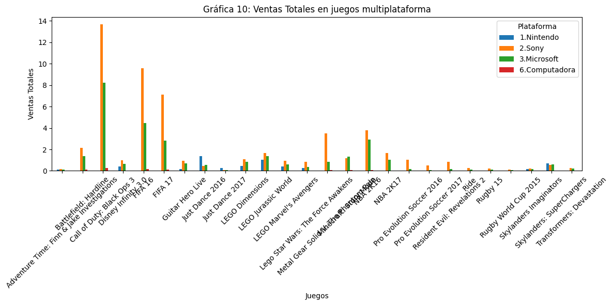
    


Observaciones (estamos analizando juegos que se usan en múltiples plataformas):

- Podemos ver en la gráfica de barras, que los juegos que se publican en distintas plataformas, suelen tener un monto de ventas mayor en 2.Sony; seguido de 3.Microsoft; y en tercer lugar las de 1.Nintendo que ya no resultan muy relevantes.


```python
# Graficamos resultado de ventas por genre y plataforma
# Agrupamos la información por plataforma
df_con_column_repetidos_plataforma = df_con_column_repetidos_final.groupby(['company','genre']).agg({'total_sales':'sum'})
df_con_column_repetidos_plataforma = df_con_column_repetidos_plataforma.reset_index()
print(df_con_column_repetidos_plataforma.head(10))

pivot_data = df_con_column_repetidos_plataforma.pivot(index='company', columns='genre', values='total_sales')
pivot_data.plot(kind='bar', figsize=(12, 6))
plt.title('Gráfica 11: Ventas Totales por género en juegos multiplataforma')
plt.xlabel('Plataformas')
plt.ylabel('Ventas Totales (M-USD)')
plt.xticks(rotation=45)
plt.legend(title='Géneros')
plt.show()
```

          company      genre  total_sales
    0  1.Nintendo     Action         3.42
    1  1.Nintendo       Misc         1.82
    2  1.Nintendo   Platform         0.17
    3      2.Sony     Action        10.77
    4      2.Sony  Adventure         1.16
    5      2.Sony       Misc         1.47
    6      2.Sony   Platform         0.21
    7      2.Sony     Racing         0.24
    8      2.Sony    Shooter        15.82
    9      2.Sony     Sports        24.02
    


    

    


Observaciones (estamos analizando juegos que se usan en múltiples plataformas):

- En los generos de Sports y Shooting tienen la mayor reelevancia en monto de ingresos. En estos géneros los juegos de la plataforma 2.Sony tienen la mayor participación en ganancias; seguidos de 3.Microsoft. Las plataformas de 3.Nintendo no figura en esta categoría.

- En genero de Acción es el segundo lugar en ingresos, la relevancia mayor es para 2.Sony, seguido de 3.Microsoft y al final 1.Nintendo (otras plataformas no tienen relevancia)

- El género de aventura no es muy relevante, sin embargo podemos decir que 2.Sony y 3.Microsoft tienen participación similar.

- Otros géneros no son relevantes cuando hablamos de juegos que se publican en distintas plataformas.


```python
# 3.8. Revisar la distribución general de los juegos por género.
#    ¿Qué se puede decir de los géneros más rentables?
#    ¿Puedes generalizar acerca de los géneros con ventas altas y bajas?

# Vamos a hacer un nuevo df_genero con datos de 2012 en adelante
df_genero = df[df['year_of_release'] >= 2012]
# Usarmeos sólamente columnas 'genre','total_sales'
df_genero = df_genero[['genre','total_sales','year_of_release']]
# Agrupas los resultados
df_genero = df_genero.groupby(['genre','year_of_release']).agg({'total_sales':'sum'})
df_genero = df_genero.reset_index()
print(df_genero.head(10))

```

           genre  year_of_release  total_sales
    0     Action           2012.0       105.31
    1     Action           2013.0       107.88
    2     Action           2014.0        85.24
    3     Action           2015.0        64.51
    4     Action           2016.0        27.04
    5  Adventure           2012.0         5.41
    6  Adventure           2013.0         5.48
    7  Adventure           2014.0         5.00
    8  Adventure           2015.0         7.28
    9  Adventure           2016.0         3.45
    


```python
# Hacemos la gráfica

pivot_data = df_genero.pivot(index='year_of_release', columns='genre', values='total_sales')
pivot_data.plot(kind='bar', figsize=(12, 6))
plt.title('Gráfica 12: Ventas Totales por género por año de publicación')
plt.xlabel('Año')
plt.ylabel('Ventas Totales (M-USD)')
plt.xticks(rotation=45)
plt.legend(title='Género')
plt.show()
```


    
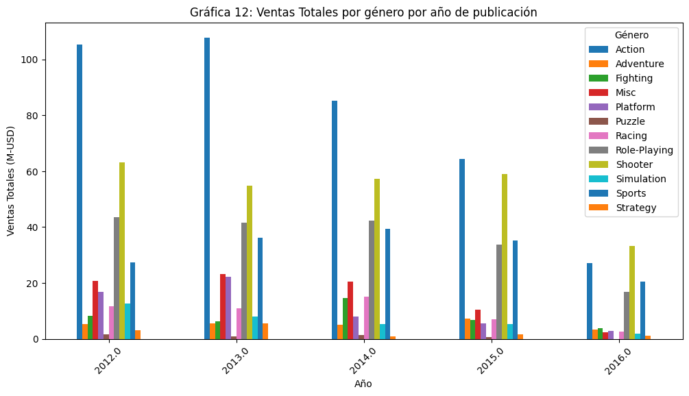
    


Observaciones:

- Los géneros Action y Shooter son los mas reelevantes. Action tiende a decrecer y Shooter a mantenerse en su nivel (ello considerando que posiblemente los datos del 2016 estén incompletos).

- Los géneros Role-Playing y Sports siguen en relevancia. Ambos géneros muestran signos de que pueden comenzar a decrecer al futuro.

- Los demás géneros muestran poco potencial.

## 4. Crea un perfil de usuario para cada región

Para cada región (NA, UE, JP) determinar:

- Las cinco plataformas principales. Describir las variaciones de cuotas de mercado.

- Los cinco géneros principales. Explica la diferencia.

- Si las clasificaciones de ESRB afectan a las ventas en regiones individuales.


```python
# 4. Para cada región (NA, UE, JP) determinar:
# 4.1. Las cinco plataformas principales. Describir las variaciones en sus cuotas de mercado.

# Vamos a hacer un nuevo df_genero con datos de 2012 en adelante
df_region = df_con_column_repetidos[df_con_column_repetidos['year_of_release'] >= 2012]
# Usarmeos sólamente columnas 'genre','platform','company','rating','na_sales','eu_sales','jp_sales','total_sales'
df_region = df_region[['genre','platform','company','rating','na_sales','eu_sales','jp_sales','total_sales']]
print(df_region.head())

```

        genre platform      company           rating  na_sales  eu_sales  \
    0  Action      PS4       2.Sony  3.From 10 years      0.32      0.42   
    1  Action     X360  3.Microsoft  3.From 10 years      0.47      0.32   
    2  Action      PS3       2.Sony  3.From 10 years      0.35      0.36   
    3  Action     XOne  3.Microsoft  3.From 10 years      0.38      0.22   
    4  Action      3DS   1.Nintendo  3.From 10 years      0.31      0.23   
    
       jp_sales  total_sales  
    0      0.02         0.76  
    1      0.00         0.79  
    2      0.00         0.71  
    3      0.00         0.60  
    4      0.03         0.57  
    


```python
# Definamos las 5 plataformas principales por región
# Agrupamos los resultados
df_region_plataforma = df_region.groupby(['platform']).agg({'na_sales':'sum','eu_sales':'sum','jp_sales':'sum','total_sales':'sum'})
df_region_plataforma = df_region_plataforma.reset_index()
print(df_region_plataforma.head(10))


# Hacemos la gráfica

df_region_plataforma.set_index('platform')[['na_sales', 'eu_sales', 'jp_sales']].plot(
    kind='bar',
    figsize=(12, 6),
    width=0.8
)

plt.title('Gráfica 13: Ventas Regionales por Plataforma')
plt.xlabel('Plataforma')
plt.ylabel('Ventas (M-USD)')
plt.legend(['Norteamérica', 'Europa', 'Japón'])
plt.xticks(rotation=45)
plt.tight_layout()
plt.show()

```

      platform  na_sales  eu_sales  jp_sales  total_sales
    0      3DS      0.93      1.03      0.54         2.50
    1       PC      3.61      7.99      0.00        11.60
    2      PS3      9.56     10.73      6.63        26.92
    3      PS4     54.64     72.80     10.25       137.69
    4      PSP      0.00      0.00      0.02         0.02
    5      PSV      0.36      0.90      4.38         5.64
    6      Wii      0.49      0.73      0.00         1.22
    7     WiiU      2.65      2.13      0.21         4.99
    8     X360     13.41      7.05      0.14        20.60
    9     XOne     42.16     24.27      0.11        66.54
    


    
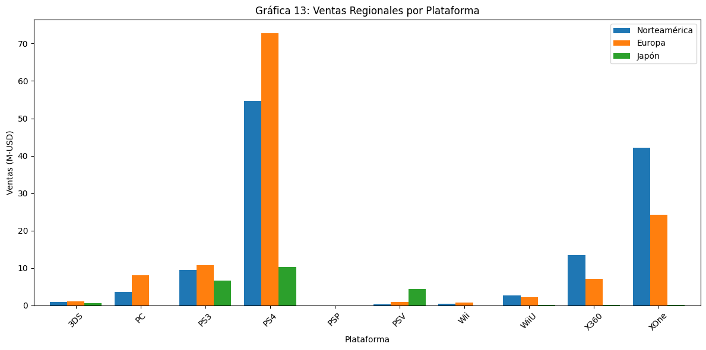
    


Observaciones:

Para Norteamerica las plataforma mas importantes en orden son:
  PS4, XOne, X360, PS3 y PC

Para Europa las plataforma mas importantes en orden son:
  PS4, XOne, PS3, PC, y X360

Para Japón  las plataforma mas importantes en orden son:
  PS4, PS3, PSV, 3DS, WiiU


```python
# 4.2 Los cinco géneros principales. Explica la diferencia.
# Agrupamos los resultados
df_region_plataforma = df_region.groupby(['genre']).agg({'na_sales':'sum','eu_sales':'sum','jp_sales':'sum','total_sales':'sum'})
df_region_plataforma = df_region_plataforma.reset_index()
print(df_region_plataforma.head(15))


# Hacemos la gráfica

df_region_plataforma.set_index('genre')[['na_sales', 'eu_sales', 'jp_sales']].plot(
    kind='bar',
    figsize=(12, 6),
    width=0.8
)

plt.title('Gráfica 14: Ventas Regionales por Género')
plt.xlabel('Plataforma')
plt.ylabel('Ventas (M-USD)')
plt.legend(['Norteamérica', 'Europa', 'Japón'])
plt.xticks(rotation=45)
plt.tight_layout()
plt.show()

```

               genre  na_sales  eu_sales  jp_sales  total_sales
    0         Action     32.04     32.37      8.88        73.29
    1      Adventure      3.06      3.45      0.85         7.36
    2       Fighting      5.19      3.46      1.28         9.93
    3           Misc      3.38      2.13      0.53         6.04
    4       Platform      1.02      0.71      0.09         1.82
    5         Puzzle      0.00      0.00      0.07         0.07
    6         Racing      1.64      4.99      0.21         6.84
    7   Role-Playing     14.27     14.45      5.93        34.65
    8        Shooter     40.30     35.50      2.93        78.73
    9     Simulation      0.73      2.59      0.03         3.35
    10        Sports     26.03     27.66      1.29        54.98
    11      Strategy      0.15      0.32      0.19         0.66
    


    
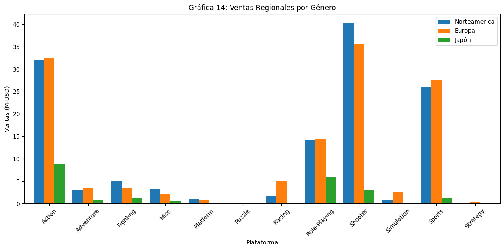
    


Observaciones:

Para Norteamerica y Europa los géneros mas importantes en orden son:
  Shooter, Action, Sports, Role-Playing y Fighting

Para Japón los géneros mas importantes en orden son:
  Action, Role-Playing, Shooter, Sports y Fighting


```python
# 4.3. Si las clasificaciones de ESRB afectan a las ventas en regiones individuales.

# Creamos df_esrb nuevo con datos de 2012 en adelante
df_esrb = df_con_column_repetidos[df_con_column_repetidos['year_of_release'] >= 2012]
# Usarmeos sólamente columnas ,'rating','na_sales','eu_sales','jp_sales','total_sales'
df_esrb = df_esrb[['rating','na_sales','eu_sales','jp_sales','total_sales']]
print(df_esrb.head())

```

                rating  na_sales  eu_sales  jp_sales  total_sales
    0  3.From 10 years      0.32      0.42      0.02         0.76
    1  3.From 10 years      0.47      0.32      0.00         0.79
    2  3.From 10 years      0.35      0.36      0.00         0.71
    3  3.From 10 years      0.38      0.22      0.00         0.60
    4  3.From 10 years      0.31      0.23      0.03         0.57
    


```python
# Agrupamos los resultados
df_esrb = df_esrb.groupby(['rating']).agg({'na_sales':'sum','eu_sales':'sum','jp_sales':'sum','total_sales':'sum'})
df_esrb = df_esrb.reset_index()
print(df_esrb.head(15))


# Hacemos la gráfica

df_esrb.set_index('rating')[['na_sales', 'eu_sales', 'jp_sales']].plot(
    kind='bar',
    figsize=(12, 6),
    width=0.8
)

plt.title('Gráfica 15: Ventas Regionales por Rating ESRB')
plt.xlabel('Rating ESRB')
plt.ylabel('Ventas (M-USD)')
plt.legend(['Norteamérica', 'Europa', 'Japón'])
plt.xticks(rotation=45)
plt.tight_layout()
plt.show()
```

                rating  na_sales  eu_sales  jp_sales  total_sales
    0       2.Everyone     19.99     28.16      0.98        49.13
    1  3.From 10 years     13.72      8.81      0.39        22.92
    2          4.Teens     14.17     12.71      5.64        32.52
    3         5.Mature     49.23     47.38      5.39       102.00
    4       99.Pending     30.70     30.57      9.88        71.15
    


    
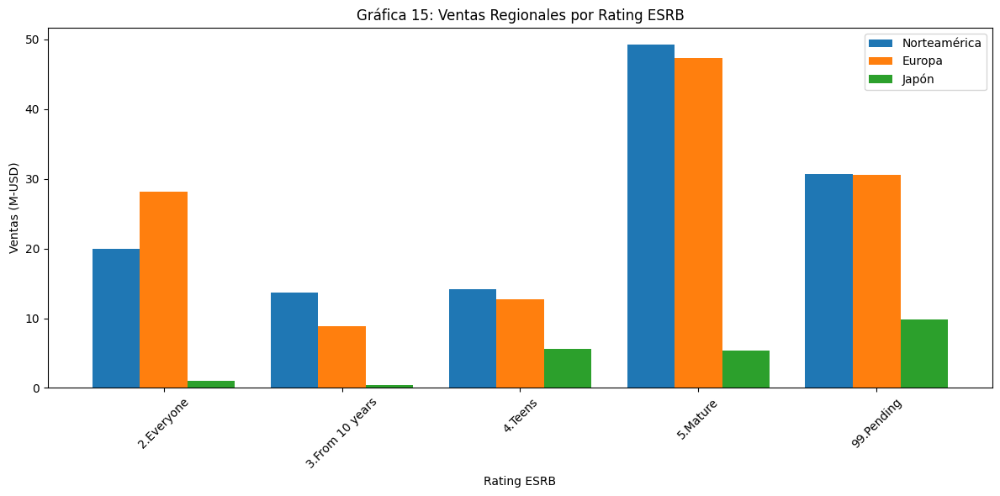
    


Observaciones:

- Es notable que el rating asignado a un videojuego condiciona el potencial de ingresos. Esto afecta distinto a cada región, debido al tamaño de mercado que se tiene para cada segmento de población en cada geografía.

- En NA
    - El grupo de adultos (5.Mature + 2.Everyone), es el que mas invierte en videojuegos = 69.2 M-USD (71% de ingresos de NA que tienen rating)
    - El grupo de adolecentes y niños (4.Teens y 3.From 10 years), invierte = 27.89 M-USD (29% de ingresos de NA que tienen rating).

- En EU:
  - El grupo de adultos (5.Mature + 2.Everyone), es el que mas invierte en videojuegos = 75.54 (78% de ingresos de EU que tienen rating)
  - El grupo de adolecentes y niños (4.Teens y 3.From 10 years), invierte = 21.52 M-USD (22% de ingresos de EU que tienen rating)

- En Japón:
  - El grupo de adultos (5.Mature + 2.Everyone), es el que mas invierte en videojuegos = 6.37 (51% de ingresos de JP que tienen rating)
  - El grupo de adolecentes y niños (4.Teens y 3.From 10 years), invierte = 6.03 M-USD (49% de ingresos de JP que tienen rating)


## 5. Probar las siguientes hipótesis:

— Las calificaciones promedio de los usuarios para las plataformas Xbox One y PC son las mismas.

— Las calificaciones promedio de los usuarios para los géneros de Acción y Deportes son diferentes.


```python
# 5. Probar las siguientes hipótesis:
# 5.1. Las calificaciones promedio de los usuarios para las plataformas Xbox One y PC son las mismas.
xone = df[df['platform'] == 'XOne']['user_score']
xone = xone.dropna()
xone = xone.reset_index(drop=True)

pc = df[df['platform'] == 'PC']['user_score']
pc = pc.dropna()
pc = pc.reset_index(drop=True)

print(xone.head(10))
print()
print(pc.head(10))

# hipotesis nula:   las dos muestras son de la misma población.
#   	"Rechazar" la hipótesis significa que muy probablemente no son de la misma población.
#   	"No rechazar" la hipótesis significa que podrían venir de la misma población.
#     Sabemos que ambos scores, califican juegos distintos, por lo tanto por lógica esperaríamos que se rechace la hipótesis nula

# Alfa
#    Tomaremos un valor de alpha = .05.
#    Parece un nivel de confianza adecuado para este ejercicio.
#    Se traduce en que sólo 1 vez, de cada 20 veces que se realice la prueba, tendremos un error del tipo "no rechazar la hipotesis nula cuando debimos haberlo hecho."

# Obtener el estadístico de prueba
results = st.stats.ttest_ind(xone,pc)
# Asignar valor a alpha
alpha = 0.05
print("El valor de p es: ", results.pvalue)
print()

# Decidir si se rechaza la hipotesis nula
if (results.pvalue < alpha):
    print("Rechazamos la hipótesis nula. Los datos provienen de distinta fuente")
else:
    print("No podemos rechazar la hipótesis nula. Los datos podrían venir del mismo origen.")
print()

```

    0    79.0
    1    54.0
    2    64.0
    3    62.0
    4    41.0
    5    55.0
    6    75.0
    7    44.0
    8    72.0
    9    64.0
    Name: user_score, dtype: float64
    
    0    76.0
    1    73.0
    2    40.0
    3    82.0
    4    91.0
    5    79.0
    6    81.0
    7    80.0
    8    78.0
    9    39.0
    Name: user_score, dtype: float64
    El valor de p es:  1.3896435533548407e-05
    
    Rechazamos la hipótesis nula. Los datos provienen de distinta fuente
    
    

    /tmp/ipython-input-2270143905.py:26: DeprecationWarning: Please import `ttest_ind` from the `scipy.stats` namespace; the `scipy.stats.stats` namespace is deprecated and will be removed in SciPy 2.0.0.
      results = st.stats.ttest_ind(xone,pc)
    


```python
# 5.2. Las calificaciones promedio de los usuarios para los géneros de Acción y Deportes son diferentes.
accion = df[df['genre'] == 'Action']['user_score']
accion = accion.dropna()
accion = accion.reset_index(drop=True)

deportes = df[df['genre'] == 'Sports']['user_score']
deportes = deportes.dropna()
deportes = deportes.reset_index(drop=True)

print(accion.head(10))
print()
print(deportes.head(10))

# hipotesis nula:   las dos muestras son de la misma población.
#   	"Rechazar" la hipótesis significa que muy probablemente no son de la misma población.
#   	"No rechazar" la hipótesis significa que podrían venir de la misma población.
#     Sabemos que ambos scores, califican generos distintos, pero los usuarios que califican ambos generos podrían hacerlo de forma semejante.

# Alfa
#    Tomaremos un valor de alpha = .05.
#    Parece un nivel de confianza adecuado para este ejercicio.
#    Se traduce en que sólo 1 vez, de cada 20 veces que se realice la prueba, tendremos un error del tipo "no rechazar la hipotesis nula cuando debimos haberlo hecho."

# Obtener el estadístico de prueba
results = st.stats.ttest_ind(accion,deportes)
# Asignar valor a alpha
alpha = 0.05
print("El valor de p es: ", results.pvalue)
print()

# Decidir si se rechaza la hipotesis nula
if (results.pvalue < alpha):
    print("Rechazamos la hipótesis nula. Los datos provienen de distinta fuente")
else:
    print("No podemos rechazar la hipótesis nula. Los datos podrían venir del mismo origen.")
print()
```

    0    82.0
    1    90.0
    2    81.0
    3    87.0
    4    85.0
    5    83.0
    6    79.0
    7    75.0
    8    66.0
    9    76.0
    Name: user_score, dtype: float64
    
    0    80.0
    1    80.0
    2    77.0
    3    74.0
    4    43.0
    5    50.0
    6    43.0
    7    74.0
    8    57.0
    9    85.0
    Name: user_score, dtype: float64
    El valor de p es:  0.10920697079317063
    
    No podemos rechazar la hipótesis nula. Los datos podrían venir del mismo origen.
    
    

    /tmp/ipython-input-3097556688.py:25: DeprecationWarning: Please import `ttest_ind` from the `scipy.stats` namespace; the `scipy.stats.stats` namespace is deprecated and will be removed in SciPy 2.0.0.
      results = st.stats.ttest_ind(accion,deportes)
    

## 6. Conclusiones


- Todo indica que la información del año 2016 está incompleta, pero aún así es útil porque los datos, aunque parciales, parecen estar bien en cuanto a sus proporciones, con lo cual se obtiene información reciente valiosa para orientar las decisiones (lo confirman las gráficas 1, 2, 3, 4 y 12)

- La venta de videojuegos es un mercado que va la baja desde el año 2010. Se recomienda diversificar los ingresos con ventas de productos/servicios sustitutos o complementarios,  que aprovechen los canales que ya tiene la empresa y vayan dirigidos a estos mismos clientes preferentemente (lo confirma la gráfica 4)

- La información que tenemos de ingresos por Ventas esta vinclulada al año en el que se pubicó cada videojuego. Sabemos que lo mejor sería tener los ingresos de cada juego en cada año, pero al no disponer de ello, el análisis lo debemos hacer asumiendo que los ingresos de cada juego se dan en el año en que se publicaron (year_of_release), lo cual es una buena aproximación.

- El negocio de videjuegos tiene alta incertidumbre, debido a que los ingresos que genera provienenen de un número muy limitado de títulos que tienen ventas muy altas. En contraste un gran porcentaje de los juegos publicados generan muy bajas ganancias (lo confirman las Gráficas 5, 6 y 7)

- Aún así se pueden tomar en cuenta algunos razgos de la información para orientar los esfuerzos comerciales en los juegos que ofrecen la  mayor probabilidad de éxito:

  - Plataforma: las plataformas dominantes son 2.Sony y 3.Microsoft (lo confirman las gráficas 11 y 13). Las consolas mas dominantes son (en orden):
    - Norteamerica: PS4, XOne, X360, PS3 y PC
    - Europa: PS4, XOne, PS3, PC, y X360
    - Japón: PS4, PS3, PSV, 3DS, WiiU
  - Genero: El esfuerzo comercial debe orientarse hacia Action y Shooter por tener las ventas reelevantes. Action tiende a decrecer y Shooter a mantenerse en su nivel. Los géneros Role-Playing y Sports siguen en nivel de importancia (lo confirma la gráfica 12)
  - Edad: La mayor probabilidad de éxito esta en las opciónes 5.Mature y 2.Everyone (lo confirma la gráfica 15)
  - Juegos multiplataforma: Los juegos que se lanzan en plataformas múltiples suelen tener mayor exito que los de plataforma individual. Pudiera ser que los fabricantes alcanzan a ver cuando un juego tiene alto potencial (lo confirma la gráfica 10)
  - Score de la crítica y usuarios: Si bien tenemos una correlación positiva de la crítica a las ventas, el índice de correlación es cercano a cero. La crítica es un aspecto a considerar, pero no es un aspecto determinante. (lo confirman las gráficas 8 y 9)

